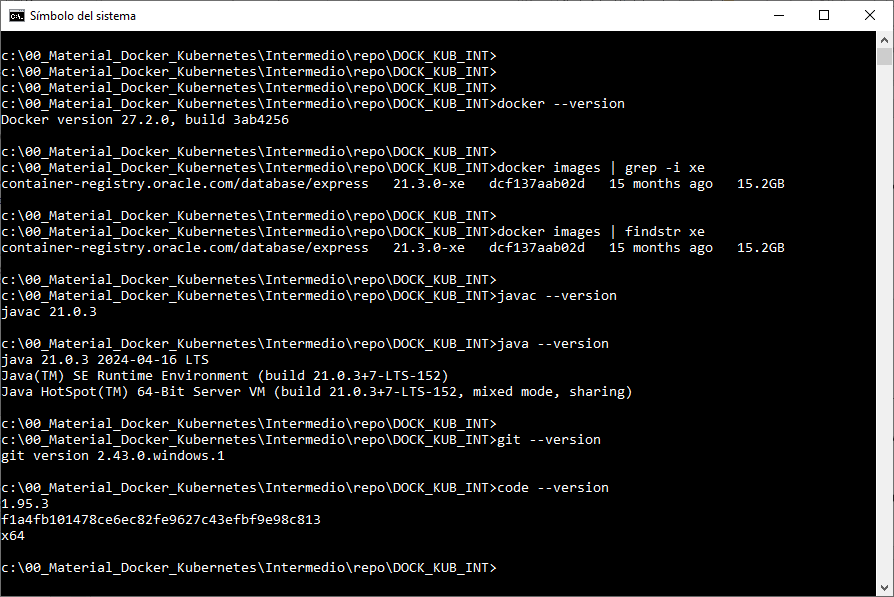

# Práctica 1.1. Verificación de entorno de curso

## Objetivos de la práctica:
Al finalizar la práctica serás capaz de:

- Verificar y preparar el entorno necesario para el curso, asegurándote de que Docker y las herramientas complementarias estén correctamente instaladas y configuradas para el desarrollo de actividades posteriores.

## Duración aproximada:
- 25 minutos.

## Instrucciones

1. Seguir atentamente las indicaciones del instructor para conectarse al ambiente asignado y asegurarse de que todo esté correctamente configurado.
   El repositorio a utilizar es el siguiente: https://github.com/Netec-Mx/DOCK_KUB_INT 

<br/>

2. Verificar Docker CLI.
    Abre una terminal y ejecuta el comando siguiente:

    ```cmd
    docker --version
    ```

    Confirmar que Docker está instalado y muestra la versión.

<br/>

3. Vericar Java SDK.

    Ejecutar los siguiente comandos:

    ```cmd
    javac --version
    java --version
    ```
    Asegúrate de que ambas herramientas están disponibles, de preferencia Java 21.

<br/>

4. Verificar Git.

    En la terminal, ejecutar:

    ```cmd
    git --version
    git config --global user.name "tu_nombre"
    git config --global user.email "tu_correo"
    git config --list
    ```
    La configuración de tu nombre y correo son opcionales, pero si el instructor te solicita subir algo en algún repositorio, ahí es cuando seran necesarias.

<br/>

5. Verificar Spring Tool Suite (STS):

    Abrir STS desde su acceso directo y verificar que cargue correctamente.

<br/>

6. Verificar la imagen de Oracle DB en Docker:

    En la terminal, ejecutar:

    ```cmd
    docker images
    ```

<br/>

7. Verificar Postman, Insomnia y Curl CLI.

    - Abrir Postman e Insomia desde sus accesos directos y verificar que ambos funcionen correctamente.

    - En la terminal, ejecutar:

    ```cmd
    curl --version
    ```

<br/>

8. Verificar Visual Studio Code & Nodepad++

    Abrir ambos programas desde sus accesos directos y asegúrate de que se carguen sin problemas. No actualizar las versiones si lo solicita.

<br/>

9. Verificar conexión SSH a los nodos:

    - Acceder a cada nodo utilizando SSH y confirmar que puedes conectarte correctamente.

    - Por ejemplo:

    ```cmd
    ssh usuario@ip_nodo_maestro

    ssh usuario@ip_nodo_worker
    ```

<br/>

10. Registrar las IPs de los nodos:

    Usar el comando siguiente en cada nodo para identificar su dirección IP.

    ```bash

    ip addr show
    ```

    Anotar las IPs y confirmar que están dentro de la misma red.

<br/>

11. Verificar Kubernetes (nodo maestro y worker).

    - En la terminal del nodo maestro, ejecutar:

    ```cmd
    kubectl version

    kubectl get nodes
    ```

    Confirmar que ambos nodos están visibles y en estado `Ready`

<br/>

12. Clonar el repositorio del curso.

    Clonar el repositorio proporcionado por el instructor para acceder a los archivos de práctica. Puedes hacerlo con:

    ```cmd

    git clone <URL del repositorio>
    ```

<br/>
<br/>

## Resultado esperado

- La siguente captura de pantalla muestra solo algunas de las versiones de las herramientas usadas en el curso.



- Al finalizar, confirma con el instructor que todas las verificaciones se han completado correctamente.
