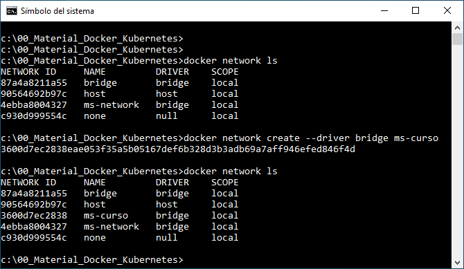
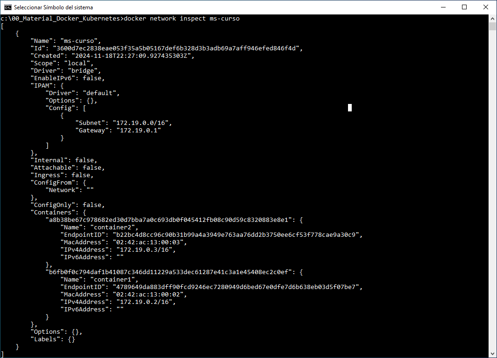

# Práctica 1.2. Docker Network

## Objetivos de la práctica:
Al finalizar la práctica serás capaz de:
- Crear y configurar redes en Docker, permitiendo la comunicación eficiente entre contenedores para el correcto funcionamiento de aplicaciones distribuidas.

## Duración aproximada:
- 25 minutos.

## Instrucciones

### Paso 1. Revisar las redes existentes en Docker

- Ejecutar el siguiente comando para listar las redes actuales:

    ```cmd
    docker network ls
    ```

<br/>

### Paso 2. Crear una red personalizada de tipo `bridge`

- Usar el siguiente comando para crear una red personalizada:

    ```cmd
    docker network create --driver bridge ms-curso
    ```

<br/>

### Paso 3. Verificar que la red se haya creado:

- Listar las redes nuevamente para confirmar la creación:

    ```cmd
    docker network ls
    ```

<br/>

### Paso 4. Crear dos contenedores conectados a la nueva red usando la imagen `alpine` para pruebas:

 ```cmd
    docker run -dit --name container1 --network ms-curso alpine sh
    docker run -dit --name container2 --network ms-curso alpine sh
 ```

<br/>

### Paso 5. Inspeccionar la red creada

- Usar el comando para inspeccionar detalles de la red ms-curso y verificar su configuración.

    ```cmd
    docker network inspect ms-curso
    ``` 
<br/>

### Paso 6. Probar la comunicación entre los contenedores

- Acceder al contenedor `container1`.

    ```cmd
    docker exec -it container1 sh
    ```

- Dentro del contenedor, realizar un ping a `container2`.

    ```sh
    ping container2
    ```

<br/>

### Paso 7. Desconectar un contenedor de la red

- Para desconectar un conetenedor de la red.

    ```cmd
    docker network disconnect ms-curso container1
    ```

<br/>

### Paso 8. Verificar que el contenedor ya no puede comunicarse:

- Intentar hacer un ping desde container1 a container2 nuevamente.

    ```sh
    ping container2
    ```

<br/>

### Paso 9. Reconectar el contenedor a la red

- Reconectar `container1` a la red.

    ```cmd
    docker network connect ms-curso container1
    ```

<br/>

### Paso 10. Limpiar los recursos creados

- Detener y eliminar los contenedores y la red creada.

 ```cmd
    docker rm -f container1 container2
    docker network rm ms-curso
 ```

<br/>

### Paso 11. Conclusión

- Al completar esta práctica, habrás aprendido a crear, administrar y verificar redes en Docker, además de probar comunicación entre contenedores.

<br/>

<br/>

## Resultado esperado

- La siguiente captura de pantalla muestra el antes y después de la creación la de red especificada en el práctica.




**Observaciones**:

1. Los campos tienen el siguiente significado:

    - **Network ID**: Es el identificador único asignado a la red por Docker, útil para operaciones específicas con redes mediante su ID.

    - **Name**: Es el nombre de la red, que puede ser asignado automáticamente por Docker o personalizado al crear la red.

    - **Driver**: Indica el tipo de controlador que gestiona la red. Los controladores comunes son:

        - **bridge**: Para redes locales, ideal para comunicación entre contenedores en el mismo host.
        - **host**: Usa la red del host directamente, sin aislamiento.
        - **none**: Sin conectividad de red.
        - **Scope**: Define el alcance de la red:

            - **local**: Disponible solo en el host actual.
            - **global**: Disponible en un clúster de Docker Swarm (si está configurado).

<br/>

- La siguiente captura de pantalla muestra el antes y después de crear los dos contenedores solicitados en la práctica.


**Observaciones**:

1. No hay puertos expuestos en ninguno de los contenedores creados.

<br/>

- La siguiente captura de pantalla muestra la instrucción `docker network inspect ms-curso`



**Observaciones**:

1. Puede apreciarse en la propiedad de `Containers` que los dos contenedores de la práctica pertenecen a la red `ms-curso`

<br/>

- La siguiente captura de pantalla ilustra la conexión a uno de los contenedores, donde se ejecutan algunos comandos de Linux. También se observa cómo el comando `ping` responde correctamente al enviar paquetes al otro contenedor dentro de la misma red Docker.


<br/>

- La siguiente captura de pantalla muestra el `disconnect` y `connect` de un contenedor a la red ms-curso.


**Observaciones**:

1. Al desconectar uno de los contenedores de la red, el intento de comunicación mediante `ping` al segundo contenedor falla, demostrando la pérdida de conectividad.

2. Al reconectar el contenedor a la red, se restablece la comunicación, y el `ping` al segundo contenedor vuelve a ser exitoso, confirmando la funcionalidad de la red.

3. Además, observa que no es necesario conocer las direcciones IP de los contenedores, ya que Docker gestiona la comunicación interna a través de su sistema **DNS**, permitiendo el uso de nombres de contenedor como identificadores.


<br/>

- La siguiente captura de pantalla muestra labores de limpieza, eliminamos los dos contenedores y la red solicitada en la práctica.


<br/>

