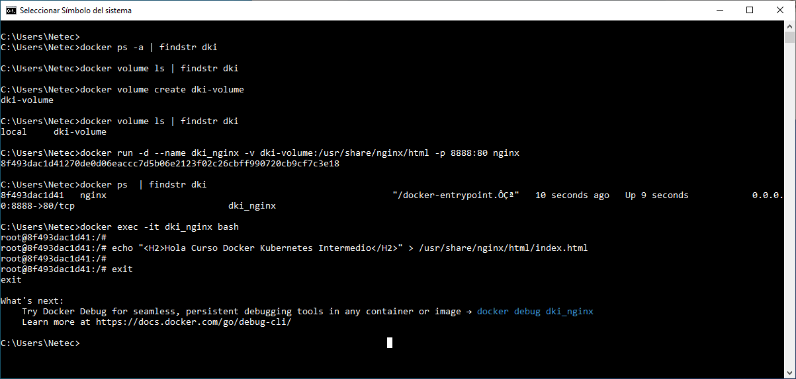
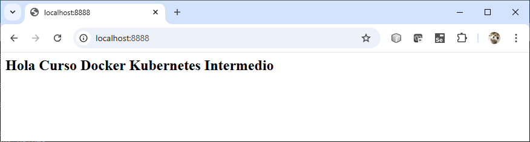
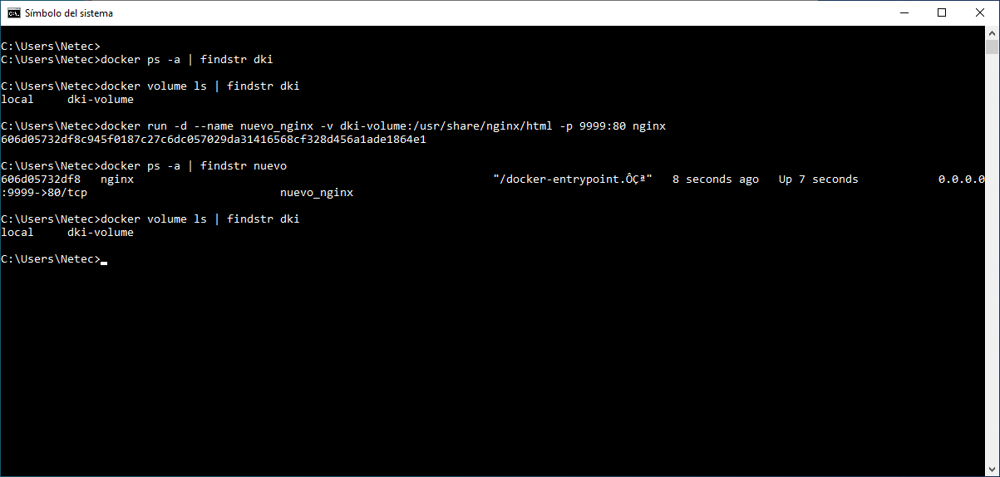
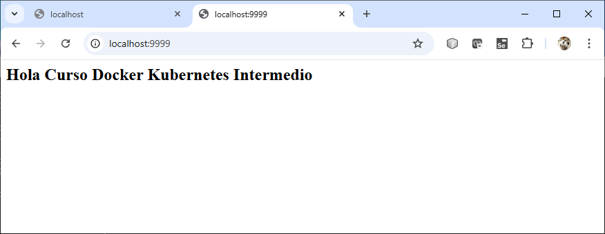
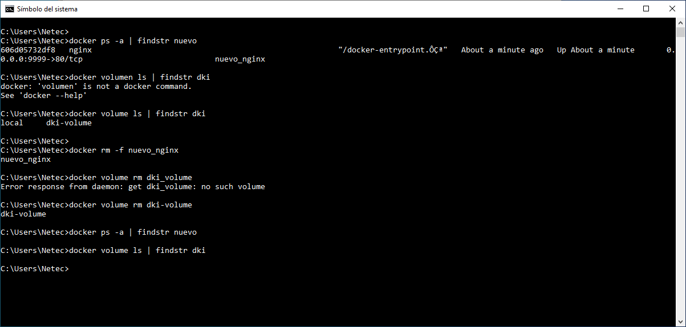

# Práctica 1.3. Docker Volume

## Objetivos de la práctica:
Al finalizar la práctica, serás capaz de:
- Utilizar volúmenes en Docker para gestionar datos persistentes, configurarlos en contenedores y verificar que la información persiste aunque los contenedores sean eliminados.

## Duración aproximada:
- 25 minutos.

## Instrucciones

### Paso 1. **Preparación del entorno**

- Asegúrate de tener Docker Desktop instalado y corriendo.

- Verificar que no haya contenedores ni voúmenes activos que puedan interferir usando:

    ```cmd
    docker ps -a | findstr dki
    docker volume ls | findstr dki
    ```
<br/>

### Paso 2. **Creación de un volume Docker**

- Crear un volumen llamado `dk-volumen`.

    ```cmd
    docker volume create dki-volume
    ```

- Verificar que el volumen ha sido creado:

    ```cmd
    docker volume ls
    ```

<br/>

### Paso 3. **Ejecución de un contenedor con el volumen**

- Lanzar un contenedor basado en la imagen oficial de nginx, adjuntando el volumen dk-volumen al directorio `/usr/share/nginx/html`.

    ```cmd
    docker run -d --name dki_nginx -v dki-volume:/usr/share/nginx/html -p 8888:80 nginx

    ```

- Confirmar que el contenedor esta ejecutandose en el puerto expuerto 8888.

<br/>

### Paso 4. **Crear un archivo dentro de volumen**

- Ingresar al contendor para interacturar con el volumen.

    ```cmd
    docker exec -it dki_nginx bash
    ```

- Dentro del contenedor, crear un archivo de ejemplo en el directorio donde está montado el volumen:

    ```bash
    echo "<H2>Hola Curso Docker Kubernetes Intermedio </H2>" > /usr/share/nginx/html/index.html
    ```

- Salir del contenedor.

    ```bash
    exit
    ```

<br/>

### Paso 5. **Probar el acceso al archivo**

Abrir un navegador web y visitar http://localhost:8888. Deberías ver el mensaje:

```html
    Hola Curso Docker Kubernetes Intermedio
```

<br/>

### Paso 6. **Eliminar el contenedor**

Eliminar el contenedor sin borrar el volumen.

```cmd
docker rm -f dki_nginx

# Verificar
docker ps -a
```

<br/>

### Paso 7. **Verificar la persistencia de datos**

- Crear un nuevo contenedor y montar nuevamente el volumen.

    ```cmd
    docker run -d --name nuevo_nginx -v dki-volume:/usr/share/nginx/html -p 9999:80 nginx

    # Verificar
    docker ps 

    ```

- Repetir el paso de prueba de acceso al archvio `http://localhost:9999. El mensaje persistente debería seguir disponible.

<br/>

### Paso 8. **Limpieza**

Al finalizar, eliminar el contenedor `dk_nginx` y el volumen `dk_volume`.

```cmd
docker rm -f nuevo_nginx
docker volume rm dki-volume
```

<br/>

### Paso 9. **Errores  comunes**

- Si el archvio no aparece en el navegador, verificar que el volumen esté correctamente montado y revisar los logs del contenedor.

```cmd
docker logs <nombre_contenedor>
```

<br/>

### Paso 10. **Conclusión**

- Está práctica permite comprender cómo Docker gestiona datos persistentes mediante volúmenes, asegurando que la información persista independientemnte del ciclo de vida de los contenedores.


<br/>

## Resultado esperado

- Captura de pantalla que muestra la creación del volumen, la creación del contenedor Docker y altera el valor de un archivo.



<br/>

- Captura de pantalla que muestra la salida en el navegador del archivo `index.html` en el contenedor.



<br/>

- Captura de pantalla que muestra la creación de un nuevo contenedor con el volumen previamente creado. No se muestra la eliminación del contenedor inicial.



<br/>

- Captura de pantalla que muestra la verificación del archivo alterado en el primer contenedor eliminado.



<br/>

- Captura de pantalla que muestra labores de limpieza al eliminar el nuevo contenedor y el primer volumen creado.



<br/>
