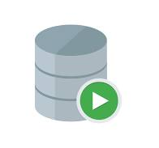

# Práctica 1.4. Oracle Container

## Objetivos de la práctica:

Al finalizar la práctica, serás capaz de:
- Configurar y desplegar Oracle Database en un contenedor Docker, utilizando redes y volúmenes para garantizar conectividad y persistencia.
- Validar la correcta operación de la base de datos mediante SQL Developer, ejecutando scripts SQL para crear y analizar su estructura y verificando la integración del contenedor con la red configurada en Docker.

## Duración aproximada:
- 25 minutos.

## Instrucciones

### Paso 1. Crear la red Docker

Para que el contenedor pueda comunicarse con otros servicio en el futuro, crear una red virtual Docker.

```cdm
# Verificar las redes creadas.
docker network ls

# Crear una nueva red.
docker network create dki-network

# Una forma más explicita de creación, esta forma es opcional, solo queda así para documentación.
# bridge es el valor predeterminado, es buena práctica especificar el tipo para mayor claridad en
# configuraciones más complejas.
docker network create --driver bridge dk-network

# Verificar la creación.
docker network ls

```

<br/>

### Paso 2. Crear el volumen Docker para persistencia

Recuerda que esto asegura que los datos se mantendrán aunque el contenedor sea eliminado.

```cdm
docker volume create dki-volume
```

<br/>


### Paso 3. Crear el contenedor para Oracle

Verificar las imagenes que aparacen en el entorno del curso y utilizar la imagen Oracle que tienes en el ambiente para crear un contenedor Oracle Database.

```cdm
docker run -d --name dki-oradb -e ORACLE_PWD=Netec_123 --network dki-network --volume dki-volume:/opt/oracle/oradata -p 1521:1521 -p 5500:5500 container-registry.oracle.com/database/express:21.3.0-xe
```

<br/>


### Paso 4. Verificar la creación del contenedor

Asegúrate que el contenedor se está ejecutando correctamente.

```cdm
# Desde Docker CLI
docker ps

# Desce S.O
netstat -ano | grep 1521

```

<br/>


### Paso 5. Conexión desde SQL Developer

1. Iniciar SQL-Developer.



<br/>

2. Crear una nueva conexión.

    - Nombre de la conexión: dba-sys
    - Ususario: sys
    - Rol: sysdba
    - Contraseña: Netec_123
    - Nombre del Host: localhost
    - Puerto: 1521
    - SID: xe

3. Probar conexión.

Si la conexión es exitosa, guardarla.


<br/>

### Paso 6. Analizar y ejecutar el script SQL

1. Copiar el siguiente contenido en la hoja de trabajo en SQL Developer.

```sql

-- Verificacion de entorno
SELECT SYS_CONTEXT('USERENV', 'CON_NAME') AS CURRENT_CONTAINER FROM DUAL;

-- Cambiarse a la PDB

ALTER SESSION SET CONTAINER = XEPDB1;

SELECT NAME, CON_ID FROM V$CONTAINERS;

-- Creación de ususario en la PDB

CREATE USER dkuser IDENTIFIED BY dkpassword
DEFAULT TABLESPACE users
TEMPORARY TABLESPACE temp;

-- Permisos 

GRANT CONNECT, RESOURCE TO dkuser;
ALTER USER dkuser QUOTA UNLIMITED ON users;


-- Espacio ilimitado en el tablespace users.

ALTER USER dkuser QUOTA UNLIMITED ON users;

-- Verificar la configuración

CONN dkuser/dkpassword@dkdatabase

CREATE TABLE test_table (
    id NUMBER GENERATED BY DEFAULT AS IDENTITY PRIMARY KEY,
    name VARCHAR2(100)
);
INSERT INTO test_table (name) VALUES ('Prueba');
SELECT * FROM test_table;

DROP Table test_table;


-- Verificación del nombre del servicio
SELECT NAME FROM V$SERVICES;


```

2. Ejecutar el script en SQL Developer.

    - Correr el script instrucción por instrucción o todas las instrucciones. 

3. Analizar la salida de la ejecución de las instrucciones SQL, para asegurarte que no haya errores en la ejecución.

4. Crear una nueva conexión en SQL Developer.

    - Nombre de la conexión: dkuser
    - Ususario: dkuser
    - Rol: valor por defecto
    - Contraseña: dkpassword
    - Nombre del Host: localhost
    - Puerto: 1521
    - Service: xepdb1


<br/>


3. Probar conexión.

Si la conexión es exitosa, guardar y conectarse a una hoja de trabajo.


<br/>


### Paso 7. Varificar la estructura y componenetes creados

1. En SQL Developer, expandir las siguientes secciones bajo la conexión:

- **Tablas**: verificar que las tablas definidas en el script hayan sido creadas.

- **Vistas, índices y procedimiento almacenos** (si los hay): revisar que estén disponibles

```sql
# Consultar las tablas creadas para el usuario dkuser.
desc user_tables;
select table_name from user_tables;

# En este punto no debe de haber creado ninguna tabla.

 
```

<br/>


### Paso 8. Verificar que el contenedor esté asociado a la red.

Ejecutar el siguiente comando para inspeccionar la red `dki-network`y confirmar que el contenedor `dki-oradb`está asociado.

```cdm
docker network inspect dki-network
```

Buscar en la salida un bloque como el siguiente:

```json
"Containers": {
    "<Container_ID>": {
        "Name": "dki-oradb",
        "EndpointID": "...",
        "MacAddress": "...",
        "IPv4Address": "...",
        "IPv6Address": "..."
    }
}

```

Si `dki-oradb`aparece, la red está correctamente configurada.

<br/>

### Paso 9. Conclusión

Una vez realizados los pasos anteriores, tendrás:

1. Oracle Database dockerizado y en ejecución con persistencia.

2. Una conexión configurada en SQL Developer para interactuar con la base de datos.

3. La estructura y componentes definidos en el script SQL creados y verificados.

4. La red `dki-network` correctamente asociada al contenedor `dki-oracledb`.

<br/>
<br/>

## Resultado esperado

- Captura de pantalla que muestra la verificación de la red, la creación y verificación del volumen. Además muestra la creación del contenedor con el servidor de base de datos Oracle.


<br/>

- Captura de pantalla que muestra la verificación del contenedor Oracle Database y el estado del puerto `1521`.


<br/>

- Captura de pantalla que muestra que inicialmente el usuario `dkuser` con contraseña `dkpassword` se puede conectar al servidor de base de datos, pero no tiene ninguna tabla en su esquema.


<br/>


- Captura de pantalla que muestra como en la red `dki-network` se encuentra el contenedor de base de datos Oracle.


<br/>
