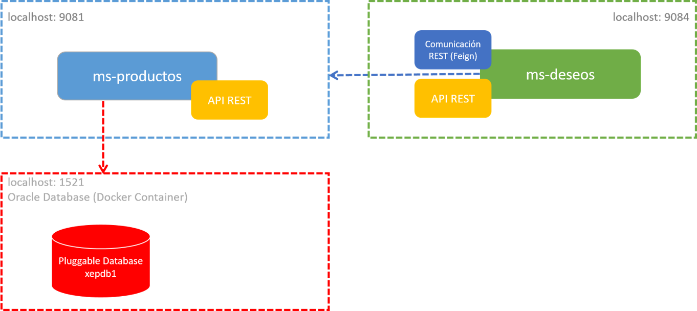
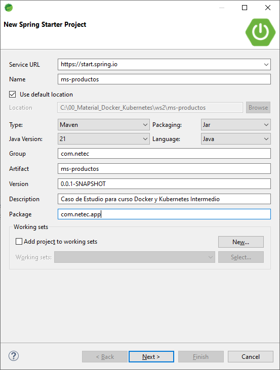
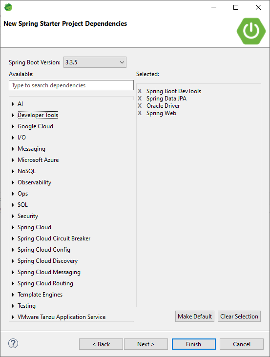
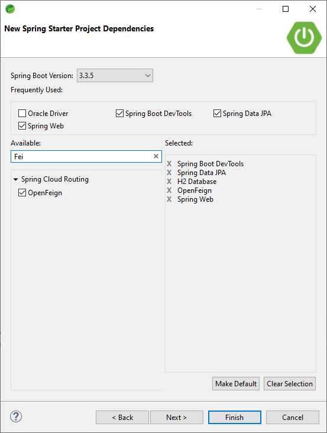
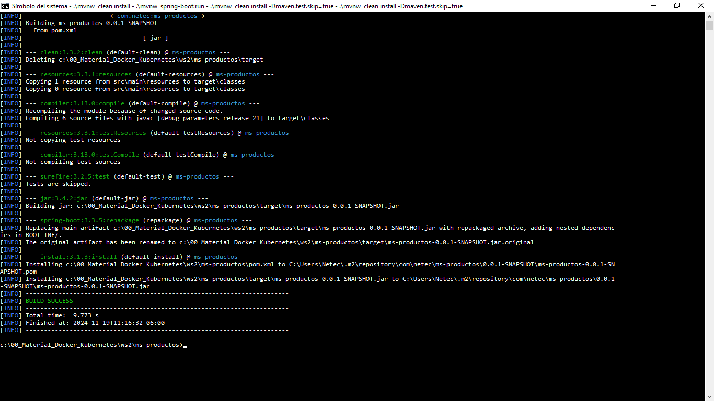
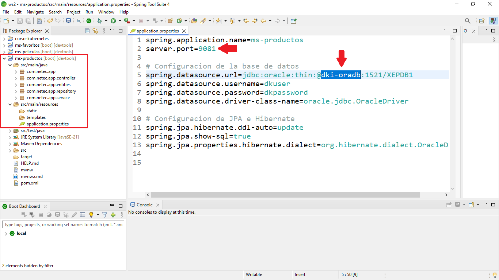
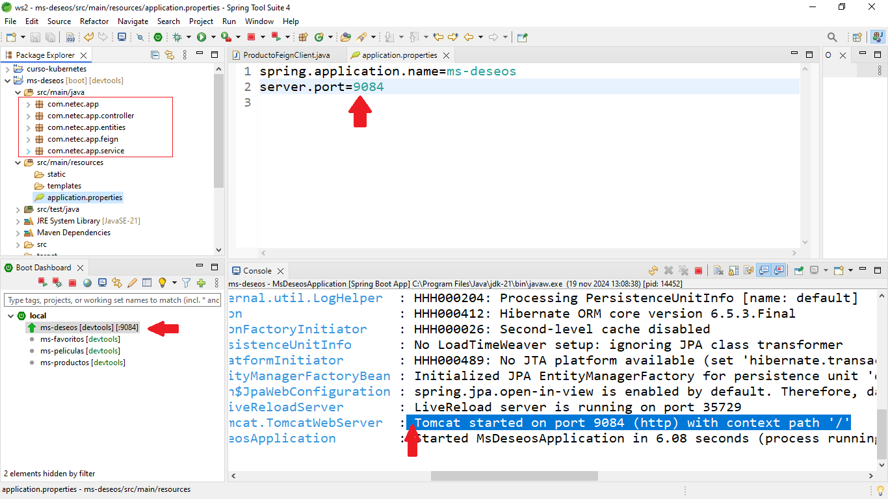

# Práctica 1.5. Caso de estudio (ms-productos & ms-deseos)

## Objetivos de la práctica:
Al finalizar esta práctica, serás capaz de:
- Implementar y consumir microservicios en una arquitectura basada en comunicación HTTP, utilizando Spring Boot y Feign como cliente declarativo, para resolver casos de estudio prácticos. 

## Duración aproximada:
- 80 minutos.

## Objetivo visual


<br/>

## Pasos sugeridos para la implementación

1. **Crear el microservicio**:  `ms-productos`:

    - Utilizar Spring Boot con **JPA** para gestionar la persistencia.

    - Configurar la base de datos en una PDB1 de Oracle Database Contenedorizada.

    - Implementar los controladores, servicios y repositorios para el CRUD de productos.

2. **Crear el microservicio**: `ms-deseos`:

    - Utilizar Spring Boot sin base de datos, manteniendo los datos en una lista en memoria.

    - Configurar un cliente Feign para consumir ms-productos.

3. **Dockerizar ambos microservicios**:

    - Esta parte se encuentra en la siguiente práctica.

<br/>

## Instrucciones para el microservicio: ms-productos

### Paso 1. Crear el proyecto

1. Usar Spring Initializr o tu IDE, por ejemplo, STS.

2. Configuración inicial:

    - Maven Project, Java 21, empaquetado JAR.

    

    - Dependencias: Spring Web, Spring Data JPA, Oracle Driver.

    


<b/>

### Paso 2. Configurar el àpplication.properties`

Configurar la conexión a la base de datos y el puerto, 9081.

```properties
spring.application.name=ms-productos
server.port=9081

# Configuracion de la base de datos.
spring.datasource.url=jdbc:oracle:thin:@dki-oradb:1521/XEPDB1
spring.datasource.username=dkuser
spring.datasource.password=dkpassword
spring.datasource.driver-class-name=oracle.jdbc.OracleDriver

# Configuracion de JPA e Hibernate.
spring.jpa.hibernate.ddl-auto=update
spring.jpa.show-sql=true
spring.jpa.properties.hibernate.dialect=org.hibernate.dialect.OracleDialect

```

<b/>

### Paso 3. Crear la entidad Producto

- Crear el paquete entities y copiar el código siguiente:

```java
package com.netec.app.entities;

import jakarta.persistence.*;

@Entity
@Table (name = "productos")
public class Producto {

    @Id
    @GeneratedValue(strategy = GenerationType.IDENTITY)
    private Long id;

    @Column(nullable = false, unique = true)
    private String nombre;

    private String descripcion;

    @Column(nullable = false)
    private Double precio;

    @Column(nullable = false)
    private Integer stock;

    // Getters y Setters
    public Long getId() {
        return id;
    }

    public void setId(Long id) {
        this.id = id;
    }

    public String getNombre() {
        return nombre;
    }

    public void setNombre(String nombre) {
        this.nombre = nombre;
    }

    public String getDescripcion() {
        return descripcion;
    }

    public void setDescripcion(String descripcion) {
        this.descripcion = descripcion;
    }

    public Double getPrecio() {
        return precio;
    }

    public void setPrecio(Double precio) {
        this.precio = precio;
    }

    public Integer getStock() {
        return stock;
    }

    public void setStock(Integer stock) {
        this.stock = stock;
    }
}

```

<br/>

### Paso 4. Crear el repositorio

- Crear el paquete repository y agregar la siguiente interface.


```java
package com.netec.app.repository;

import org.springframework.data.jpa.repository.JpaRepository;

import com.netec.app.entities.Producto;

public interface ProductoRepository extends JpaRepository<Producto, Long> {
    boolean existsByNombre(String nombre);
}

```

<br/>

### Paso 5. Crear el servicio

- Crear el paquete service y agregar la interface siguiente:

```java
package com.netec.app.service;

import java.util.List;
import java.util.Optional;

import com.netec.app.entities.Producto;

public interface IProductoService {
	public List<Producto> listarTodos() ;
	public Optional<Producto> obtenerPorId(Long id);
	public Producto guardar(Producto producto);
	public Producto actualizar(Long id, Producto productoActualizado);
	public void eliminar(Long id);
}

```
<br/>

- Crear la clase que implemente la interface `IProductoService`.

```java
package com.netec.app.service;

import java.util.List;
import java.util.Optional;

import org.springframework.stereotype.Service;

import com.netec.app.entities.Producto;
import com.netec.app.repository.ProductoRepository;

@Service
public class ProductoServiceImpl implements IProductoService {

	private final ProductoRepository productoRepository;

	public ProductoServiceImpl(ProductoRepository productoRepository) {
		this.productoRepository = productoRepository;
	}

	@Override
	public List<Producto> listarTodos() {
		return productoRepository.findAll();
	}

	@Override
	public Optional<Producto> obtenerPorId(Long id) {
		return productoRepository.findById(id);
	}

	@Override
	public Producto guardar(Producto producto) {
		if (productoRepository.existsByNombre(producto.getNombre())) {
			throw new IllegalArgumentException("El producto ya existe con ese nombre.");
		}
		return productoRepository.save(producto);
	}

	@Override
	public Producto actualizar(Long id, Producto productoActualizado) {
		return productoRepository.findById(id).map(producto -> {
			producto.setNombre(productoActualizado.getNombre());
			producto.setDescripcion(productoActualizado.getDescripcion());
			producto.setPrecio(productoActualizado.getPrecio());
			producto.setStock(productoActualizado.getStock());
			return productoRepository.save(producto);
		}).orElseThrow(() -> new IllegalArgumentException("Producto no encontrado"));
	}

	@Override
	public void eliminar(Long id) {
		productoRepository.deleteById(id);
	}
}

```

<br/>

### Paso 6. Crear el controlador

- Crear el paquete controller y agregar la clase `ProductoController`.

```java

package com.netec.app.controller;

import java.util.List;

import org.springframework.http.ResponseEntity;
import org.springframework.web.bind.annotation.DeleteMapping;
import org.springframework.web.bind.annotation.GetMapping;
import org.springframework.web.bind.annotation.PathVariable;
import org.springframework.web.bind.annotation.PostMapping;
import org.springframework.web.bind.annotation.PutMapping;
import org.springframework.web.bind.annotation.RequestBody;
import org.springframework.web.bind.annotation.RequestMapping;
import org.springframework.web.bind.annotation.RestController;

import com.netec.app.entities.Producto;
import com.netec.app.service.IProductoService;

@RestController
@RequestMapping("/productos")
public class ProductoController {

	private final IProductoService productoService;

	public ProductoController(IProductoService productoService) {
		this.productoService = productoService;
	}

	@GetMapping
	public ResponseEntity<List<Producto>> listarTodos() {
		return ResponseEntity.ok(productoService.listarTodos());
	}

	@GetMapping("/{id}")
	public ResponseEntity<Producto> obtenerPorId(@PathVariable Long id) {
		return productoService.obtenerPorId(id).map(ResponseEntity::ok).orElse(ResponseEntity.notFound().build());
	}

	@PostMapping
	public ResponseEntity<Producto> crear(@RequestBody Producto producto) {
		return ResponseEntity.ok(productoService.guardar(producto));
	}

	@PutMapping("/{id}")
	public ResponseEntity<Producto> actualizar(@PathVariable Long id, @RequestBody Producto producto) {
		return ResponseEntity.ok(productoService.actualizar(id, producto));
	}

	@DeleteMapping("/{id}")
	public ResponseEntity<Void> eliminar(@PathVariable Long id) {
		productoService.eliminar(id);
		return ResponseEntity.noContent().build();
	}
}

```
<br/>

### Paso 7. Compilar y empaquetar (JAR)

1. Empaquetar la aplicación usando lo siguiente:

```cmd 
cd <carpeta del proyecto ms-productos>

# Genera el JAR.

.\mvnw clean install -Dmaven.test.skip=true

```

<br/>

<br/>


## Instrucciones para el microservicio: ms-deseos

### Paso 1. Crear el proyecto

1. Configuración inicial

- Crear un nuevo proyecto con la siguiente configuración inicial.


- Agregar las dependencias: Spring Web, Spring Boot OpenFeign.




<br/>

### Paso 2. Configurar las propiedades de la aplicación

- Configurar el archivo `application.properties` para que Feign pueda realizar las solicitudes a ms-productos.

```properties
spring.application.name=ms-deseos
server.port=9084

```

<br/>

### Paso 3. Crear la entidad para la lista de Deseos

- Crear el paquete entities y agregar la case `Deseo`.

```java
package com.netec.app.entities;

import java.time.LocalDateTime;

public class Deseo {

	private Long idProducto;
	private String nombre;
	private Double precio;
	private LocalDateTime fechaAgregado;

	// Constructor vacío
	public Deseo() {
	}

	// Constructor completo
	public Deseo(Long idProducto, String nombre, Double precio, LocalDateTime fechaAgregado) {
		this.idProducto = idProducto;
		this.nombre = nombre;
		this.precio = precio;
		this.fechaAgregado = fechaAgregado;
	}

	// Getters y Setters
	public Long getIdProducto() {
		return idProducto;
	}

	public void setIdProducto(Long idProducto) {
		this.idProducto = idProducto;
	}

	public String getNombre() {
		return nombre;
	}

	public void setNombre(String nombre) {
		this.nombre = nombre;
	}

	public Double getPrecio() {
		return precio;
	}

	public void setPrecio(Double precio) {
		this.precio = precio;
	}

	public LocalDateTime getFechaAgregado() {
		return fechaAgregado;
	}

	public void setFechaAgregado(LocalDateTime fechaAgregado) {
		this.fechaAgregado = fechaAgregado;
	}
}

```

<br/>

### Paso 4. Crear el cliente feign

- Crear el paquete feign y agregar la siguiente interface.

```java
package com.netec.app.feign;

import org.springframework.cloud.openfeign.FeignClient;
import org.springframework.web.bind.annotation.GetMapping;
import org.springframework.web.bind.annotation.PathVariable;

// Observar como la URL apunta ya al microservicio contenedorizado
@FeignClient(name = "ms-productos", url = "http://ms-productos:9081")
public interface ProductoFeignClient {

	@GetMapping("/productos/{id}")
	Producto obtenerProductoPorId(@PathVariable Long id);

    // Member class
	class Producto {
		private Long id;
		private String nombre;
		private String descripcion;
		private Double precio;
		private Integer stock;

		// Getters y Setters
		public Long getId() {
			return id;
		}

		public void setId(Long id) {
			this.id = id;
		}

		public String getNombre() {
			return nombre;
		}

		public void setNombre(String nombre) {
			this.nombre = nombre;
		}

		public String getDescripcion() {
			return descripcion;
		}

		public void setDescripcion(String descripcion) {
			this.descripcion = descripcion;
		}

		public Double getPrecio() {
			return precio;
		}

		public void setPrecio(Double precio) {
			this.precio = precio;
		}

		public Integer getStock() {
			return stock;
		}

		public void setStock(Integer stock) {
			this.stock = stock;
		}
	}
}

```

<br/>

### Paso 5. Crear el servicio

- Crear la interface IDeseoService y copiar el siguiente código:

```java
package com.netec.app.service;

import java.util.List;

import com.netec.app.entities.Deseo;

public interface IDeseoService {
	public List<Deseo> listarDeseos();

	public Deseo agregarDeseo(Long idProducto);

	public void eliminarDeseo(Long idProducto);
}

```

- Crear la clase IDeseoServiceImpl con la implementación del servicio.

```java

package com.netec.app.service;

import java.time.LocalDateTime;
import java.util.ArrayList;
import java.util.List;

import org.springframework.stereotype.Service;

import com.netec.app.entities.Deseo;
import com.netec.app.feign.ProductoFeignClient;

@Service
public class DeseoServiceImpl implements IDeseoService {

	private final ProductoFeignClient productoClient;
	private final List<Deseo> deseos = new ArrayList<>();

	public DeseoServiceImpl(ProductoFeignClient productoClient) {
		this.productoClient = productoClient;
	}

	@Override
	public List<Deseo> listarDeseos() {
		return deseos;
	}

	@Override
	public Deseo agregarDeseo(Long idProducto) {
		ProductoFeignClient.Producto producto = productoClient.obtenerProductoPorId(idProducto);
		Deseo nuevoDeseo = new Deseo(producto.getId(), producto.getNombre(), producto.getPrecio(), LocalDateTime.now());
		deseos.add(nuevoDeseo);
		return nuevoDeseo;
	}

	@Override
	public void eliminarDeseo(Long idProducto) {
		deseos.removeIf(deseo -> deseo.getIdProducto().equals(idProducto));
	}
}


```

<br/>

### Paso 6. Crear el controlador

Crear el paquete controller y crear la clase DeseoController con el siguiente código:

```java
package com.netec.app.controller;

import java.util.List;

import org.springframework.http.ResponseEntity;
import org.springframework.web.bind.annotation.DeleteMapping;
import org.springframework.web.bind.annotation.GetMapping;
import org.springframework.web.bind.annotation.PathVariable;
import org.springframework.web.bind.annotation.PostMapping;
import org.springframework.web.bind.annotation.RequestMapping;
import org.springframework.web.bind.annotation.RestController;

import com.netec.app.entities.Deseo;
import com.netec.app.service.IDeseoService;

@RestController
@RequestMapping("/deseos")
public class DeseoController {

	private final IDeseoService deseoService;

	public DeseoController(IDeseoService deseoService) {
		this.deseoService = deseoService;
	}

	@GetMapping
	public ResponseEntity<List<Deseo>> listarDeseos() {
		return ResponseEntity.ok(deseoService.listarDeseos());
	}

	@PostMapping("/{idProducto}")
	public ResponseEntity<Deseo> agregarDeseo(@PathVariable Long idProducto) {
		return ResponseEntity.ok(deseoService.agregarDeseo(idProducto));
	}

	@DeleteMapping("/{idProducto}")
	public ResponseEntity<Void> eliminarDeseo(@PathVariable Long idProducto) {
		deseoService.eliminarDeseo(idProducto);
		return ResponseEntity.noContent().build();
	}
}

```

<br/>

### Paso 7. Configurar la clase principal

- Habilitar Feign declarando `@EnableFeignClients` en la clase principal.

```java
package com.netec.app;

import org.springframework.boot.SpringApplication;
import org.springframework.boot.autoconfigure.SpringBootApplication;
import org.springframework.cloud.openfeign.EnableFeignClients;

@EnableFeignClients
@SpringBootApplication
public class MsDeseosApplication {

	public static void main(String[] args) {
		SpringApplication.run(MsDeseosApplication.class, args);
	}

}

```

<br/>

### Paso 8. Compilar y empaquetar (JAR)

1. Empaquetar la aplicación usando lo siguiente:

```cmd 
cd <carpeta del proyecto ms-deseos>

# Generar el JAR.

.\mvnw clean install  

```

2. Este microservicio puede iniciarse, pero solo puedes consultar hasta este momento los productos deseados.

<br/>

<br/>
<br/>

### Conclusión

- Hasta este momento solo tenemos los JAR de dos microservcios (ms-productos & ms-deseos).

- Si tuvieramos una instancia de Oracle Database local y las propiedades del proyecto ms-productos apuntando correctamente, podríamos probar el microservcio ms-productos y en consecuencia también toda la funcionalidad del microservicio ms-deseos.

- No se recomienda desplegar cosas a producción sin haber pasado por un estricto control de pruebas.

- En el servicio ms-deseos se agregó la dependencia a JPA y H2, pero no se usa se mantienen los productos deseados en memoria.

<br/>

<br/>

## Resultado esperado

- Captura de pantalla que muestra la construcción exitosa de ms-productos.



<br/>

- Captura de pantalla que muestra la estructura del proyecto ms-productos, además muestra el contenido del archivo `application.properties`.




<br/>

- Captura de pantalla que muestra la construcción, el empaquetamiento y ejecución de `ms-deseos`.




<br/>
