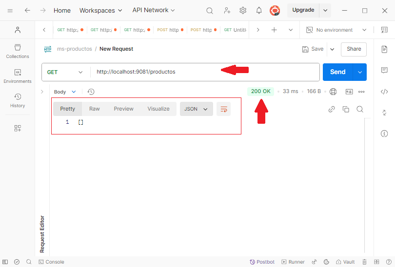

# Práctica 1.7. Consumo de microservicios - Caso de estudio

## Objetivos de las prácticas:
Al finalizar esta práctica, serás capaz de:
- Consumir microservicios mediante el uso de herramientas como Postman o implementaciones en código.  

## Duración aproximada:
- 25 minutos.

<br/>

## Preparativos

1. Asegúrate de que el microservicio `ms-productos` esté en ejecución y accesible en el puerto 9081.

2. Abrir Postman y opcionalmente crear una colección para organizar las solicitudes relacionadas con el microservicio.

3. Asegúrate de que el microservicio `ms-deseos` esté en ejecución y accesible en http://localhost:9084.

4. Abrir Postman y opcionalmente crear una nueva colección llamada ms-deseos.

<br/>

## Instrucciones 

### Paso 1. Obtener todos los productos

- Método HTTP: GET
- URL: http://localhost:9081/productos
- Descripción: Recuperar una lista de todos los productos disponibles.
- Paso en Postman:
    1. Crear una nueva solicitud en la colección ms-productos con el método GET y la URL especificada.
    2. Ejecutar la solicitud y verificar que se devuelva una lista en formato JSON.

<br/>

### Paso 2. Obtener un producto por ID
- Método HTTP: GET
- URL: http://localhost:9081/productos/{id}
- Reemplazar {id} con el ID de un producto existente, por ejemplo, 1.
- Descripción: Recuperar los detalles de un producto específico por su ID.
- Paso en Postman:
    1. Crear una nueva solicitud con el método GET y la URL especificada.
    2. Probar con un ID existente y verificar los detalles del producto en la respuesta.

<br/>

### Paso 3. Crear un nuevo producto
- Método HTTP: POST
- URL: http://localhost:9081/productos
- Cuerpo (Body):
    - Seleccionar el tipo JSON y utilizar el siguiente ejemplo:
    ```json
    {
    "nombre": "Producto A",
    "descripcion": "Descripción del Producto A",
    "precio": 100.0,
    "stock": 50
    }
    ```

- Descripción: Agregar un nuevo producto a la base de datos.
- Paso en Postman:
    1. Crear una nueva solicitud con el método POST, la URL especificada y el cuerpo en formato JSON.
    2. Ejecutar la solicitud y verificar que se cree un nuevo producto con el ID generado.

<br/>

### Paso 4. Actualizar un producto existente
- Método HTTP: PUT
- URL: http://localhost:9081/productos/{id}
- Reemplazar {id} con el ID de un producto existente, por ejemplo, 1.
- Cuerpo (Body):
    - Seleccionar el tipo JSON y utilizar el siguiente ejemplo:

    ```json
    {
    "nombre": "Producto B",
    "descripcion": "Descripción actualizada del produto B",
    "precio": 150.0,
    "stock": 40
    }
    ```

- Descripción: Actualizar los detalles de un producto existente.
- Paso en Postman:
    1. Crear una nueva solicitud con el método PUT, la URL especificada y el cuerpo en formato JSON.
    2. Ejecutar la solicitud y verificar que los cambios se reflejen al consultar el producto actualizado.

<br/>

### Paso 5. Eliminar un producto por ID
- Método HTTP: DELETE
- URL: http://localhost:9081/productos/{id}
- Reemplazar {id} con el ID de un producto existente, por ejemplo, 1.
- Descripción: Eliminar un producto específico por su ID.
- Paso en Postman:
    1. Crear una nueva solicitud con el método DELETE y la URL especificada.
    2. Ejecutar la solicitud y verificar que el producto ya no exista al intentar recuperarlo.

<br/>

### Paso 6. Validación del microservcio ms-productos

- Probar cada uno de los endpoints utilizando Postman.

- Documentar las respuestas obtenidas, incluyendo los códigos de estado HTTP (200, 201, 204, 404, etc.).

- Verificar que las operaciones cumplan con los objetivos definidos para la práctica.
 
<br/>


### Paso 7. Listar todos los deseos

- Método HTTP: GET
- URL: http://localhost:9084/deseos
- Descripción: Recuperar una lista con todos los productos en la lista de deseos.
- Paso en Postman:
    1. Crear una nueva solicitud en la colección ms-deseos con el método GET y la URL especificada.
    2. Ejecutar la solicitud y verificar que se devuelva una lista en formato JSON.

<br/>

### Paso 8. Agregar un producto a la lista de deseos

- Método HTTP: POST
- URL: http://localhost:9084/deseos/{idProducto}
- Reemplazar {idProducto} con el ID de un producto existente (por ejemplo, 1).
- Descripción: Agregar un producto a la lista de deseos usando su ID.
- Paso en Postman:
    1. Crear una nueva solicitud con el método POST y la URL especificada.
    2. Ejecutar la solicitud y verificar que se devuelva el producto agregado en la respuesta, incluyendo los detalles como idProducto, nombre, precio y fechaAgregado.

<br/>

### Paso 9. Eliminar un producto de la lista de deseos

- Método HTTP: DELETE
- URL: http://localhost:9084/deseos/{idProducto}
- Reemplazar {idProducto} con el ID de un producto existente en la lista de deseos (por ejemplo, 1).
- Descripción: Eliminar un producto específico de la lista de deseos utilizando su ID.
- Paso en Postman:
    1. Crear una nueva solicitud con el método DELETE y la URL especificada.
    2. Ejecutar la solicitud y verificar que el producto sea eliminado correctamente al listar los deseos nuevamente.

<br/>

### Paso 10. Validación del microservcio ms-deseos

- Probar cada uno de los endpoints utilizando Postman.

- Documentar las respuestas obtenidas, incluyendo los códigos de estado HTTP (200, 201, 204, 404, etc.)

- Verificar que las operaciones cumplan con los objetivos definidos para la práctica.

<br/>

### Paso 11. Notas adicionales

- La lista de deseos no tiene persistencia; los datos se manejan en memoria. Por lo tanto, al reiniciar el microservicio, los datos se perderán.

- Asegúrate de que los IDs de productos utilizados para agregar o eliminar existan en el microservicio ms-productos (en el puerto 9081).


<br/>
<br/>

## Resultado esperado

- Captura de pantalla que muestra los contenedores involucrados en la preparación de la prática 1.7.


<br/>

- Captura de pantalla que muestra el consumo inicial de productos disponibles, HTTP 200 OK.



<br/>

- Captura de pantalla que muestra el consumo de un producto que no existe, HTTP 404 Not Found. 


<br/>

- Captura de pantalla que muestra la inserción de un producto, HTTP 200 OK.


<br/>

- Captura de pantalla que muestra la actualización de un producto, HTTP 200 OK.


<br/>


- Captura de pantalla que muestra la eliminación de un producto, HTTP 204 No Content.


<br/>


- Captura de pantalla que muestra la lista de los productos, HTTP 200 OK.


<br/>


- Captura de pantalla que muestra la lista de deseos, HTTP 200 OK.


<br/>


- Captura de pantalla que muestra la agregación de un deseo, HTTP 200 OK.


<br/>


- Captura de pantalla que muestra la lista de deseos, HTTP 200 OK.


<br/>

- Captura de pantalla que muestra la eliminación de un deseo, HTTP 204 No Content.


<br/>

- Captura de pantalla que muestra el estado actual de la lista de deseos, HTTP 200 OK.


<br/>
