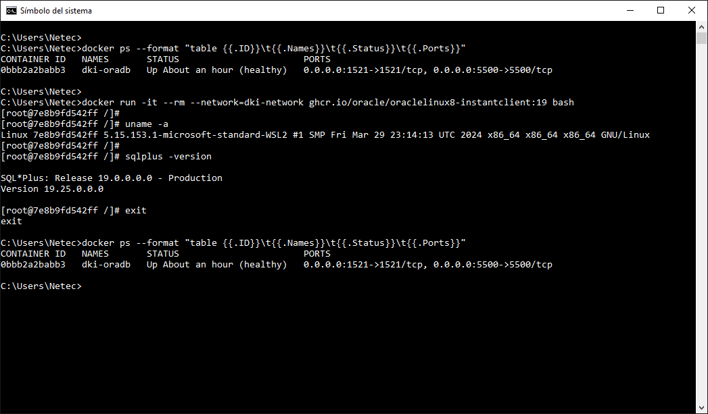
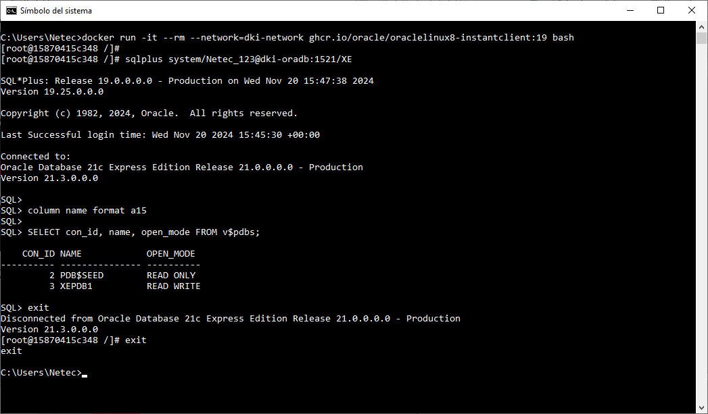
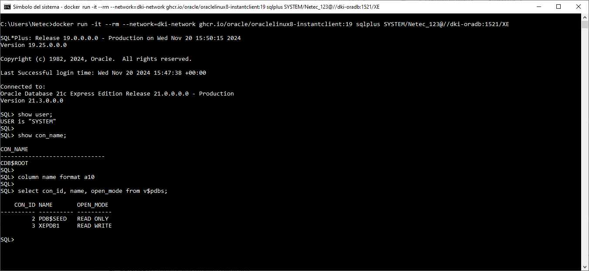
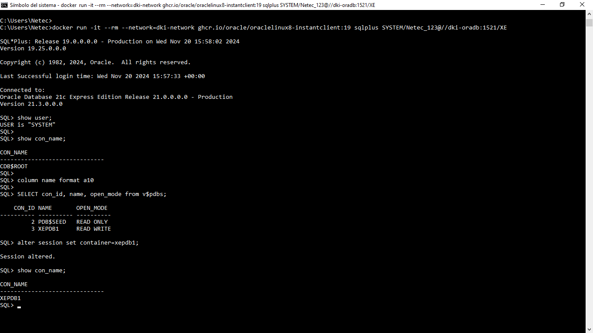
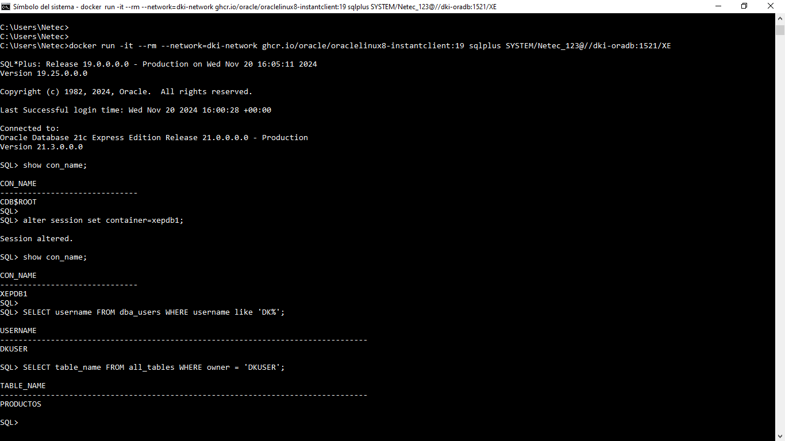
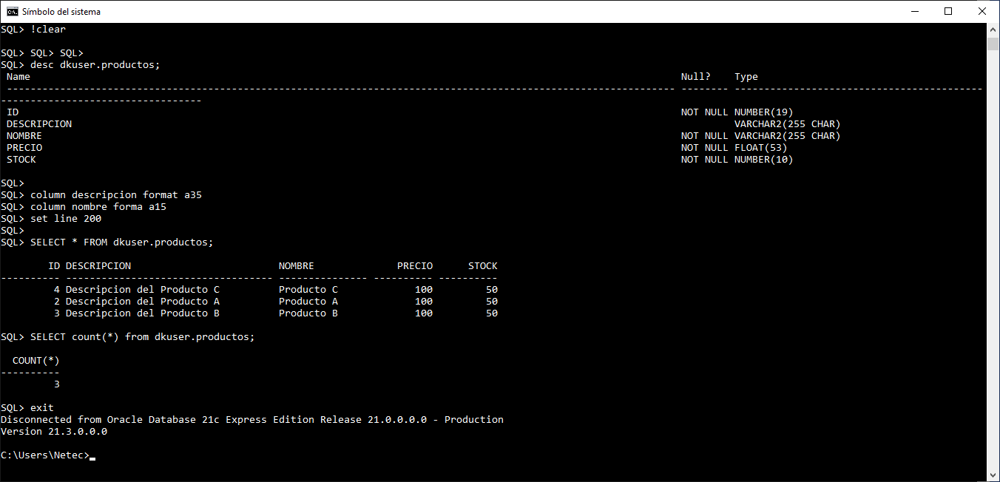

# Práctica 1.8. Contenedor utilitario

## Objetivos de la práctica:
Al finalizar esta práctica, serás capaz de:
- Crear y utilizar un contenedor Docker utilitario con un cliente ligero para conectarte a la base de datos del microservicio ms-productos utilizando SQL*Plus.

## Duración aproximada:
- 25 minutos.

## Instrucciones

### Paso 1. Verificar el contenedor Oracle

Antes de proceder, asegúrate de que el contenedor Oracle llamado `dki-oradb` está en ejecución y accesible. 

1. Listar los contenedores activos:

```cmd
docker ps
```

2. Verificar que el contenedor `dki-oradb` está en la lista con el puerto mapeado, por ejemplo, 1521 para Oracle DB.

<br/>

### Paso 2. Crear un contenedor utilitario con SQL*Plus

Vamos a usar una imagen ligera de Oracle Instant Client para conectarnos a la base de datos.

1. Ejecutar el siguiente comando para lanzar un contenedor interactivo:


```cmd
docker run -it --rm --network=dki-network ghcr.io/oracle/oraclelinux8-instantclient:19 bash
```

**Nota**: 

    1. Solo por curiosidad, puedes verificar que version de Linux tienes en ese contenedor.


<br/>

### Paso 3. Verificar SQL*Plus

Dentro del contenedor interactivo, ejecutar los siguientes comandos:

1. Verificar que SQL*Plus está instalado:

```cmd
sqlplus -version
```

2. Conectar usando el siguiente comando, ajustando los valores según tu configuración (usuario, contraseña y servicio):

```cmd
sqlplus USERNAME/PASSWORD@HOST:PORT/SERVICENAME
```

Ejemplo (ajustar según sea necesario):

```cmd
sqlplus system/Netec_123@dki-oradb:1521/XE
```

3. Puedes verificar las PDBs configuradas hasta este momento.

```sql
column name format a15
SELECT con_id, name, open_mode FROM v$pdbs;
exit

```

4. Desconectarse del contenedor utilitario.

```cmd
exit
```

<br/>

### Paso 4. Crear un contenedor utilitario con SQL*Plus

Vamos a usar una imagen ligera de Oracle Instant Client para conectarnos a la base de datos.

1. Ejecutar el siguiente comando para lanzar un contenedor interactivo:

```cmd
docker run -it --rm --network=dki-network ghcr.io/oracle/oraclelinux8-instantclient:19 sqlplus SYSTEM/Netec_123@//dki-oradb:1521/XE
```

<br/>


2. Una vez conectado, puedes consultar la tabla creada por el microservicio `ms-productos`. Por ejemplo:

```sql

show user;

show con_name;

column name format a10

SELECT con_id, name, open_mode from v$pdbs;

alter session set container=xepdb1;

show con_name;

SELECT username FROM dba_users WHERE username like 'DK%'; 

SELECT table_name FROM all_tables WHERE owner = 'DKUSER';   

desc dkuser.productos;

column descripcion format a35

column nombre format a15

set line 200

SELECT * FROM dkuser.productos;

SELECT count(*) from dkuser.productos;

exit
```

### Notas

- Si necesitas un alias para simplificar la conexión con SQL*Plus, puedes configurarlo en el archivo **tnsnames.ora**. Esto puede hacerse en un paso avanzado si decides persistir la configuración del contenedor utilitario.

- Asegúrate de revisar que los puertos y credenciales sean los correctos antes de intentar conectarte.

<br/> <br/>

## Resultado esperado

- Captura de pantalla que muestra que el contenedor con la base de datos Oracle está en ejecución y correctamente configurado.



<br/>

- Captura de pantalla que muestra la creación de un contenedor utilitario con SQL*Plus, junto con la forma de conectarse a la base de datos en el contenedor dki-oradb.



<br/>

- Captura de pantalla que muestra la conexión directa a la base de datos Oracle en el contenedor dki-oradb sin pasar por bash. Incluye instrucciones SQL, como el usuario conectado, la base de datos actual y el estado de las PDBs.



<br/>

- Captura de pantalla que muestra cómo, desde un contenedor utilitario con SQL*Plus, se altera la sesión para trabajar en el contexto de la pluggable database XEPDB1.



<br/>

- Captura de pantalla que muestra la creación de un conetenedor utilitario con SQL*Plus, al que se cambia de base de datos XEPDB, verifica la existencia del usuario dkuser, así como las tablas asociadas a su esquema.



<br/>

- Captura de pantalla que muestra la estructura de la tabla Productos, verificando y contabilizando los registros existentes en la misma.



<br/>
