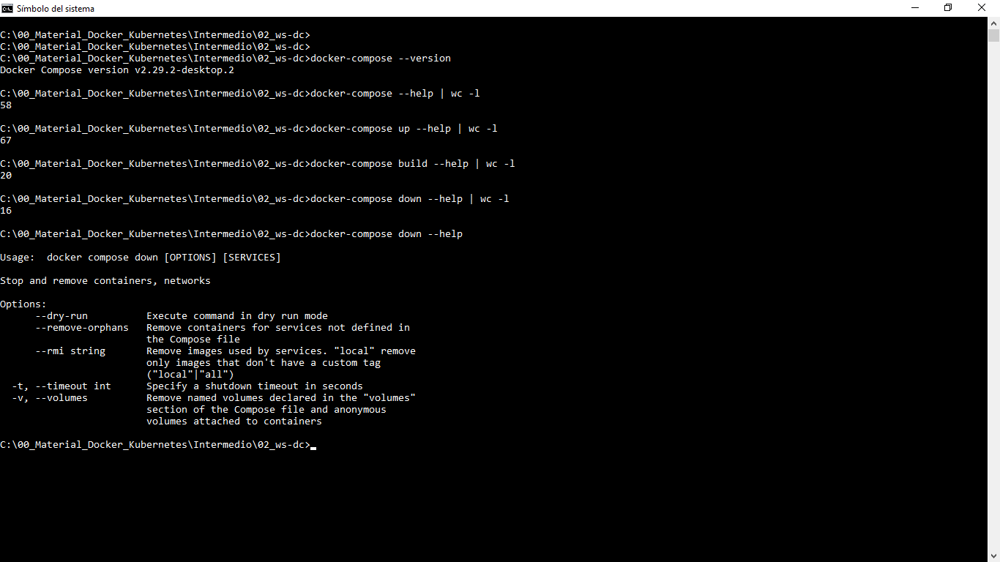
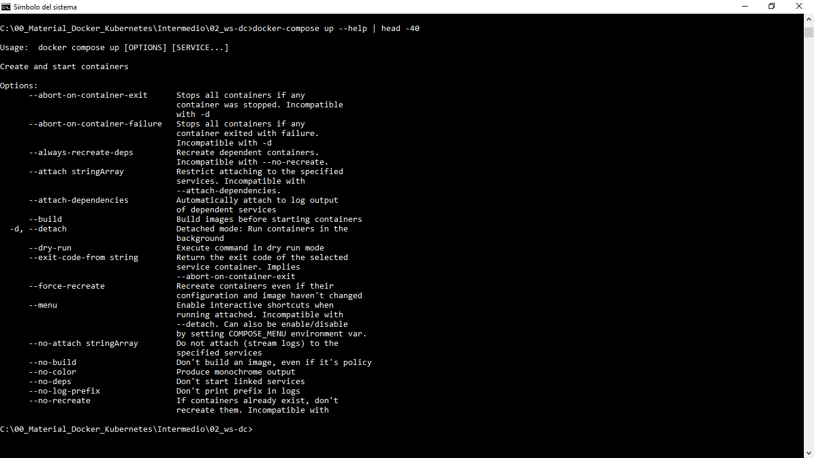
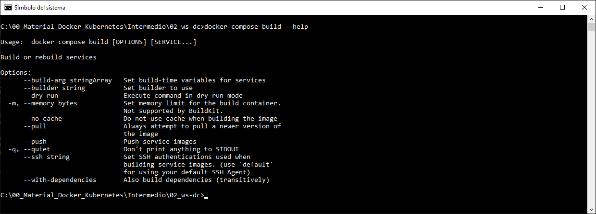
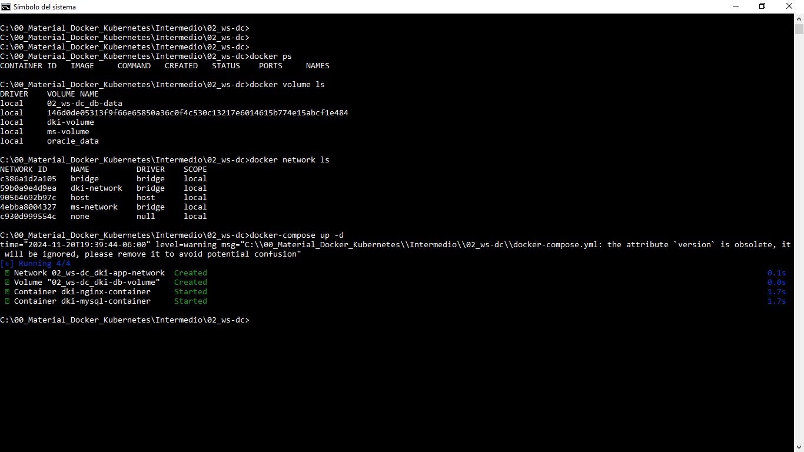
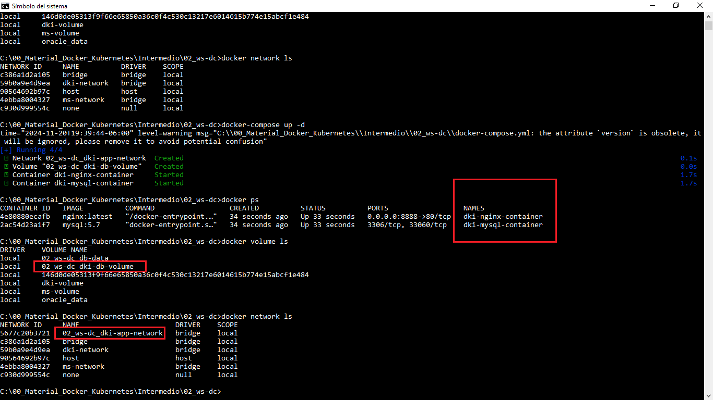
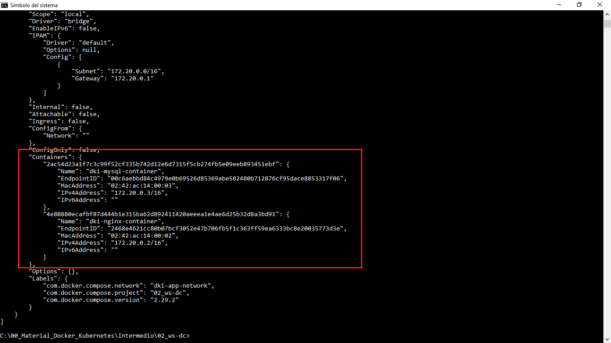
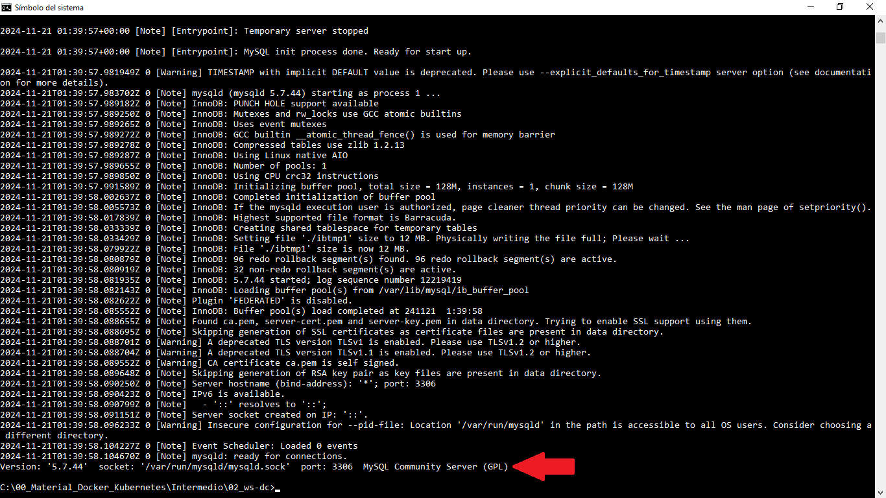
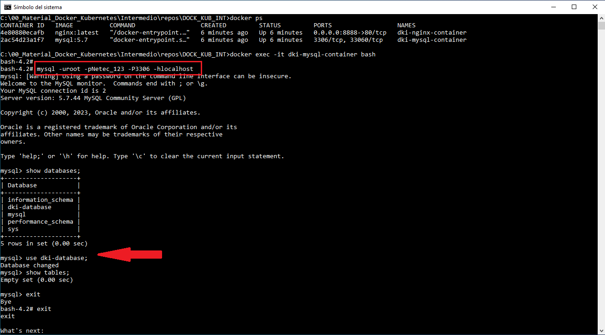
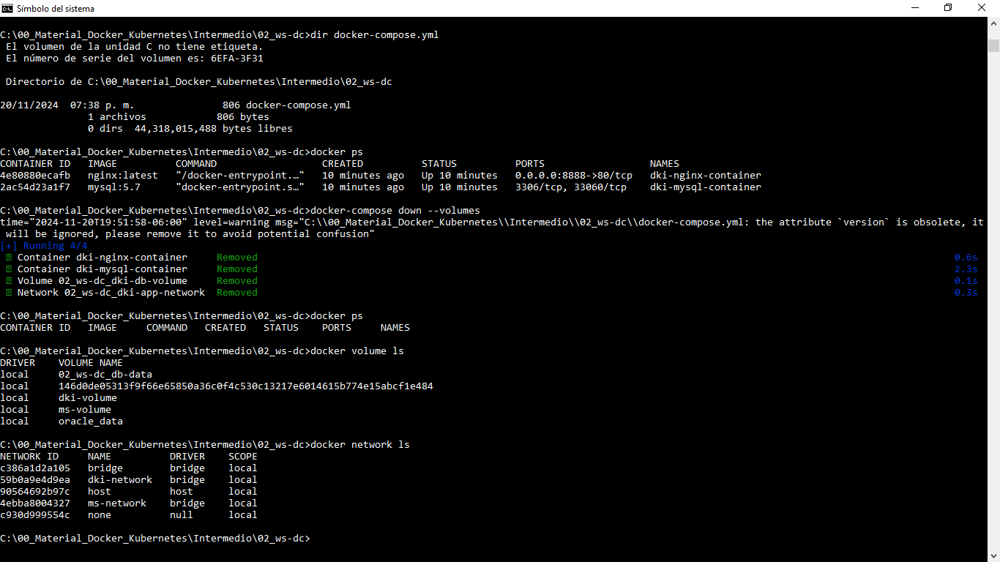
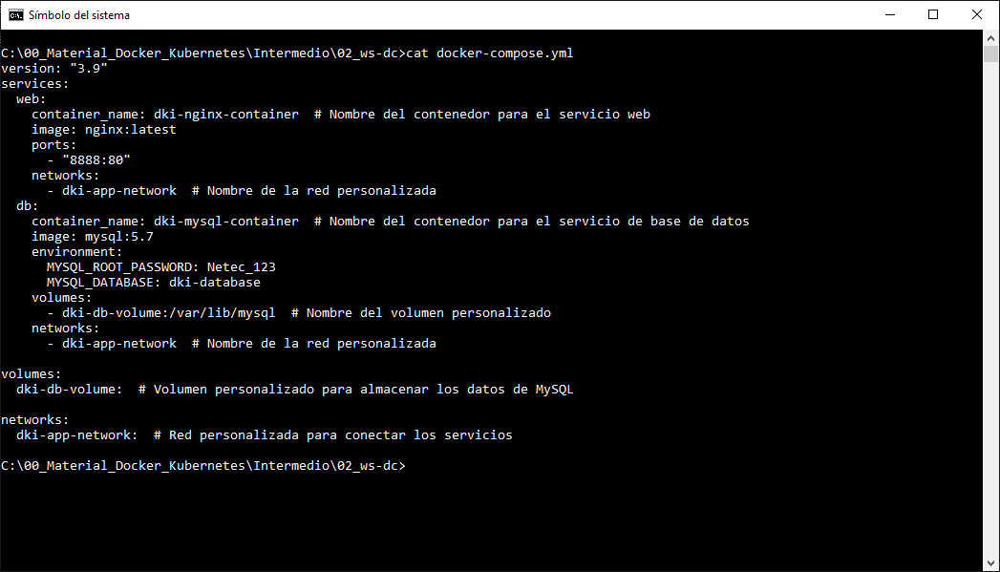

# Práctica 2.1. Explorando Docker Compose

## Objetivos de la práctica:
Al finalizar esta práctica, serás capaz de:
- Analizar y comprender la estructura y función de un archivo docker-compose.yml, identificando sus componentes principales.

## Duración aproximada:
- 25 minutos.

## Material necesario

- Docker compose instalado y funcionando.

<br/>

## Instrucciones

### Paso 1. Verificar la instalación de Docker Compose

1. Abrir una terminal o consola.

2. Escribir el comando siguiente:

```cmd
docker-compose --version
```

3. Verificar que se muestre la versión instalada de Docker Compose. Si no está instalado, consultar el material adicional para su instalación.

<br/>

### Paso 2. Familiarízate con Docker Compose

1. Ejecutar el siguiente comando para ver los comandos disponibles en Docker Compose:

```cmd
docker-compose --help
```

2. Observar las opciones y comandos más comúnes, como `up`, `down` y `build`.

<br/>

### Paso 3. Analizar el contenido del archivo YAML proporcionado

1. Abrir tu editor de texto favorito (VSC o Notepad++).

2. Copiar el contenido siguiente a un arhivo `docker-compose.yml`.

```yaml
version: "3.9"
services:
  web:
    container_name: dki-nginx-container  # Nombre del contenedor para el servicio web.
    image: nginx:latest
    ports:
      - "8888:80"
    networks:
      - dki-app-network  # Nombre de la red personalizada.
  db:
    container_name: dki-mysql-container  # Nombre del contenedor para el servicio de base de datos.
    image: mysql:5.7
    environment:
      MYSQL_ROOT_PASSWORD: Netec_123
      MYSQL_DATABASE: dki-database
    volumes:
      - dki-db-volume:/var/lib/mysql  # Nombre del volumen personalizado.
    networks:
      - dki-app-network  # Nombre de la red personalizada.

volumes:
  dki-db-volume:  # Volumen personalizado para almacenar los datos de MySQL.

networks:
  dki-app-network:  # Red personalizada para conectar los servicios.

```

3. Identificar y comprender las secciones principales.

  - **version**: Especificar la versión de Docker Compose utilizada.

  - **services**: Listar los contenedores definidos:

      - Servicio `web` que usa la imagen `nginx:latest` y exponer el puerto `8888`.

      - Servicio `db` que usa la imagen `mysql:5.7` y configurar un volumen y variables de entorno.

  - **volumes**: Definir un volumen persistente llamado `dki-db-volume`.

  - **networks**: Configurar una red para que los servicios se comuniquen entre sí.

  - Recuerda que es importante mantener la indentación correcta en cada nivel.

<br/>

### Paso 4. Reflexionar y responder las siguiente preguntas

1. ¿Qué servicios están definidos en el archivo?

2. ¿Cómo se configuran los puertos para el servicio `web`?

3. ¿Qué variables de entorno se establecen para el servicio `db`?

4. ¿Qué función cumple el volumen `dki-db-volume`?

5. ¿Por qué es importante la red `dki-app-network` en esta configuración?

<br/>

### Paso 5. Ejecutar el archivo Docker Compose

1. Abrir una terminal en la misma carpeta donde se encuentra el archivo `docker-compose.yml`.

2. Ejecutar el siguiente comando para iniciar los servicios:

```cmd 
docker-compose up -d
```

3. Verificar que los servicios estén corriendo usando:

```cmd  
docker ps
docker volume ls
docker network ls
docker network inspect labs_dki-app-network
docker logs dki-mysql-container
```

4. Conéctate al servidor de base MySQL y verificar que la base de datos `dki-database` existe y no tienen ninguna tabla.

```cmd
docker exec -it dki-mysql-container bash
```

```bash
mysql -u root -pNetec_123 -hdb
```

```sql
show databases;
use dki-database
show tables;
```


5. Con el navegador de tu preferencia, verificar el servidor NGINX funciona correctamente.


6. Detener los servicios y eliminar los contenedores con:
 
```cmd 
docker-compose down

# Eliminar al mismo tiempo los volúmenes.
docker-compose down --volumes


```

7. Verificar los contenedores, volumenes y red que se eliminaron.

```cmd
docker ps
docker ps -a
docker volume ls
docker network ls
```


<br/>
<br/>

## Resultado esperado

- La siguente captura de pantalla muestra el uso básico de docker-compose (la versión, ayuda, etc.)




<br/>

- La siguente captura de pantalla muestra parte de la ayuda del comando: `docker-compose up`.



- ¿Cuál es el uso de la opción `--dry-run` y/o `config`?


<br/>

- La siguente captura de pantalla muestra la ayuda del comando `docker-compose build`.




<br/>

- La siguente captura de pantalla muestra la ejecución de `docker-compose up`.




<br/>

- La siguente captura de pantalla muestra la verificación de los recursos creados en el `docker-compose.yml`.




<br/>

- La siguente captura de pantalla muestra la salida del comando `docker network inspect`, los dos contenedores definidos en el `docker-compose.yml`.




<br/>

- La siguente captura de pantalla muestra la bitácora del contenedor de la base de datos MySQL.




<br/>

- La siguente captura de pantalla muestra como se ingresa al contenedor de la base de datos y de ahí al servidor de base de datos MySQL. Además verificamos la creación de la base de datos `dki-database`.




<br/>

- La siguente captura de pantalla muestra la salida del comando `docker down --volumes`, además de la verificación de recursos eliminados.




<br/>

- La siguente captura de pantalla muestra el contenido del archivo `docker-compose.yml`.




<br/>
