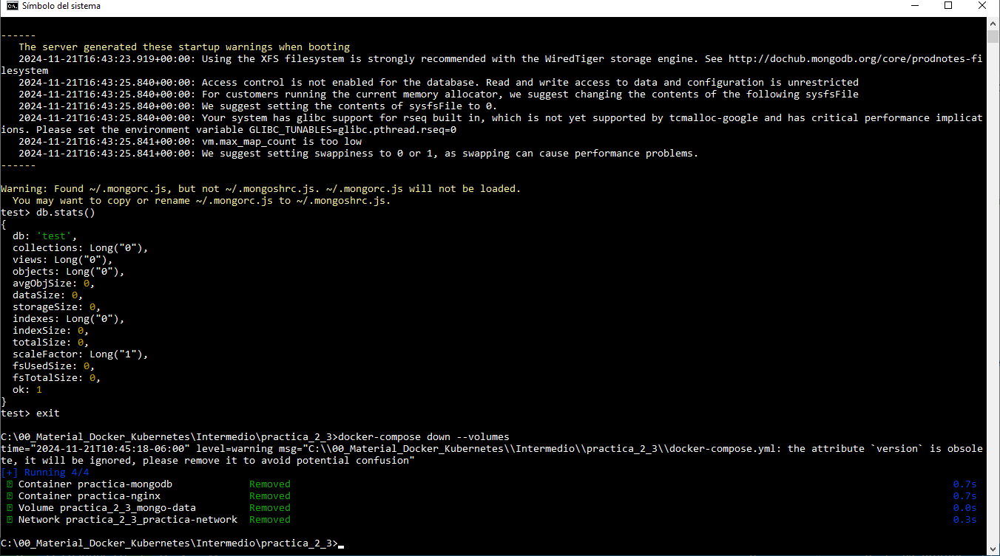

# Práctica 2.2 Creación de un archivo Docker Compose Intermedio

## Objetivos de la práctica:
Al finalizar esta práctica, serás capaz de:
- Crear un archivo docker-compose.yml de nivel intermedio que defina dos contenedores simples:

1. Un servicio NGINX que sirva en el puerto 9999.

2. Un servicio MongoDB con persistencia de datos mediante volúmenes.

## Duración aproximada:
- 25 minutos.

## Material necesario

- Docker y Docker Compose instalados y funcionando.

- Un editor de texto (VSC, vim. Notepad++, etc.).

- Acceso a la terminal o consola del entorno de curso.


<br/>

## Instrucciones

### Paso 1. Configurar el entorno de trabajo

1. Crear una carpeta para almacenar los archvios de la práctica.

```cmd
mkdir practica_2_2
cd practica_2_2
```

2. Crear un archivo vacío llamado `docker-compose.yml`.

```cmd
touch docker-compose.yml
```

<br/>

### Paso 2. Escribir el contenido del archivo `docker-compose.yml`

Abrir el archivo en el editor de texto de tu preferencia y escribir las instrucciones necesarias que debe de contener el archivo YAML.

1. Especificar que versión estás utilizando en el esquema de Compose versión 3.9.

2. Definir dos servicios:

    - **nginx**: Definir un contenedor basado en la imagen oficial `nginx:latest` y exponer el puerto `9999`.

    - **mongodb**: Definir un contenedor basado en la imagen oficial `mongo:latest` con persistencia de datos en el volumen `mongo-data` expuesto en el puerto `27017`.

3. Definir un volumen para almacenar datos de MongoDB.

4. Permitir la comunicación entre los servicios **nginx** y **mongodb**.

<br/>

### Paso 3. Validar el archivo

Antes de ejecutar el archivo, validar su sintaxis con el comando:

```cmd
docker-compose config
```

Si hay errores, revisar los mensajes proporcionados para corregirlos.

<br/>

### Paso 4. Ejecutar los servicios

1. Iniciar los contenedores con:

```cmd
docker-compose up -d

docker ps

docker volume ls

docker network ls

```
<br/>

### Paso 5. Verificar el funcionamiento

1. Probar el servicio NGINX:

    - Abrir un navegador y acceder a `http://localhost:9999`.

    - Deberías ver la página de inicio de NGINX.

2. Probar el servicio MongoDB:

    - Usar la herramienta de `mongosh` o un cliente MongoDB para conectarte al puerto `27017`.

    ```cmd
    mongosh --host localhost --port 27017
    ```

    - Opcionalmente, ejecutar los comandos siguientes:

    ```javascript

    show dbs;

    db.stats();

    use my_db

    db.my_collection.insertOne({ name: "Producto 1", price: 100, stock: 50 });

    db.my_collection.find();

    db.my_collection.updateOne({ name: "Producto 1" }, { $set: { stock: 5 } })

    db.my_collection.find();

    db.my_collection.deleteOne({ name: "Producto 1" });

    db.stats();

    ```

<br/>

### Paso 7. Detener y eliminar los contenedores Docker

Al termianr, detener y eliminar los recursos creados:

```cmd

docker-compose down --volumes

docker ps

docker volume ls

docker network ls

```
<br/>
<br/>

## Resultados esperados

- Archivo `docker-compose.yml` funcional con dos servicios definidos.

- NGINX sirviendo en el puerto `9999`.

- MongoDB funcionando con persistencia de datos en el volumen `mongo-data`.

- Conocimiento práctico sobre cómo definir servicios, volúmenes y redes en Docker Compose.

- Captura de imagen que muestra la conexión a MongoDB, además de la iliminación de los contenedores creados en esta práctica.


