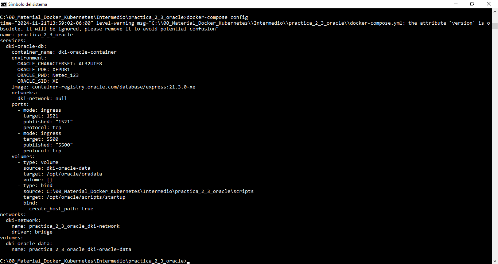
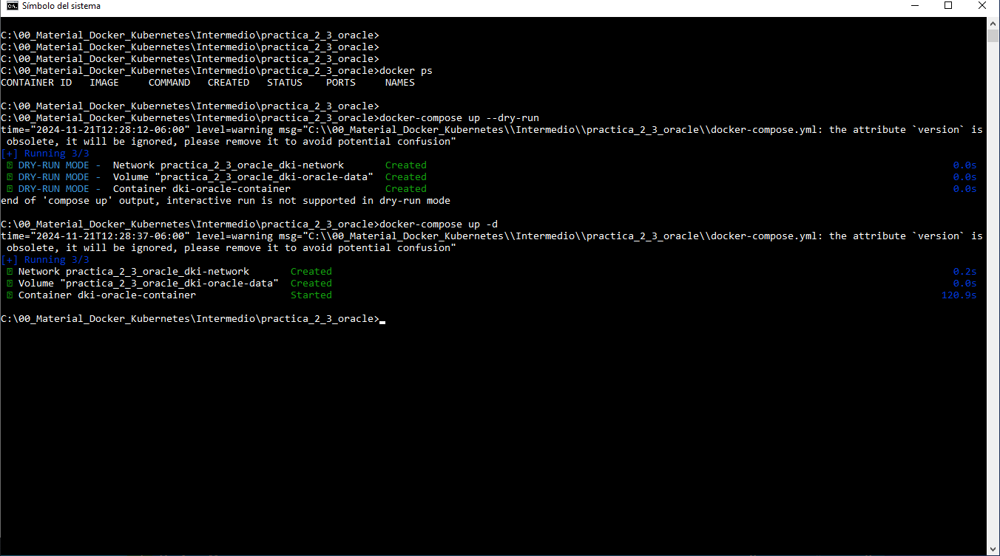
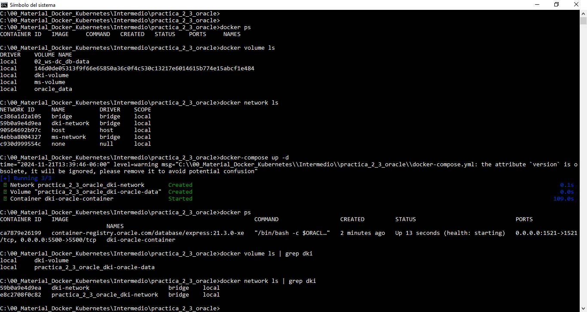
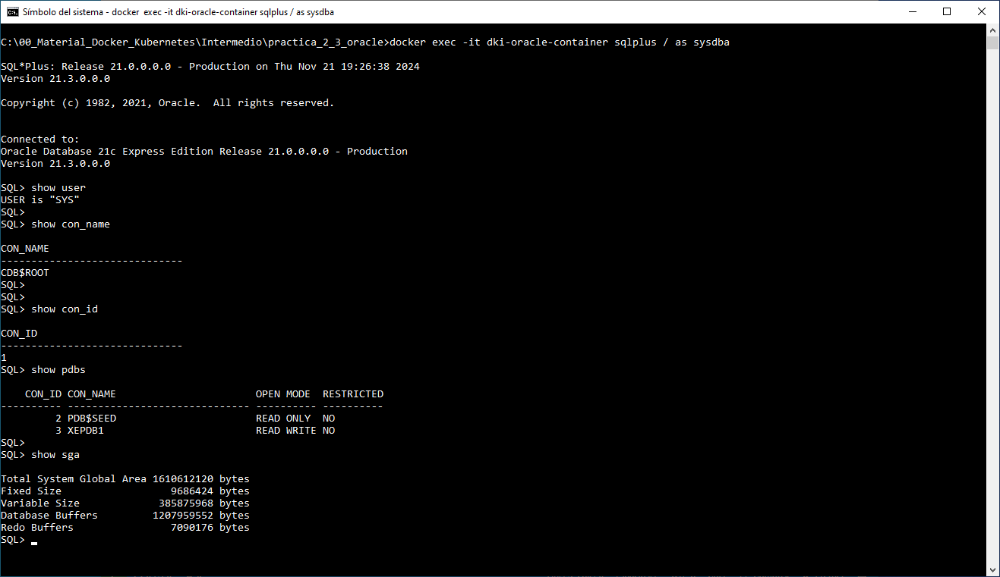
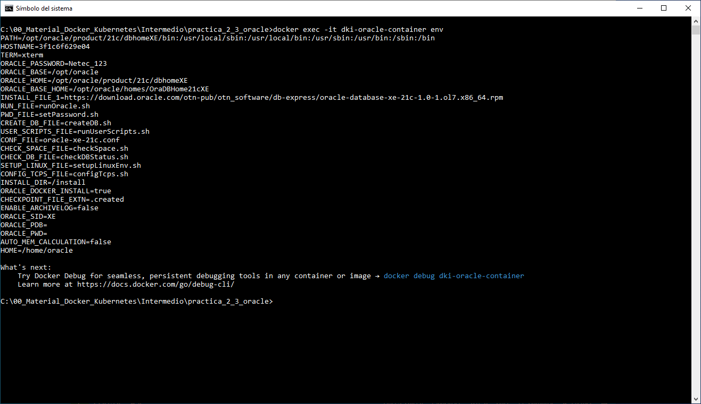
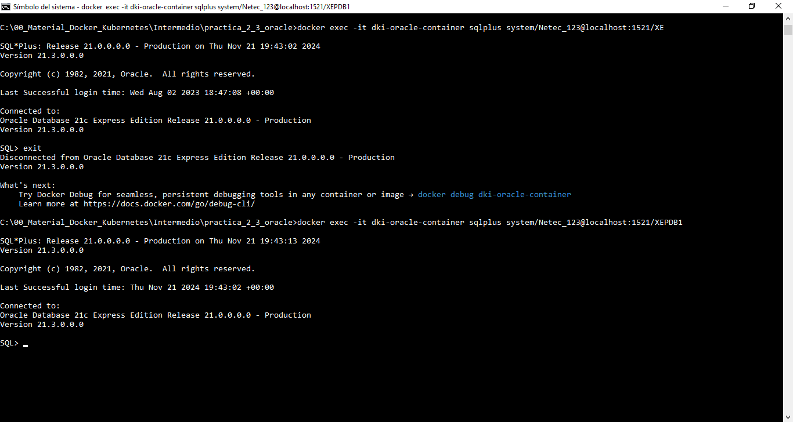
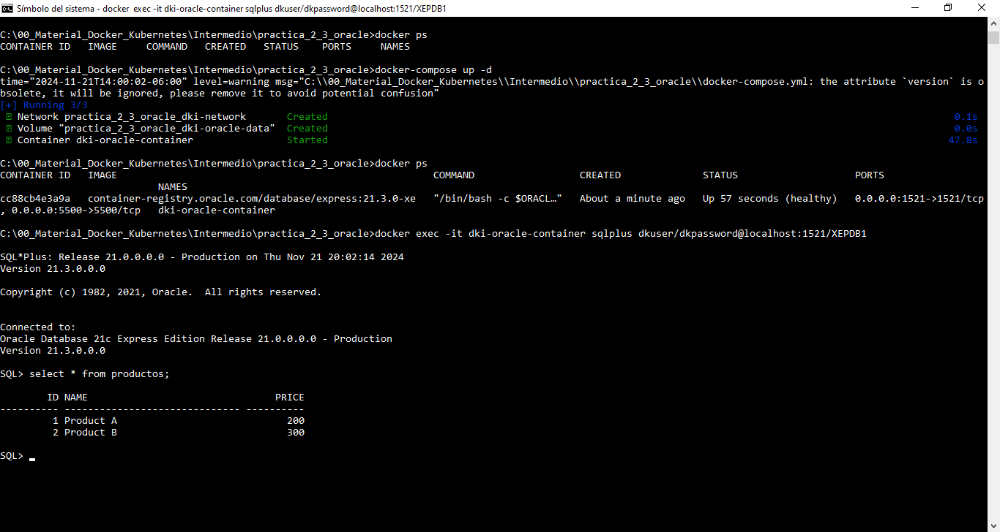
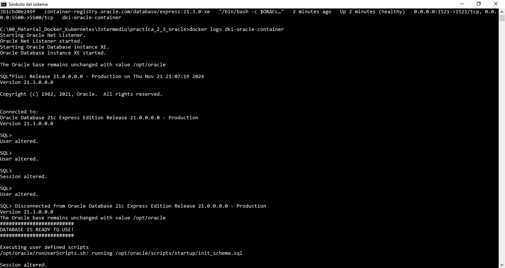

# Práctica 2.3. Configuración de un contenedor Oracle DB con Docker Compose

## Objetivos de la práctica:
Al finalizar esta práctica, serás capaz de:
- Definir un contenedor de Oracle Database en un archivo docker-compose.yml, configurando variables de entorno, volúmenes y redes personalizadas.

## Duración aproximada:
- 25 minutos.

## Material necesario

- Docker y Docker Compose instalados.

- Acceso a la terminal o consola.

- Un editor de texto para crear el archivo `docker-compose.yml`.


<br/>

## Instrucciones

## Paso 1. Preparar el entorno

1. Crear un directorio de trabajo para esta práctica:

```cmd
mkdir practica_2_3
cd practica_2_3
```

2. Crear un archivo vacío llamado `docker-compose.yml`:

```cmd
touch docker-compose.yml
```

3. Crear una carpeta local llamada `scripts` en el mismo directorio donde está el archivo ```docker-compose.yml``` y colocar ahí el archivo ```init_schema.sql```:

```cmd
mkdir scripts
cd scripts
touch init_schema.sql
code init_schema.sql
```

4. Copiar el siguiente contenido a tu archivo SQL.

```sql
-- Cambiamos de sesión
ALTER SESSION SET CONTAINER = XEPDB1;

-- Crear un esquema y asignar permisos
CREATE USER dkuser IDENTIFIED BY dkpassword;
GRANT CONNECT, RESOURCE TO dkuser;

-- Espacio ilimitado en el tablespace users
ALTER USER dkuser QUOTA UNLIMITED ON users;

-- Crear una tabla en el esquema
CREATE TABLE dkuser.productos (
    id NUMBER GENERATED BY DEFAULT AS IDENTITY PRIMARY KEY,
    name VARCHAR2(30),
    price NUMBER
);

-- Insertar datos iniciales
INSERT INTO dkuser.productos (name, price) VALUES ('Product A', 200);
INSERT INTO dkuser.productos (name, price) VALUES ('Product B', 300);

-- Confirmamos las inserciones
COMMIT;


```
<br/>

## Paso 2. Crear el archivo `docker-compose.yml`

Abrir el archivo en el editor de texto y escribir la siguiente configuración:

```yaml
version: "3.9"
services:
  dki-oracle-db:
    container_name: dki-oracle-container   
    image: container-registry.oracle.com/database/express:21.3.0-xe   
    environment:
      ORACLE_PWD: Netec_123 
      ORACLE_SID: XE
      ORACLE_PDB: XEPDB1
      ORACLE_CHARACTERSET: AL32UTF8
    ports:
      - "1521:1521"  
      - "5500:5500"   
    volumes:
      - dki-oracle-data:/opt/oracle/oradata   
      - ./scripts:/opt/oracle/scripts/startup  # Montar el directorio de scripts
    networks:
      - dki-network   
volumes:
  dki-oracle-data:   
networks:
  dki-network:   
     driver: bridge

```
<br/>

## Paso 3. Análisis del `docker-compose.yml`

1. ¿Qué versión del esquema YAML se está utilizando?

2. ¿Cuál es el nombre del servicio definido en el archivo?

3. ¿Cuál es el nombre del contenedor asociado al servicio?

4. ¿Qué versión del servidor de base de datos Oracle se está configurando?

5. ¿Quiénes son los usuarios administradores de la base de datos?

6. ¿Cuál es la contraseña del servidor de base de datos Oracle?

7. ¿Cuáles son los nombres y contraseñas de los usuarios no administrativos?

8. ¿Qué puertos TCP/IP se exponen y cuál es la funcionalidad asociada a cada uno de ellos?

9. ¿Qué nombre tienen el volumen y la red creados para este servicio?

<br/>

## Paso 4. Validar el archivo YAML

Validar la sintaxis del archivo antes de ejecutarlo:

```cmd
docker-compose config
```
<br/>

## Paso 5. Levantar el contendor

Ejecutar el comando para iniciar el contenedor.

```cmd
docker-compose up -d
```

<br/>

## Paso 6. Verificar que Oracle Database está funcionando

1. Consultar la bitácora del contenedor.

```cmd
docker logs dki-oracle-container
```

Buscar la línea que indique que la base de datos está lista.

2. Conectar a Oracle con SQL*Plus

Abrir una terminal y conectar al contenedor usando `docker exec`.

```cmd
docker exec -it dki-oracle-container sqlplus system/Netec_123@localhost:1521/XEPDB1
```

3. Consultar el estado de la base de datos.

Ejecutar el siguiente comando en SQL*Plus:

```cmd
SELECT name, open_mode FROM v$pdbs;

SELECT * FROM dkuser.productos;


```
<br/>

## Paso 7. Detener y eliminar el contenedor

Cuando termines, detener y eliminar todos los recursos creados:

```cmd
docker-compose down --volumes

```

<br/>

## Notas 
1. Puedes tener **múltiples scripts** en el directorio `scripts`, y se ejecutarán en orden alfabético.

2. Para configuraciones avanzadas, puedes incluir scripts en PL/SQL o configurar roles y permisos adicionales.

<br/>
<br/>

## Resultados esperados

- Crear un archivo `docker-compose.yml` funcional que define un contenedor de Oracle Database.

- Contenedor de Oracle Database corriendo en los puertos `1521` y `5500`, con persistencia de datos y un usuario de aplicación configurado.

- Capacidad para conectarte al contenedor y realizar consultas básicas en la base de datos.

<br/>
<br/>

### Imágenes

- Captura de pantalla que muestra la salida del comando `docker-compose config`, evidenciando la configuración detallada del archivo `docker-compose.yml`, como los servicios, volúmenes, redes y demás parámetros definidos.



<br/>

- Captura de pantalla que muestra el uso de `--dry-run` y `up` de `docker-compose`



<br/>

- Captura de pantalla que muestra el estado antes y después de ejecutar la instrucción `docker-compose up -d`, evidenciando cómo se crean y configuran los componentes: contenedores Docker, volúmenes Docker y redes Docker.



<br/>

- Captura de pantalla que muestra cómo conectarse al servidor de base de datos utilizando el comando `docker exec`. Además, incluye un ejemplo de conexión como administrador de la base de datos y la ejecución de algunos comandos SQL administrativos.



<br/>

- Captura de pantalla que muestra cómo, desde el entorno del curso (típicamente Windows), puedes conectarte al contenedor utilizando `docker exec -it dki-oracle-container env` para verificar las variables de entorno como ORACLE_BASE, ORACLE_HOME, ORACLE_SID, entre otras.



- Captura de pantalla que muestra las diversas conexiones exitosas a la base de datos utilizando los comandos `docker exec -it dki-oracle-container sqlplus system/Netec_123@localhost:1521/XE` y `docker exec -it dki-oracle-container sqlplus system/Netec_123@localhost:1521/XEPDB1`, destacando que ambas conexiones se establecen correctamente.



<br/>

- Captura de pantalla que muestra básicamente la conexión al nuevo contenedor Oracle Xe y como el esquema del usuario DKUSER existe, el usuario, la contraseña, la tabla Productos y los registros ingresados.



- Captura de pantalla que muestra la salida del comando docker logs dki-oracle-container, donde se registra la secuencia de eventos del contenedor, incluyendo el inicio del servidor Oracle Database, mensajes de estado y posibles errores o advertencias. Además, se destaca cómo, después de completar el proceso de configuración inicial de la base de datos, el contenedor ejecuta los scripts previamente colocados en el volumen de tipo "Bind Mounts".



