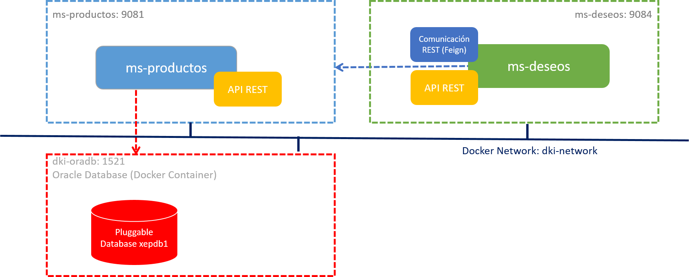
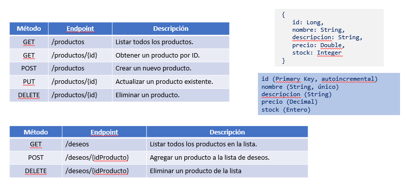
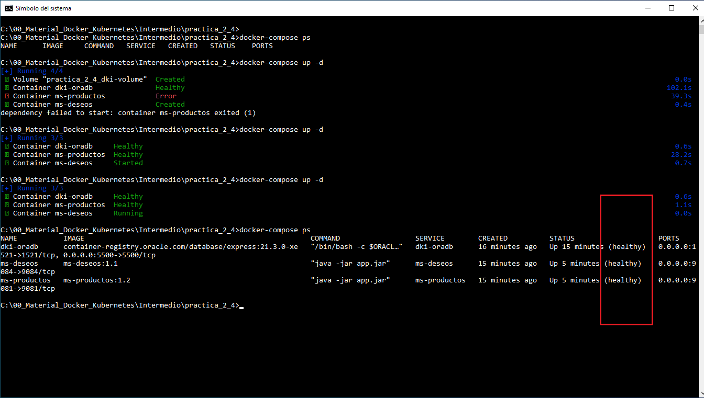
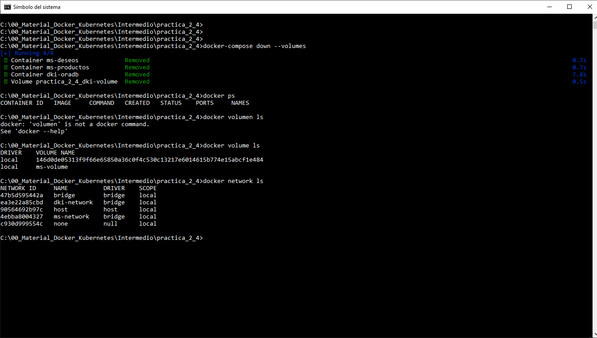
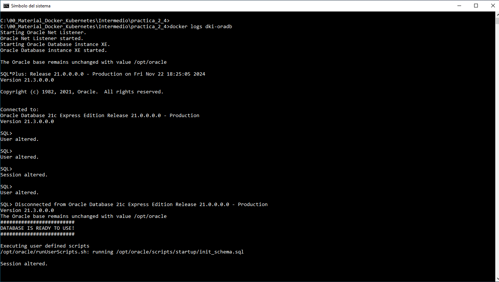
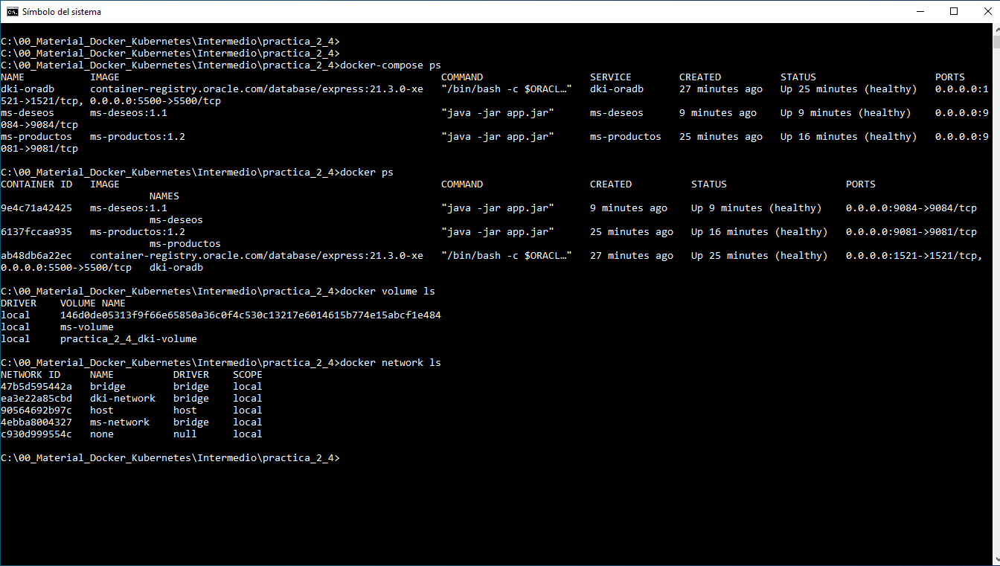
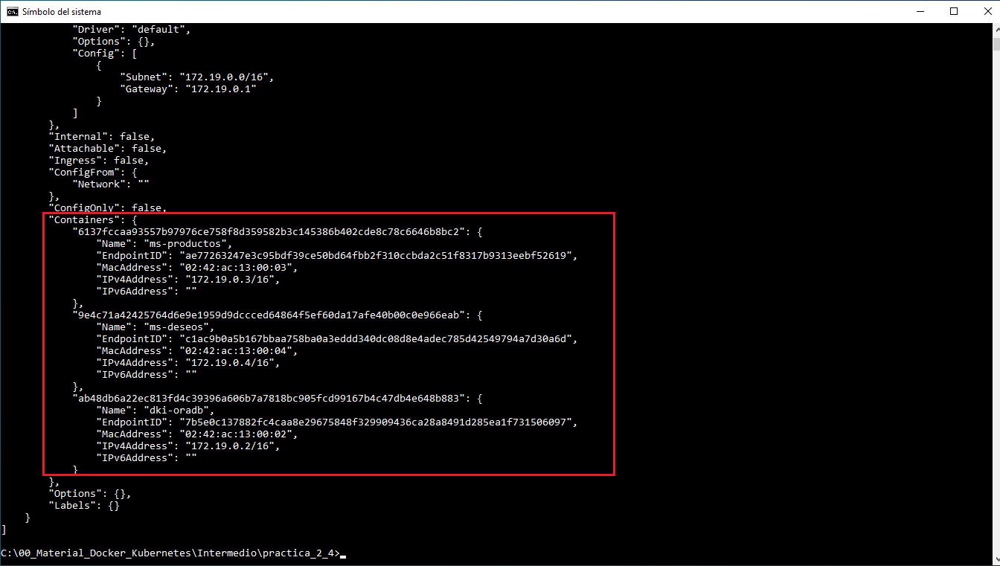

# 2.4. Integración de microservicios en Docker Compose

## Objetivo
Al finalizar esta práctica, serás capaz de:
- Añadir los microservicios del caso de estudio al archivo `docker-compose.yml`, conectándolos a la base de datos Oracle y definiendo redes para la comunicación entre ellos.

## Duración aproximada:
- 50 minutos.

<br/>

## Objetivo visual



<br/>

## Solicitudes HTTP



<br/>


## Instrucciones

### Paso 1. Verificar contenedores existentes

- Verificar los contenedores y recursos actualmente configurados.

```cmd
docker ps
docker ps -a
docker images
docker volume ls
docker network ls
```

- Eliminar los contenedores ms-productos, ms-deseos y dki-oradb si es que existen, pues usarás los mismos nombres.

```cmd
docker rm -f ms-productos ms-deseos oracle-db
```

<br/>

### Paso 2. Crear la carpeta de trabajo para esta práctica

- Abrir una terminal o consola y navegar al directorio de las prácticas del curso.

- Crear una nueva carpeta llamada practica_2_4 y copiar el archivo `docker-compose.yml` desde la carpeta practica_2_3.  


```cmd
mkdir practica_2_4
cp practica_2_3/docker-compose.yml practica_2_4/docker-compose.yml
cd practica_2_4
```

- **Nota**: También puedes ir al [README2_3](./README2_3.md) y copiar el contenido del `docker-compose.yml` de la práctica_2_3.

<br/>


### Paso 3. Crear la estructura para los scripts de Oracle

- Los scripts deben de ejecutarse después del **setup** de Oracle Database.

- Crear una carpeta local llamada `scripts` en el mismo directorio donde está el archivo `docker-compose.yml` y colocar ahí el archivo `init_schema.sql`:

```cmd
mkdir scripts
cd scripts
touch init_schema.sql
code init_schema.sql
```

<br/>


### Paso 4. Crear Scripts de Oracle para inicialización.

- Configurar un usuario llamado `dkuser` con la contraseña `dkpassword` en la base de datos. Asegúrate de otorgarle los permisos necesarios para:

  - Establecer conexiones a la base de datos.

  - Crear tablas dentro de su esquema.

  - Insertar y modificar registros en las tablas.

  - Utilizar espacio en el tablespace asignado.

- Puedes usar el siguiente contenido en SQL para realizar la configuración:

```sql

-- Cambiamos de sesión a la PDB
ALTER SESSION SET CONTAINER = XEPDB1;

-- Crear el usuario y asignar permisos
CREATE USER dkuser IDENTIFIED BY dkpassword;
GRANT CONNECT, RESOURCE TO dkuser;

-- Establecer el espacio ilimitado en el tablespace users.
ALTER USER dkuser QUOTA UNLIMITED ON users;

```

<br/>


### Paso 5. Verificar y crear la red externa dki-network

Antes de ejecutar la configuración con Docker Compose, asegúrate de que la red externa dki-network esté creada. Sigue estos pasos:

- Verificar si la red ya existe: Ejecutar el siguiente comando para listar las redes existentes en Docker:

```cmd
docker network ls

```

- Crear la red si no existe: Si no encuentras dki-network en la lista, puedes crearla con el siguiente comando:


```cmd
docker network create dki-network
```
 
**Nota**: Esto creará una red de tipo bridge (predeterminada) para ser utilizada como red externa.

<br/>

### Paso 6. Configurar y verificar los microservicios

1. Verificar las propiedades de configuración de los microservicios:

    - Asegúrate de que los archivos `application.properties` contengan las configuraciones necesarias para cada microservicio.

    - Microservicios:

      - **ms-productos**: Revisar su archivo `application.properties`.

        ```text
        spring.application.name=ms-productos
        server.port=9081

        # Configuracion de la base de datos.
        spring.datasource.url=jdbc:oracle:thin:@dki-oradb:1521/XEPDB1
        spring.datasource.username=dkuser
        spring.datasource.password=dkpassword
        spring.datasource.driver-class-name=oracle.jdbc.OracleDriver

        # Configuracion de JPA e Hibernate.
        spring.jpa.hibernate.ddl-auto=update
        spring.jpa.show-sql=true
        spring.jpa.properties.hibernate.dialect=org.hibernate.dialect.OracleDialect
        ```


      - **ms-deseos**: Revisar su archivo `application.properties`.

          ```text
          spring.application.name=ms-deseos
          server.port=9084
          ```


<br/>

2. Generar los archivos JAR:

    - Si los JAR generados no corresponden con las versiones esperadas, compilar los proyectos nuevamente.

    - Comando para compilar:

      ```cmd
      .\mvnw clean package --Dmaven.test.skip=true
      ```

    - Ubicación del JAR generado:

      - Para **ms-productos**: target/ms-productos-<version>.jar

      - Para **ms-deseos**: target/ms-deseos-<version>.jar

      - **Nota**: Haste este momento la versión podría ser `0.0.1-SNAPSHOT.jar`


<br/>

3. Verificar los **Dockerfiles**:

    - Asegúrate de que ambos **Dockerfile incluyen la etapa para instalar curl** en las imágenes de los microservicios.

    - Microservicios:

      - **ms-productos**: Revisar el contenido del Dockerfile.

      ```dockerfile
        FROM openjdk:21-jdk-slim
        WORKDIR /app
        COPY target/ms-productos-0.0.1-SNAPSHOT.jar app.jar
        EXPOSE 9081
        RUN apt-get update && apt-get install -y curl
        ENTRYPOINT ["java", "-jar", "app.jar"]
      ```

      - **ms-deseos**: Revisar el contenido del Dockerfile.

      ```dockerfile
        FROM openjdk:21-jdk-slim
        WORKDIR /app
        COPY target/ms-deseos-0.0.1-SNAPSHOT.jar app.jar
        EXPOSE 9084
        RUN apt-get update && apt-get install -y curl
        ENTRYPOINT ["java", "-jar", "app.jar"]
      ```

<br/>

4. Generar las imágenes Docker:

    - Crear las imágenes para cada microservicio utilizando sus respectivos Dockerfile.

    - Comandos para generar las imágenes:

      - Para ms-productos:

        ```cmd
        docker build -t ms-productos:<version> .
        ```

      - Para ms-deseos:
        ```cmd
        docker build -t ms-deseos:<version> .
        ```

      - Reemplazar <version> con el número de versión correspondiente

<br/>

5. Confirmar las versiones en el archivo `docker-compose.yml`:

  - Asegúrate de que las versiones de las imágenes generadas sean las mismas especificadas en el archivo `docker-compose.yml`. Si no coinciden, actualizar el archivo `docker-compose.yml` con las versiones correctas.

<br/>

### Paso 7. Actualizar el archivo docker-compose.yml para incluir los microservicios:

- Añadir los servicios `ms-productos` y `ms-deseos` al archivo. Asegúrate de que cada servicio esté conectado a la red `dki-network` y que utilicen variables de entorno para la conexión con la base de datos Oracle.

```yaml
services:
  dki-oradb:
    container_name: dki-oradb
    image: container-registry.oracle.com/database/express:21.3.0-xe
    environment:
      ORACLE_PWD: Netec_123
      ORACLE_SID: XE
      ORACLE_PDB: XEPDB1
      ORACLE_CHARACTERSET: AL32UTF8
    ports:
      - "1521:1521"
      - "5500:5500"
    volumes:
      - dki-volume:/opt/oracle/oradata
      - ./scripts:/opt/oracle/scripts/startup
    networks:
      - dki-network
    healthcheck:
      test: ["CMD", "sh", "-c", "echo 'SELECT 1 FROM DUAL;' | sqlplus system/Netec_123@localhost:1521/XE"]
      interval: 30s
      timeout: 10s
      retries: 5
      start_period: 60s

  ms-productos:
    image: ms-productos:1.2  
    container_name: ms-productos
    ports:
      - "9081:9081"
    environment:
      USER_DEMO: Netec
    networks:
      - dki-network
    depends_on:
      dki-oradb:
        condition: service_healthy
    healthcheck:
      test: ["CMD", "curl", "-f", "http://127.0.0.1:9081/productos"]
      interval: 30s
      timeout: 15s
      retries: 5
      start_period: 30s

  ms-deseos:
    image: ms-deseos:1.1
    container_name: ms-deseos
    ports:
      - "9084:9084"
    environment:
      MS_PRODUCTOS_URL: http://ms-productos:9081/productos
    networks:
      - dki-network
    depends_on:
      ms-productos:
        condition: service_healthy
    healthcheck:
      test: ["CMD", "curl", "-f", "http://127.0.0.1:9084/deseos"]
      interval: 30s
      timeout: 15s
      retries: 5
      start_period: 30s

volumes:
  dki-volume:

networks:
  dki-network:
    external: true

```

- Guardar los cambios en el archivo `docker-compose.yml`.

<br/>

### Paso 8. Levantar los contenedores con Docker Compose

- Ejecutar el siguiente comando para verificar la configuración.

```cmd
docker-compose config
```

- Ejecutar el siguiente comando para desplegar los contenedores.

```cmd
docker-compose up -d
```
<br/>

### Paso 9. Verificar que los contenedores están funcionando correctamente:

- Usar el comando `docker ps` para listar los contenedores en ejecución.

```cmd
docker ps
docker image ls
docker volume ls
docker network ls
```

- Usar el comando `docker logs <nombre_contenedor>` por si tienes problemas.

<br/>

### Paso 10. Probar la conexión entre los servicios:

- Usar una herramienta como Postman o curl para enviar solicitudes a `ms-productos` en el puerto 9081 y a `ms-deseos` en el puerto 9084.

Ejemplo para verificar `ms-productos`:

```cmd
curl http://localhost:9081/productos
```

Ejemplo para verificar ms-deseos:

```cmd
curl http://localhost:9084/deseos
```


**Nota**:
- Recuerda que la primera vez que usas los microservicios no se tiene información.


### 11. Detener los contenedores:

- Cuando termines, detener y eliminar los contenedores ejecutando:

```cmd
docker-compose down --volumes
```

<br/>
<br/>


## Resultado esperado:

- Los microservicios `ms-productos` y `ms-deseos` deben estar funcionando correctamente, conectados entre sí y a la base de datos Oracle, a través de la red `dki-network`.

- Captura de pantalla que muestre la salida del comando `docker-compose up -d`. Nota que, aunque el estado de salud de uno de los microservicios inicialmente mostró un **Error**, en la siguiente ejecución del comando su estado cambió a **'Healthy'**. Observa cómo, en cada ejecución, se registran los estados `'Created'`, `'Started'` y `'Running'` para el microservicio **ms-deseos**. Finalmente, se verifica que los tres contenedores/servicios se encuentran en estado 'Healthy' al concluir.



- Captura de pantalla que muestra la salida del comando `docker-compose down --volumes`, junto con la verificación de que los contenedores y los recursos asociados (volúmenes) han sido eliminados. Ten en cuenta que la red utilizada es externa y no forma parte del archivo `docker-compose.yml`.



- Captura de pantalla que muestra la salida del comando `docker logs dki-oradb`.



- Captura de pantalla que muestre la salida del comando `docker-compose ps`, verificando que los contenedores y recursos definidos en el archivo `docker-compose.yml` se hayan creado correctamente y estén en ejecución según lo esperado.





- Captura de pantalla que muestre parte de la salida del comando `docker network inspect dki-network`. Observa que en la sección Containers se pueden visualizar los tres contenedores configurados en el archivo `docker-compose.yml`.



