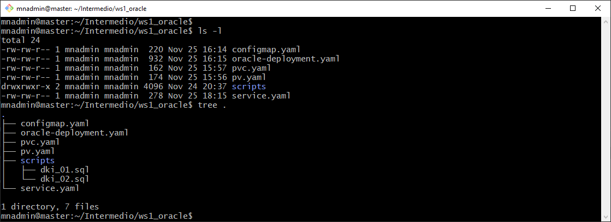
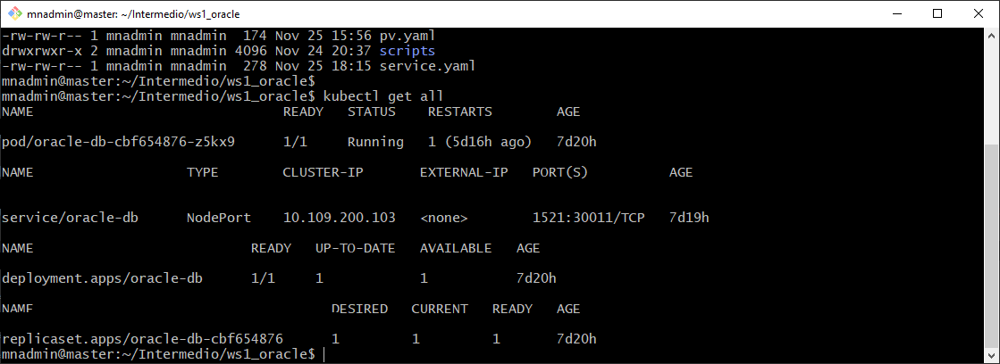
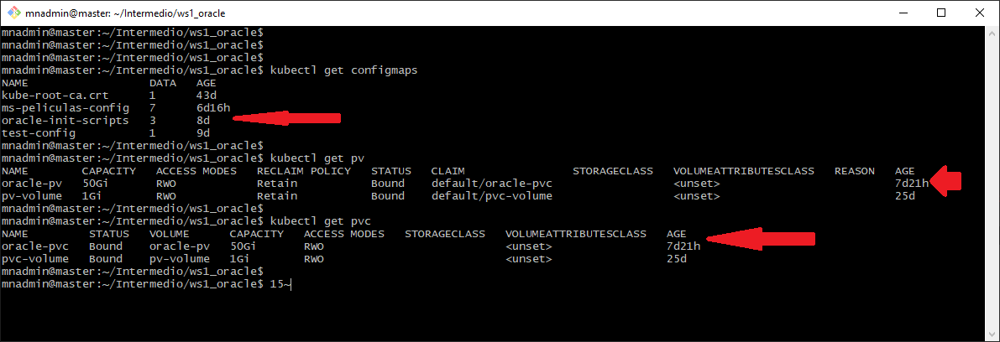
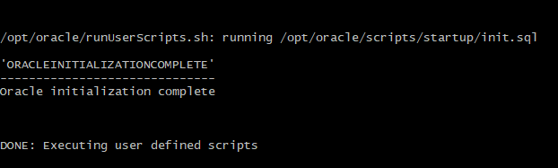
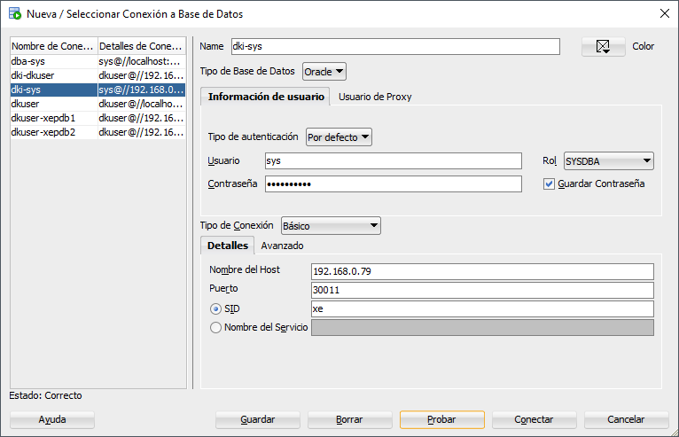
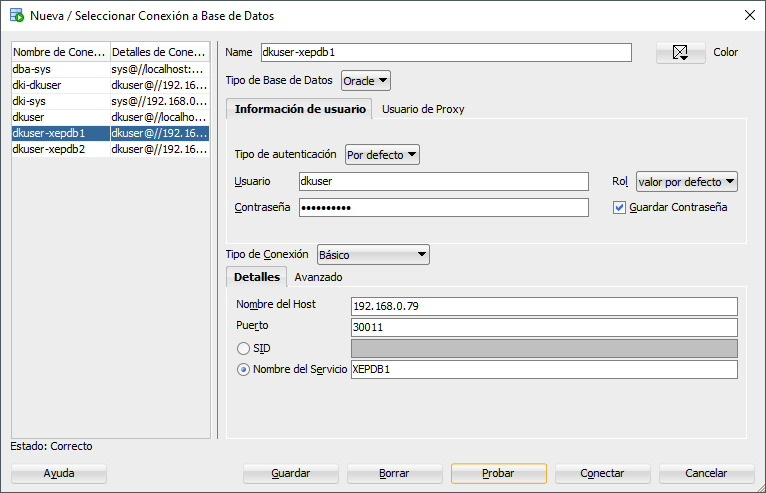

# **Guía: Instalación de Oracle Database 21 en Kubernetes**


## **1. Crear Carpeta de Trabajo**

1. Abre una terminal y ejecuta los siguientes comandos:
   ```bash
   cd ~
   mkdir -p $HOME/Intermedio/ws1_oracle
   cd $HOME/Intermedio/ws1_oracle
   ```
   > Esto crea el directorio de trabajo para la instalación y configuración de Oracle Database.

<br/>

## **2. Crear Estructura de Archivos y Directorios**

1. En la carpeta `$HOME/Intermedio/ws1_oracle`, ejecuta:
   ```bash
   touch configmap.yaml oracle-deployment.yaml pvc.yaml pv.yaml service.yaml
   mkdir scripts
   touch scripts/dki_01.sql scripts/dki_02.sql
   ```
   > Asegúrate de crear la carpeta `scripts`, ya que se usará como volumen de Kubernetes para los scripts de inicialización.

<br/>

## **3. Configurar Archivos YAML y SQL**
1. **Reglas Generales para YAML:**
   - Respeta la indentación, usa solo **espacios**, nunca tabuladores.
   - Asegúrate de que los archivos YAML estén correctamente estructurados.

<br/>

### **Archivo: `configmap.yaml`**
Define un ConfigMap para inicializar Oracle Database:
```yaml
apiVersion: v1
kind: ConfigMap
metadata:
  name: oracle-init-scripts
data:
  init.sql: |
    SELECT 'Oracle initialization complete' FROM dual;
```

<br/>

### **Archivo: `oracle-deployment.yaml`**
Define el despliegue de Oracle Database:
```yaml
apiVersion: apps/v1
kind: Deployment
metadata:
  name: oracle-db
spec:
  replicas: 1
  selector:
    matchLabels:
      app: oracle-db
  template:
    metadata:
      labels:
        app: oracle-db
    spec:
      containers:
      - name: oracle-db
        image: container-registry.oracle.com/database/express:21.3.0-xe
        ports:
          - containerPort: 1521
        env:
          - name: ORACLE_SID
            value: "XE"
          - name: ORACLE_PDB
            value: "PDB1"
          - name: ORACLE_PWD
            value: "dkpassword"
        volumeMounts:
          - name: oracle-data
            mountPath: /opt/oracle/oradata
          - name: oracle-scripts
            mountPath: /opt/oracle/scripts/startup
      volumes:
        - name: oracle-data
          persistentVolumeClaim:
            claimName: oracle-pvc
        - name: oracle-scripts
          configMap:
            name: oracle-init-scripts
```

<br/>

### **Archivo: `pvc.yaml`**

Define un PersistentVolumeClaim:

```yaml
apiVersion: v1
kind: PersistentVolumeClaim
metadata:
  name: oracle-pvc
spec:
  accessModes:
    - ReadWriteOnce
  resources:
    requests:
      storage: 50Gi
```

<br/>

### **Archivo: `pv.yaml`**

Define un PersistentVolume:

```yaml
apiVersion: v1
kind: PersistentVolume
metadata:
  name: oracle-pv
spec:
  capacity:
    storage: 50Gi
  accessModes:
    - ReadWriteOnce
  hostPath:
    path: /data/oracle
```

<br/>

### **Archivo: `service.yaml`**

Define el servicio para exponer Oracle Database:
```yaml
apiVersion: v1
kind: Service
metadata:
  name: oracle-db
spec:
  type: NodePort
  selector:
    app: oracle-db
  ports:
    - name: oracle
      protocol: TCP
      port: 1521
      targetPort: 1521
      nodePort: 30011
```

<br/>

### **Archivo: `scripts/dki_01.sql`**

Incluye configuraciones iniciales para Oracle:

```sql
SELECT SYS_CONTEXT('USERENV', 'CON_NAME') AS CURRENT_CONTAINER FROM DUAL;
ALTER SESSION SET CONTAINER = XEPDB1;

CREATE USER dkuser IDENTIFIED BY dkpassword;
GRANT CONNECT, RESOURCE TO dkuser;
ALTER USER dkuser QUOTA UNLIMITED ON users;

CREATE TABLE test_table (
    id NUMBER GENERATED BY DEFAULT AS IDENTITY PRIMARY KEY,
    name VARCHAR2(100)
);

INSERT INTO test_table (name) VALUES ('Prueba');

SELECT * FROM test_table;

DROP TABLE test_table;

```

<br/>

### **Archivo: `scripts/dki_02.sql`**

Configura pluggable databases (PDB):

```sql
ALTER SESSION SET CONTAINER=CDB$ROOT;
ALTER DATABASE OPEN;
CREATE PLUGGABLE DATABASE XEPDB2 FROM XEPDB1;
ALTER PLUGGABLE DATABASE XEPDB2 OPEN;
```

<br/>

## **4. Desplegar Componentes en Kubernetes**

1. Ejecuta los siguientes comandos desde `$HOME/Intermedio/ws1_oracle`:

   ```bash
   kubectl apply -f configmap.yaml
   kubectl apply -f pv.yaml
   kubectl apply -f pvc.yaml
   kubectl apply -f oracle-deployment.yaml
   kubectl apply -f service.yaml
   ```

<br/>

2. Verifica los recursos:
   ```bash
   kubectl get all
   kubectl get configmaps
   kubectl get pv
   kubectl get pvc
   ```

<br/>

## **5. Verificar Logs del Pod**

1. Obtén el nombre del Pod:
   ```bash
   kubectl get pods
   ```

2. Verifica los logs:
   ```bash
   kubectl logs oracle-db-<IDENTIFICADOR>
   ```
   > Debes ver el mensaje: **"Oracle initialization complete"**.

<br/>

## **6. Pruebas de Conectividad**

1. En una máquina con **Windows** y **SQL Developer**:

   - Crea una conexión:
     - **Nombre**: `dki-sys`
     - **Usuario**: `sys`
     - **Contraseña**: `dkpassword`
     - **Rol**: DBA
     - **Host**: IP del nodo worker.
     - **Puerto**: Obtenido con `kubectl get services -o wide`.
   - Prueba la conexión y asegúrate de que el estado sea **Correcto**.

<br/>

2. Crea otra conexión:
   - **Nombre**: `dkuser-xepdb1`
   - **Usuario**: `dkuser`
   - **Contraseña**: `dkpassword`
   - **Host**: IP del nodo worker.
   - **Puerto**: Igual al paso anterior.

<br/>

## **Notas Adicionales**

- Asegúrate de que la IP del nodo worker sea accesible desde tu máquina.

- Si encuentras errores en los logs del Pod, revisa los YAML y asegúrate de que las imágenes y configuraciones sean correctas.

<br/>
<br/>

## **Resultados Esperados**

- Captura de pantalla que muestra los archivos y script creados.



<br/>

- Captura de pantalla que muestra todos los objetos Kubernetes asociados a la creación del servicio, pod, deployment de Oracle



<br/>

- Captura de pantalla que muestra en lineas rojas los componentes ConfigMaps & Volumenes de Oracle DB debe tener.



<br/>

- Captura de pantalla que muestra un fragmento de la salida de logs del Pod asociado a Oracle




<br/>


- Captura de pantalla que muestra la configuración de la conexión a Oracle Database 21, desplegado como un servicio en el clúster de Kubernetes. La conexión se realizó desde SQL Developer en una máquina con Windows, utilizando el usuario `sys` y la contraseña `dkpassword`.



<br/>

- Captura de pantalla que muestra la configuración de la conexión a Oracle Database 21, desplegado como un servicio en el clúster de Kubernetes. La conexión se realizó desde SQL Developer en una máquina con Windows, utilizando el usuario `dkuser` y la contraseña `dkpassword`.



<br/>