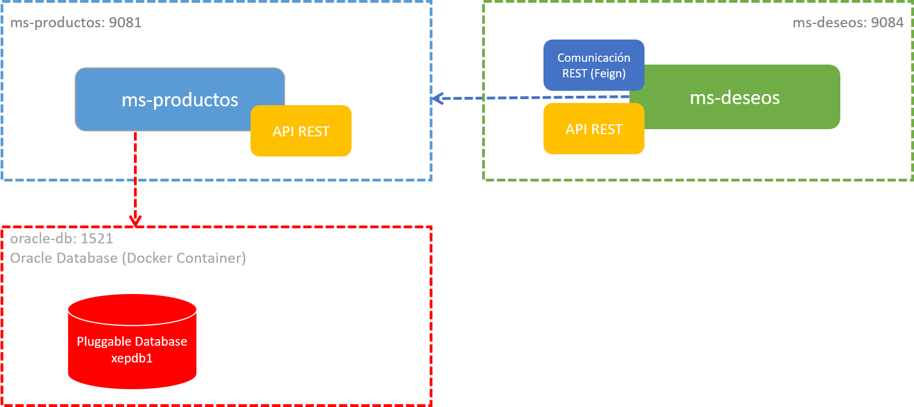

# Práctica 3.2. Customización de propiedades

## Objetivos de la práctica:
Al finalizar esta práctica, serás capaz de:
- Retomar los microservicios desarrollados anteriormente (ms-productos y ms-deseos), ajustando su configuración mediante la definición de propiedades en archivos application.properties y variables de ambiente para su despliegue en un entorno basado en contenedores.

## Duración aproximada:
- 20 minutos.

## Objetivo visual


<br/>
## Instrucciones


### Paso 1. **Preparación del entorno**  

- **Configurar los microservicios:** Asegúrate de que los microservicios `ms-productos` y `ms-deseos` están correctamente configurados y listos para ejecutarse en el entorno de desarrollo **Spring Tool Suite (STS)**.

- **Confirmar la base de datos:** Verificar que el contenedor de Oracle Database (`oracle-db`) está correctamente desplegado, funcionando y accesible en el **espacio de nombres por defecto** del clúster de Kubernetes.

<br/>

### Paso 2. **Archivos de configuración (`application.properties`)**  

#### **Microservicio `ms-productos`**  
Editar el archivo `application.properties` en el directorio de configuración del microservicio `ms-productos` con las siguientes propiedades básicas:

```properties
# Configuración del nombre de la aplicación.
spring.application.name=ms-productos

# Configuración del puerto del servidor.
server.port=9081

# Configuración de la base de datos.
spring.datasource.url=jdbc:oracle:thin:@dki-oradb:1521/XEPDB1
spring.datasource.username=dkuser
spring.datasource.password=dkpassword
spring.datasource.driver-class-name=oracle.jdbc.OracleDriver

# Configuración de JPA e Hibernate.
spring.jpa.hibernate.ddl-auto=update
spring.jpa.show-sql=true
spring.jpa.properties.hibernate.dialect=org.hibernate.dialect.OracleDialect
```

#### **Microservicio `ms-deseos`**  
Editar el archivo `application.properties` en el directorio de configuración del microservicio `ms-deseos` con las siguientes propiedades básicas:

```properties
# Configuración del nombre de la aplicación.
spring.application.name=ms-deseos

# Configuración del puerto del servidor.
server.port=9084
```
<br/>

### Paso 3. **Actualizar configuraciones usando variables de entorno**  

Reemplazar el contenido de los archivos `application.properties` en ambos microservicios con las siguientes configuraciones que utilizan variables de entorno:

#### **Archivo `application.properties` para `ms-productos`:**

```properties
spring.application.name=${APP_NAME:ms-productos}


server.port=${SERVER_PORT:9081}

spring.datasource.url=${DB_URL:jdbc:oracle:thin:@oracle-db:1521/XEPDB1}
spring.datasource.username=${DB_USERNAME:dkuser}
spring.datasource.password=${DB_PASSWORD:dkpassword}
spring.datasource.driver-class-name=${DB_DRIVER:oracle.jdbc.OracleDriver}

spring.jpa.hibernate.ddl-auto=${JPA_DDL_AUTO:update}
spring.jpa.show-sql=${JPA_SHOW_SQL:true}
spring.jpa.properties.hibernate.dialect=${HIBERNATE_DIALECT:org.hibernate.dialect.OracleDialect}
```

#### **Archivo `application.properties` para `ms-deseos`:**

```properties
spring.application.name=${APP_NAME:ms-deseos}

server.port=${SERVER_PORT:9084}

productos.service.url=${PRODUCTOS_SERVICE_URL:http://ms-productos:9081}
```

<br/>

### Paso 4. **Validación en el código fuente**

Revisar el código fuente del microservicio `ms-deseos` para verificar la anotación utilizada en la interfaz que define el cliente Feign para el consumo del microservicio `ms-productos`.

- **Anotación actual:**
  
  ```java
  @FeignClient(name = "ms-productos", url = "http://ms-productos:9081")
  public interface ProductoFeignClient {
      // Métodos del cliente
  }
  ```

- **Cambios necesarios:** Modificar el valor de `url` para utilizar la variable configurada en el archivo `application.properties`:
  
  ```java
  @FeignClient(name = "ms-productos", url = "${productos.service.url}")
  public interface ProductoFeignClient {
      // Métodos del cliente
  }
  ```

Este cambio asegura que la URL se cargue desde las propiedades configuradas, haciéndola más flexible y fácil de adaptar a diferentes entornos.

<br/>

### Paso 5. **Construcción de artefactos**

Generar los archivos JAR para cada microservicio ejecutando los siguientes comandos en la raíz de cada proyecto:

- Si estás utilizando Maven:
 
  ```bash
  mvn clean package -Dmaven.test.skip=true
  ```

- Si estás utilizando el wrapper de Maven:
 
  ```bash
  ./mvnw clean package -Dmaven.test.skip=true
  ```

El argumento `-Dmaven.test.skip=true` permite omitir la ejecución de pruebas unitarias para acelerar el proceso de construcción.


<br/>

### Paso 6. **Verificación de artefactos**

Confirmar que se generaron los archivos JAR en el directorio `target` de cada microservicio. Los nombres de los archivos deberían ser similares a los siguientes:

- Para `ms-productos`: `ms-productos-0.0.1-SNAPSHOT.jar`

- Para `ms-deseos`: `ms-deseos-0.0.1-SNAPSHOT.jar`

Si los archivos no se generaron correctamente, verificar los mensajes de error en el log de Maven y corregir cualquier problema antes de continuar.


<br/>
<br/>

## Resultados esperados

### **Resultados esperados de la práctica**

1. **Configuración correcta de propiedades**
   - Los archivos `application.properties` de ambos microservicios (`ms-productos` y `ms-deseos`) estarán correctamente actualizados con valores dinámicos utilizando variables de entorno.

   - Se habrán definido valores por defecto en las propiedades para asegurar su funcionamiento en entornos sin configuración adicional.

2. **Cliente Feign actualizado**
   - El cliente Feign en el microservicio `ms-deseos` estará correctamente configurado para consumir el microservicio `ms-productos` utilizando la propiedad `${productos.service.url}` en lugar de una URL fija.
   
   - Este cambio permitirá una mayor flexibilidad para adaptarse a diferentes entornos.

3. **Construcción de artefactos**
   - Los archivos JAR para cada microservicio (`ms-productos` y `ms-deseos`) se habrán generado correctamente y estarán disponibles en el directorio `target` de sus respectivos proyectos.
   
   - Ejemplo:
     - `ms-productos-0.0.1-SNAPSHOT.jar`
     - `ms-deseos-0.0.1-SNAPSHOT.jar`

