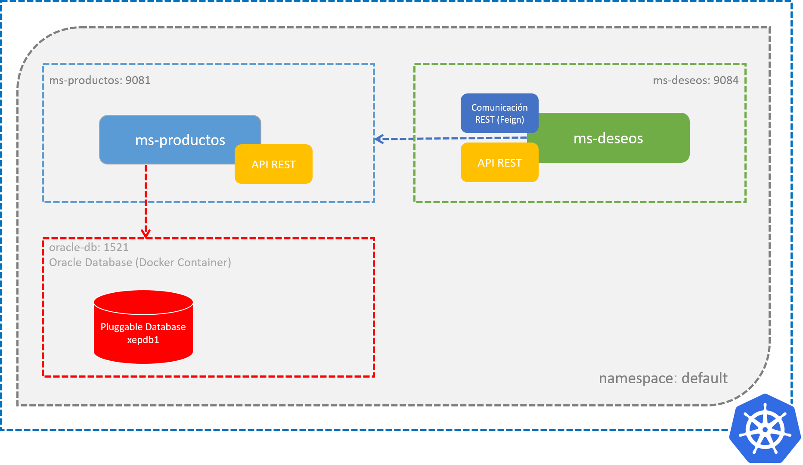

# Práctica 3.4. Configuración con ConfigMaps y Secrets

## Objetivos de las prácticas:
Al finalizar esta práctica, serás capaz de:
- Crear manifiestos YAML para configurar ConfigMaps y Secrets en Kubernetes.
- Aplicar esta configuración para gestionar información sensible y específica de la aplicación, desplegando los microservicios `ms-productos` y `ms-deseos` con estas configuraciones y probando su funcionamiento.

## Duración aproximada:
- 30 minutos.

## Objetivo visual



<br/>

## Instrucciones

### Paso 1. Crear Secret para credenciales de la base de datos

El Secret almacenará las credenciales de `dkuser` y `dkpassword` para la base de datos Oracle.

**Archivo `secret-db.yaml`:**
```yaml
apiVersion: v1
kind: Secret
metadata:
  name: db-credentials
type: Opaque
data:
  DB_USERNAME: ZGt1c2Vy # Base64 de "dkuser"
  DB_PASSWORD: ZGtwYXNzd29yZA== # Base64 de "dkpassword"
```

- **Nota**: Verifica que efectivamente la contraseña para dkuser y contraseña son las correctas en Base64

**Comandos para aplicar y verificar el Secret:**

```bash
kubectl apply -f secret-db.yaml

# Para verificar

kubectl get secrets

kubectl describe secret <nombre-del-secret> -n <namespace>

kubectl get secret <nombre-del-secret> -n <namespace> -o yaml

echo <valor-codificado-base64> | base64 --decode

```
<br/>

### Paso 2. Crear ConfigMaps para propiedades de los microservicios

**Archivo `configmap-ms-productos.yaml`:**

```yaml
apiVersion: v1
kind: ConfigMap
metadata:
  name: ms-productos-config
data:
  APP_NAME: ms-productos
  SERVER_PORT: "9081"
  DB_URL: jdbc:oracle:thin:@oracle-db:1521/XEPDB1
  DB_DRIVER: oracle.jdbc.OracleDriver
  JPA_DDL_AUTO: update
  JPA_SHOW_SQL: "true"
  HIBERNATE_DIALECT: org.hibernate.dialect.OracleDialect
```

**Archivo `configmap-ms-deseos.yaml`:**
```yaml
apiVersion: v1
kind: ConfigMap
metadata:
  name: ms-deseos-config
data:
  APP_NAME: ms-deseos
  SERVER_PORT: "9084"
  PRODUCTOS_SERVICE_URL: http://ms-productos:9081
```

**Comandos para aplicar y verificar los ConfigMaps:**

```bash
kubectl apply -f configmap-ms-productos.yaml

kubectl apply -f configmap-ms-deseos.yaml

# Verificar
kubectl get configmaps -n <namespace>

kubectl describe configmap <nombre-del-configmap> -n <namespace>

kubectl get configmap <nombre-del-configmap> -n <namespace> -o yaml


```

<br/>

### Paso 3. Crear Deployments para los microservicios

Verificar que tengas a la mano el TAG de la imagen Docker correspondiente al microservicio `ms-productos`, registrada en tu repositorio de Docker Hub. Este TAG será indispensable para reemplazar el valor del atributo `image` en el siguiente archivo YAML de deployment.


**Archivo `deployment-ms-productos.yaml`:**

```yaml
apiVersion: apps/v1
kind: Deployment
metadata:
  name: ms-productos
spec:
  replicas: 1
  selector:
    matchLabels:
      app: ms-productos
  template:
    metadata:
      labels:
        app: ms-productos
    spec:
      containers:
      - name: ms-productos
        image: <tu-docker-registry>/ms-productos:<version | latest>
        ports:
        - containerPort: 9081
        env:
        - name: DB_USERNAME
          valueFrom:
            secretKeyRef:
              name: db-credentials
              key: DB_USERNAME
        - name: DB_PASSWORD
          valueFrom:
            secretKeyRef:
              name: db-credentials
              key: DB_PASSWORD
        - name: APP_NAME
          valueFrom:
            configMapKeyRef:
              name: ms-productos-config
              key: APP_NAME
        - name: SERVER_PORT
          valueFrom:
            configMapKeyRef:
              name: ms-productos-config
              key: SERVER_PORT
        - name: DB_URL
          valueFrom:
            configMapKeyRef:
              name: ms-productos-config
              key: DB_URL
        - name: DB_DRIVER
          valueFrom:
            configMapKeyRef:
              name: ms-productos-config
              key: DB_DRIVER
        - name: JPA_DDL_AUTO
          valueFrom:
            configMapKeyRef:
              name: ms-productos-config
              key: JPA_DDL_AUTO
        - name: JPA_SHOW_SQL
          valueFrom:
            configMapKeyRef:
              name: ms-productos-config
              key: JPA_SHOW_SQL
        - name: HIBERNATE_DIALECT
          valueFrom:
            configMapKeyRef:
              name: ms-productos-config
              key: HIBERNATE_DIALECT
```

<br/>

Verificar que tengas a la mano el TAG de la imagen Docker correspondiente al microservicio `ms-deseos`, registrada en tu repositorio de Docker Hub. Este TAG será indispensable para reemplazar el valor del atributo `image` en el siguiente archivo YAML de deployment.

**Archivo `deployment-ms-deseos.yaml`:**
```yaml
apiVersion: apps/v1
kind: Deployment
metadata:
  name: ms-deseos
spec:
  replicas: 1
  selector:
    matchLabels:
      app: ms-deseos
  template:
    metadata:
      labels:
        app: ms-deseos
    spec:
      containers:
      - name: ms-deseos
        image: <tu-docker-registry>/ms-deseos:<TAG | lastest>
        ports:
        - containerPort: 9084
        env:
        - name: APP_NAME
          valueFrom:
            configMapKeyRef:
              name: ms-deseos-config
              key: APP_NAME
        - name: SERVER_PORT
          valueFrom:
            configMapKeyRef:
              name: ms-deseos-config
              key: SERVER_PORT
        - name: PRODUCTOS_SERVICE_URL
          valueFrom:
            configMapKeyRef:
              name: ms-deseos-config
              key: PRODUCTOS_SERVICE_URL
```

<br/>

**Comandos para aplicar y verificar los Deployments:**

```bash
kubectl apply -f deployment-ms-productos.yaml
kubectl apply -f deployment-ms-deseos.yaml

# Verificación

kubectl get deployments -n <namespace>

kubectl describe deployment <nombre-del-deployment> -n <namespace>

kubectl get deployments --all-namespaces

kubectl get deployment <nombre-del-deployment> -n <namespace> -o yaml

kubectl get pods -n <namespace>

kubectl logs <nombre-del-pod> -n <namespace>


```

<br/>

### Paso 4. Crear Services para ambos microservicios


**Archivo `service-ms-productos.yaml`:**

```yaml
apiVersion: v1
kind: Service
metadata:
  name: ms-productos
spec:
  selector:
    app: ms-productos
  ports:
  - protocol: TCP
    port: 9081 # Puerto interno del servicio
    targetPort: 9081 # Puerto del contenedor
    nodePort: 30081 # Puerto expuesto en el nodo
  type: NodePort
```

**Archivo `service-ms-deseos.yaml`:**
```yaml
apiVersion: v1
kind: Service
metadata:
  name: ms-deseos
spec:
  selector:
    app: ms-deseos
  ports:
  - protocol: TCP
    port: 9084 # Puerto interno del servicio
    targetPort: 9084 # Puerto del contenedor
    nodePort: 30084 # Puerto expuesto en el nodo
  type: NodePort

```

**Comandos para aplicar y verificar los Services:**
```bash
kubectl apply -f service-ms-productos.yaml
kubectl apply -f service-ms-deseos.yaml

# Verificación
kubectl get services

kubectl describe service ms-productos

kubectl describe service ms-deseos

kubectl get pods -o wide

```

<br/>

### Paso 5. Probar el despliegue con `curl` o Postman

1. **Verificar los servicios están expuestos correctamente:**

   ```bash
   kubectl get services
   ```

Esto mostrará los servicios con sus puertos configurados, incluyendo los `NodePort`. Por ejemplo:

   ```
   NAME           TYPE        CLUSTER-IP      EXTERNAL-IP   PORT(S)          AGE
   ms-productos   NodePort    10.96.0.1       <none>        9081:30081/TCP   5m
   ms-deseos      NodePort    10.96.0.2       <none>        9084:30084/TCP   5m
   ```

<br/>

2. **Obtener la IP del nodo (clúster):**

   Para acceder a los servicios expuestos, necesitas conocer la IP del nodo en el clúster. Por ejemplo, si la IP es `192.168.49.2`, esta será la dirección para las pruebas.

<br/>

3. **Realizar una prueba con `curl`:**

   Acceder a los servicios a través de la IP del nodo y los puertos configurados (`30081` para `ms-productos` y `30084` para `ms-deseos`).

   ```bash
   curl http://192.168.49.2:30081/endpoint-de-prueba
   curl http://192.168.49.2:30084/endpoint-de-prueba
   ```

   **Nota:** Reemplazar `192.168.49.2` con la IP real del nodo.

<br/>

4. **Alternativamente, usar Postman para realizar las pruebas:**

   - Para `ms-productos`: Usa la URL `http://192.168.49.2:30081/endpoint-de-prueba`.
   - Para `ms-deseos`: Usa la URL `http://192.168.49.2:30084/endpoint-de-prueba`.

   Configura los métodos HTTP, encabezados y payload según los endpoints definidos en tus microservicios.


<br/>
<br/>

## Resultado esperado

Aquí tienes una tabla que resume los endpoints de cada microservicio (`ms-productos` y `ms-deseos`) con detalles sobre sus métodos HTTP, rutas, y descripciones.

<br/>

### **Endpoints de `ms-productos`**

| Método HTTP | Endpoint               | Descripción                                                 | Ejemplo de uso                        |
|-------------|------------------------|-------------------------------------------------------------|---------------------------------------|
| GET         | `/productos`           | Lista todos los productos.                                  | `curl http://<IP>:30081/productos`    |
| GET         | `/productos/{id}`      | Obtiene un producto por su ID.                              | `curl http://<IP>:30081/productos/1`  |
| POST        | `/productos`           | Crea un nuevo producto.                                     | `curl -X POST -H "Content-Type: application/json" -d '{"nombre":"Producto 1","descripcion":"Desc 1","precio":100.0,"stock":10}' http://<IP>:30081/productos` |
| PUT         | `/productos/{id}`      | Actualiza un producto existente por su ID.                  | `curl -X PUT -H "Content-Type: application/json" -d '{"nombre":"Producto Actualizado","descripcion":"Nueva Desc","precio":150.0,"stock":20}' http://<IP>:30081/productos/1` |
| DELETE      | `/productos/{id}`      | Elimina un producto por su ID.                              | `curl -X DELETE http://<IP>:30081/productos/1` |


<br/>


### **Endpoints de `ms-deseos`**

| Método HTTP | Endpoint               | Descripción                                                 | Ejemplo de uso                        |
|-------------|------------------------|-------------------------------------------------------------|---------------------------------------|
| GET         | `/deseos`              | Lista todos los deseos actuales.                           | `curl http://<IP>:30084/deseos`       |
| POST        | `/deseos/{idProducto}` | Agrega un producto a la lista de deseos por su ID.         | `curl -X POST http://<IP>:30084/deseos/1` |
| DELETE      | `/deseos/{idProducto}` | Elimina un producto de la lista de deseos por su ID.       | `curl -X DELETE http://<IP>:30084/deseos/1` |


<br/>

### **Notas importantes:**

1. **IP y puertos:** 
   - Reemplazar `<IP>` con la IP del nodo del clúster.
   - `30081` es el puerto NodePort para `ms-productos`.
   - `30084` es el puerto NodePort para `ms-deseos`.

2. **Formato del payload:** Asegúrate de enviar el JSON correcto para las operaciones `POST` y `PUT`. 
   - Para `ms-productos`, usar el esquema de la entidad `Producto` para las solicitudes.

3. **Pruebas:** Puedes usar `curl` o Postman para probar los endpoints con los ejemplos proporcionados.


