# Práctica 4. Spring Cloud Kubernetes

## Objetivos de la práctica:
Al finalizar esta práctica, serás capaz de:
- Integrar y aplicar todos los conocimientos adquiridos en la unidad 4 para configurar, desplegar y probar microservicios Spring Boot en un clúster de Kubernetes, utilizando Spring Cloud Kubernetes, ConfigMaps, configuración de entornos, probes de liveness y readiness, y ajustes de recursos para contenedores, validando la implementación mediante herramientas como Postman y observando el comportamiento del LoadBalancer y metadata de los Pods.

## Duración aproximada:
- 180 minutos.

## Objetivo visual

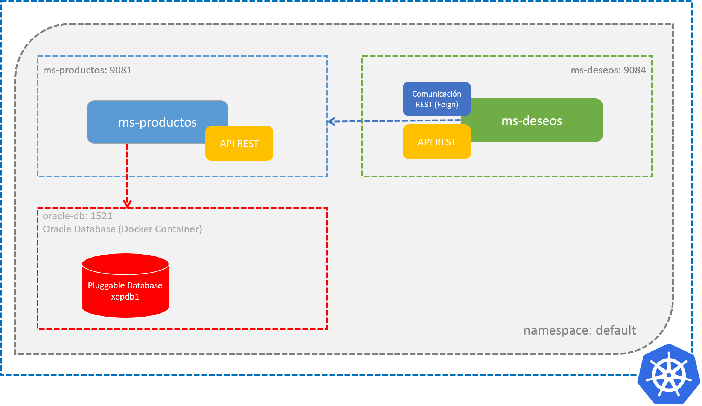


## Instrucciones

### **Paso 1. Configuración de Spring Cloud Kubernetes en los microservicios**

#### 1. **Agregar las dependencias necesarias en el archivo `pom.xml`** para cada microservicio:

   - **Spring Cloud Kubernetes Client**
   - **Spring Cloud Kubernetes Client Config**
   - **Spring Cloud Kubernetes Client LoadBalancer**
   - **Spring Boot Starter Actuator**

##### **Notas:**

1. Usar las versiones compatibles con Spring Boot y Kubernetes. Consultar las [Versiones Soportadas](https://github.com/spring-cloud/spring-cloud-release/wiki/Supported-Versions).

2. En la elaboración del material de curso (Nov/2024) se usó la versión 3.1.2 con Spring Boot 3.3.5.

3. Para sincronizar las dependencias del proyecto y asegurarte de que las configuraciones del archivo `pom.xml` sean reconocidas en el entorno de desarrollo, sigue estos pasos:

    - Abrir el archivo `pom.xml` del proyecto en tu IDE.  
    - Presionar la combinación de teclas **[Alt] + [F5]** para iniciar la actualización del proyecto Maven.  
    - En el cuadro de diálogo "Update Maven Project", verificar las opciones necesarias y confirmar presionando el botón **OK**.

<br/>

#### 2. **Anota la clase principal de cada microservicio con `@EnableDiscoveryClient`**:

Anotar la clase principal de cada aplicación con `@EnableDiscoveryClient` para habilitar la capacidad de descubrimiento en Kubernetes.

- Abrir el archivo de la clase principal de la aplicación, llamados `MsProductosApplication` y `MsDeseosApplication`.

- Agregar la anotación `@EnableDiscoveryClient` para permitir que los microservicios se registren y descubran en Kubernetes.

- **Archivo**: `MsProductosApplication.java`

    ```java
    package com.netec.app;

    import org.springframework.boot.SpringApplication;
    import org.springframework.boot.autoconfigure.SpringBootApplication;
    import org.springframework.cloud.client.discovery.EnableDiscoveryClient;

    @EnableDiscoveryClient
    @SpringBootApplication
    public class MsProductosApplication {

        public static void main(String[] args) {
            SpringApplication.run(MsProductosApplication.class, args);
        }

    }
   ```

<br/>

- **Archivo**: `MsDeseosApplication.java`

    ```java
    package com.netec.app;

    import org.springframework.boot.SpringApplication;
    import org.springframework.boot.autoconfigure.SpringBootApplication;
    import org.springframework.cloud.client.discovery.EnableDiscoveryClient;
    import org.springframework.cloud.openfeign.EnableFeignClients;

    @EnableDiscoveryClient
    @EnableFeignClients
    @SpringBootApplication
    public class MsDeseosApplication {

        public static void main(String[] args) {
            SpringApplication.run(MsDeseosApplication.class, args);
        }

    }
   ```

<br/>


#### 3. **Actualizar el cliente Feign en el microservicio `ms-deseos`:**
 
- Modificar la clase `ProductoFeignClient` para usar el servicio de descubrimiento en lugar de una URL estática. 

- Eliminar la referencia el atributo URL en la anotación `@FeignClient`.

- **Archivo: `ProductoFeignClient.java`**

    ```java
    package com.netec.app.feign;

    import org.springframework.cloud.openfeign.FeignClient;
    import org.springframework.web.bind.annotation.GetMapping;
    import org.springframework.web.bind.annotation.PathVariable;

    //@FeignClient(name = "ms-productos", url = "http://ms-productos:9081")
    @FeignClient(name = "ms-productos")
    public interface ProductoFeignClient {

        @GetMapping("/productos/{id}")
        Producto obtenerProductoPorId(@PathVariable Long id);

        class Producto {
            private Long id;
            private String nombre;
            private String descripcion;
            private Double precio;
            private Integer stock;

            // Getters y Setters
            // Líneas omitidas
        }
    }

    ```
 
<br/>

#### 4. **Modificar el controlador de ms-productos para incluir metadatos del Pod** 

Modificar el controlador del microservicio para incluir en la respuesta el nombre y la dirección IP del Pod que procesa la solicitud.

- **Archivo**: `ProductoController.java`


    ```java
    
    package com.netec.app.controller;

    import java.util.List;
    import java.util.Map;

    import org.springframework.beans.factory.annotation.Autowired;
    import org.springframework.core.env.Environment;
    import org.springframework.http.ResponseEntity;
    import org.springframework.web.bind.annotation.DeleteMapping;
    import org.springframework.web.bind.annotation.GetMapping;
    import org.springframework.web.bind.annotation.PathVariable;
    import org.springframework.web.bind.annotation.PostMapping;
    import org.springframework.web.bind.annotation.PutMapping;
    import org.springframework.web.bind.annotation.RequestBody;
    import org.springframework.web.bind.annotation.RequestMapping;
    import org.springframework.web.bind.annotation.RestController;

    import com.netec.app.entities.Producto;
    import com.netec.app.service.IProductoService;

    @RestController
    @RequestMapping("/productos")
    public class ProductoController {

        private final IProductoService productoService;

        @Autowired
        private Environment environment;

        public ProductoController(IProductoService productoService) {
            this.productoService = productoService;
        }

        /*
        POD_NAME: Obtiene el nombre del Pod desde la metadata.
        POD_ID: Obtiene la IP del Pod desde el estado.
       */

        @GetMapping
        public Map<String, Object> listarTodos() {
            return Map.of(
                "POD_NAME", environment.getProperty("POD_NAME", "Unknown"),   
                "POD_ID", environment.getProperty("POD_ID", "Unkown"), 
                "SALUDO", environment.getProperty("config.saludo", "Unknown"),
                "productos", productoService.listarTodos());
        }

        @GetMapping("/{id}")
        public ResponseEntity<Producto> obtenerPorId(@PathVariable Long id) {
            return productoService.obtenerPorId(id).map(ResponseEntity::ok).orElse(ResponseEntity.notFound().build());
        }

        @PostMapping
        public ResponseEntity<Producto> crear(@RequestBody Producto producto) {
            return ResponseEntity.ok(productoService.guardar(producto));
        }

        @PutMapping("/{id}")
        public ResponseEntity<Producto> actualizar(@PathVariable Long id, @RequestBody Producto producto) {
            return ResponseEntity.ok(productoService.actualizar(id, producto));
        }

        @DeleteMapping("/{id}")
        public ResponseEntity<Void> eliminar(@PathVariable Long id) {
            productoService.eliminar(id);
            return ResponseEntity.noContent().build();
        }
    }
    ```

<br/>

#### 5. **Configurar los archivos `application.properties` o `application.yml`**:

Agregar las propiedades necesarias para habilitar la integración con Spring Cloud Kubernetes y Actuator, en ambos microservicios.

 
```properties

    # Spring Cloud Kubernetes
    spring.cloud.kubernetes.discovery.enabled=true
    spring.cloud.kubernetes.secrets.enable-api=true
    spring.cloud.kubernetes.discovery.all-namespaces=true

    # Spring Boot Actuator
    management.endpoints.web.exposure.include=*
    management.endpoint.health.show-details=always
    management.endpoint.health.probes.enabled=true
    management.health.livenessstate.enabled=true
    management.health.readinessstate.enabled=true

    # Perfiles
    spring.profiles.active=dev

```

- **Nota:** Evitar incluir caracteres especiales, como acentos, incluso en los comentarios del archivo `properties`, ya que esto podría provocar la excepción `MalformedInputException` durante el proceso de empaquetado.

<br/>


#### 6. **Crear los artefactos para cada microservicio**

- Asegúrate de que el código fuente de cada microservicio (`ms-productos` y `ms-deseos`) esté actualizado y sin errores en el entorno de desarrollo.

- Usar la herramienta de construcción (**Maven**) para compilar el proyecto y generar los artefactos JAR correspondientes.

- Verificar que los archivos JAR generados estén en la carpeta `target` de cada microservicio. Los artefactos deben tener nombres como:

  - `ms-productos-<versión>.jar`
  - `ms-deseos-<versión>.jar`

- Asegúrate de que los artefactos cumplen con los requisitos funcionales y de configuración antes de continuar con los siguientes pasos del despliegue.

<br/>

> **Nota:** Estos artefactos serán usados en la construcción de imágenes Docker para cada microservicio desplegado en Kubernetes.


<br/>

#### 7. **Registrar las nuevas imagenes en Docker Hub**

- Iniciar sesión en Docker Hub desde la terminal para autenticarte con tu cuenta.
   
- Etiquetar las imágenes locales para asociarlas al repositorio en Docker Hub.

- Subir las imágenes etiquetadas al repositorio en Docker Hub.

- Verificar en la plataforma de Docker Hub que las imágenes `ms-productos` y `ms-deseos` se hayan registrado correctamente en la cuenta.

- **Nota:** Recuerda utilizar tu nombre de usuario de Docker Hub al etiquetar las imágenes.

<br/>
<br/>


### Paso 2. Crear Role & RoleBinding

#### 1. Crear un archivo YAML para configurar un Role

- Crear un archivo YAML llamado `role.yml`.

- Definir un Role que permita al ServiceAccount acceder al recurso `pods` dentro del namespace `default`.

- Asegúrate de especificar los permisos mínimos necesarios:
  - `apiGroups`: Configura el grupo de API como vacío (`""`) para recursos básicos como `pods`.
  - `resources`: Especifica `pods`.
  - `verbs`: Incluye los permisos requeridos, como `get` y `list`.

- Crear un archivo YAML llamado `rolebinding.yml`.

- Configurar un RoleBinding que enlace el Role creado anteriormente al ServiceAccount que usará el microservicio.

- Especificar:
  - `subjects`: Definir el ServiceAccount `default` en el namespace `default`, o un ServiceAccount dedicado si ya lo has creado.
  - `roleRef`: Hacer referencia al Role definido en el archivo `role-pod-reader.yml`.

- Guardar ambos archivos (`role-pod-reader.yml` y `rolebinding-pod-reader.yml`).

- Aplicar las configuraciones usando los siguientes comandos:

   ```bash
   kubectl apply -f role.yml
   kubectl apply -f rolebinding.yml
   ```
<br/>
<br/>


### Paso 3. Crear ConfigMaps para las configuraciones de los microservicios

#### 1. **Codificar un archivo YAML para ConfigMap**:
   
- Definir un ConfigMap para cada microservicio (`ms-productos` y `ms-deseos`) que incluya configuraciones personalizadas, como propiedades específicas del entorno.

- **Elementos a incluir en el ConfigMap:**
    - Nombre del ConfigMap.
    - Clave-valor de las propiedades (`app.name`, `app.environment`, etc.).
    - No olvides a config.saludo : Bienvenido <tu-nombre> al curso Docker Kubernetes Intermedio
   
- **Comandos para crear los ConfigMap:**

    ```bash
    kubectl apply -f ms-productos-configmap.yml
    kubectl apply -f ms-deseos-configmap.yml
    ```
   

- **Nota**: Dado que ambos microservicios están, por defecto, en el espacio de nombres `default`, puedes utilizar `oracle-db` como identificador. Sin embargo, para mayor claridad y especificidad, puedes usar una URL completa como: 

    ```plaintext
    DB_URL: jdbc:oracle:thin:@oracle-db.default.svc.cluster.local:1521/XEPDB1
    ```

<br/>
<br/>

### **Paso 4. Verificar los Secrets**

#### 1. Asegúrate de tener configurados los **Secrets** que contienen el usuario y la contraseña de la base de datos, ambos codificados en **Base64**.  

#### 2. Los valores para el usuario y la contraseña son:  
   - **Usuario:** `dkuser`  
   - **Contraseña:** `dkpassword`  

#### 3. Utilizar los siguientes comandos para verificar la existencia y contenido de los **Secrets**:  

   - `kubectl get secrets`  
   - `kubectl describe secrets <nombre-del-secret>`

<br/>
<br/>

### Paso 5. Configurar los Deployments de Kubernetes

Crear el YAML para los Deployments de cada microservicio que cumpla lo siguiente:

#### 1. **Especificar las `Liveness Probe` y `Readiness Probe`:**
   - Definir las `probes` en la especificación del contenedor dentro del archivo YAML del Deployment:
     - **Liveness Probe**: Configura el endpoint `/actuator/health/liveness`.
     - **Readiness Probe**: Configura el endpoint `/actuator/health/readiness`.
   - Asegúrate de incluir los tiempos de inicio (`initialDelaySeconds`), períodos de sondeo (`periodSeconds`) y tiempos de espera (`timeoutSeconds`).

#### 2. **Configurar el número de réplicas:**
   - Especificar que el **Deployment** de `ms-productos` debe tener **dos réplicas** del contenedor para garantizar alta disponibilidad y balanceo de carga. Esto se logra ajustando el valor del atributo `replicas` en la definición del Deployment.

#### 3. **Usar las imágenes Docker registradas:**
   - Asegúrate de utilizar las imágenes Docker creadas y registradas previamente en el Paso 1 en la configuración del contenedor dentro del Deployment.

#### 4. **Configurar las variables de entorno `POD_NAME` y `POD_ID`:**
   - Agregar las siguientes variables de entorno para que los contenedores obtengan automáticamente datos del Pod:
     1. **`POD_NAME`**: Configúrala para obtener el nombre del Pod desde `metadata.name`.
     2. **`POD_ID`**: Configúrala para obtener la IP del Pod desde `status.podIP`.
   - Utilizar la sección `env` en la especificación del contenedor para definir estas variables, haciendo referencia a los campos correspondientes mediante `fieldRef`.

#### 5. **Establecer recursos para el contenedor:**
   - Configurar límites (`limits`) y solicitudes (`requests`) de recursos en la especificación del contenedor:
     - **Requests**:
       - CPU: `500m`.
       - Memoria: `256Mi`.
     - **Limits**:
       - CPU: `800m`.
       - Memoria: `800Mi`.

#### 6. **Configurar un Deployment con ConfigMap y Mounts**

- **Definir el volumen basado en un ConfigMap**:
   - Crear un volumen utilizando un ConfigMap existente. 
   - Especificar el nombre del ConfigMap (`ms-productos-config`) que contiene las configuraciones necesarias.
   - Seleccionar los elementos del ConfigMap que se deben incluir en el volumen, indicando claves específicas (por ejemplo, `application.yml`) y la ruta dentro del volumen.

- **Asignar el volumen al contenedor mediante `volumeMounts`**:
   - Montar el volumen en un directorio dentro del contenedor (por ejemplo, `/config/application.yml`).
   - Configurar `subPath` para asegurarte de que solo el archivo necesario (`application.yml`) esté disponible en el directorio especificado.

- **Configurar los argumentos del contenedor (`args`)**:
   - Agregar un argumento que especifique una ubicación adicional de configuración de Spring Boot. Esto permite que la aplicación cargue las propiedades desde el archivo montado.
   - Usar la opción `--spring.config.additional-location=file:/config/application.yml` para indicar el archivo de configuración montado.

- **Integrar estas configuraciones en el archivo YAML del Deployment**:
   - Incluir la sección de `volumes` en la especificación del `pod`.
   - Configurar `volumeMounts` dentro de la definición del contenedor.
   - Asegúrate de agregar los argumentos en la sección de configuración del contenedor para que Spring Boot pueda acceder al archivo de configuración correctamente.


#### **7. Aplicar el archivo YAML:**

- Una vez completado el archivo YAML del Deployment, aplicar la configuración en el clúster con los siguientes comandos:

```bash
   kubectl apply -f ms-productos-deployment.yml
   kubectl apply -f ms-deseos-deployment.yml
```
<br/>

#### **8. Verificar el estado de los Pods**

- Asegúrate de que los **Pods del microservicio `ms-productos`** estén en el estado correcto:

   - Deberían haber **dos Pods** para `ms-productos`, ambos con el estado **`Running`**.

   - La columna **`READY`** debe mostrar **`1/1`**, indicando que cada Pod está listo y funcionando correctamente.

   ```bash
   kubectl get pods -l app=ms-productos
   ```

   Observar la salida y confirmar que los Pods cumplen con los criterios mencionados.

- Verificar el estado del **Pod del microservicio `ms-deseos`**:

   - Debería haber **un único Pod** con el estado **`Running`**.

   - La columna **`READY`** debe mostrar **`1/1`**, indicando que el Pod está operativo y listo para manejar solicitudes.

   ```bash
   kubectl get pods -l app=ms-deseos
   ```

- Si encuentras algún Pod en estado diferente a **`Running`**, usar el siguiente comando para inspeccionar detalles y diagnosticar posibles problemas:

   ```bash
   kubectl describe pod <pod-name>
   ```

- Para logs específicos de un Pod en particular, ejecutar:

   ```bash
   kubectl logs <pod-name>
   ```

<br/>
<br/>


### Paso 9. Configurar los Services Kubernetes

#### 1. **Codificar el YAML para el servicio de tipo LoadBalancer**:
   
- Definir los puertos y el selector correspondiente.
   
- Incluir el tipo de servicio como `LoadBalancer`.

- **Comando para crear el servicio:**
  
   ```bash
   kubectl apply -f ms-productos-service.yml
   kubectl apply -f ms-deseos-service.yml
   ```

 
#### 2. **Verificar la dirección IP asignada:**
   ```bash
   kubectl get services
   ```

<br/>
<br/>

### Paso 10. Validación final con Postman o curl

#### 1. **Probar los Endpoints**

- Utilizar herramientas como Postman o `curl` para interactuar con los endpoints disponibles:
  - `/actuator/health` para verificar el estado de salud de la aplicación.
  - `/productos` para gestionar productos.
  - `/deseos` para gestionar deseos.
- Asegúrate de usar las direcciones IP y los puertos configurados durante el despliegue.

#### 2. **Validar las respuestas y el comportamiento del balanceador**

- Realizar múltiples solicitudes y observar las respuestas. 
  - Buscar metadatos específicos como los nombres de los Pods que manejaron las solicitudes, lo cual te ayudará a confirmar el balanceo de carga.
- Asegúrate de que las respuestas sean consistentes con la configuración y el estado de los servicios.

#### 3. **Insertar y verificar datos**

- Insertar nuevos productos en la tabla correspondiente mediante las solicitudes API.
- Crear deseos asociándolos con los productos previamente insertados.
- Consultar los productos y deseos para validar que se registraron correctamente y que las relaciones funcionan como se espera.
- Esto garantiza que `ms-deseos` consuma los servicios de `ms-productos` utilizando únicamente el nombre del microservicio, sin necesidad de conocer su dirección IP o puerto.

#### 4. **Monitorear el uso de recursos**

- Revisar el estado del nodo worker para evaluar el consumo de recursos, como memoria y CPU.
  - Utilizar herramientas como `kubectl top` o el dashboard de Kubernetes para obtener métricas detalladas.
- Verificar que los recursos asignados cumplen con las necesidades de las aplicaciones y ajusta si es necesario. 

Con este último paso, garantizas que los microservicios y la infraestructura funcionan correctamente en un entorno de producción simulado.


<br/>
<br/>

### Paso 11. Observación de Pods y Logs

1. **Monitorear los Pods en ejecución**:
   ```bash
   kubectl get pods -o wide
   ```
   
2. **Revisar los logs de los microservicios**:
   ```bash
   kubectl logs <nombre-del-pod>
   ```

<br/>
<br/>

## **Resumen de los resultados esperados**

1. Visualización de los **roles y rolebindings** asignados, confirmando su correcta configuración y asociación.

2. Inspección y verificación de los **ConfigMaps** y **Secrets** configurados, asegurando que se encuentren disponibles y vinculados a los microservicios en el clúster de Kubernetes.

3. Validación clara y estructurada de los **Deployments** y **Pods**, asegurando que estén desplegados y funcionando correctamente.

4. Comprobación de los **Services** creados, verificando sus tipos, puertos configurados y conectividad dentro del clúster.

5. Validación del **balanceo de carga**, confirmando que las solicitudes al servicio de productos se distribuyen equitativamente entre las réplicas configuradas.

6. Acceso a los endpoints de **Actuator**, garantizando el funcionamiento correcto de los probes y la exposición de métricas en cualquiera de los microservicios.

7. Ejecución exitosa y respuesta adecuada al consumir los endpoints estándar de **Actuator** (`/health`, `/metrics`, etc.), confirmando la salud y el rendimiento de los servicios.

8. Consumo exitoso de los endpoints principales de los microservicios, verificando que respondan de forma correcta y cumplan con las expectativas funcionales.

<br/>
<br/>

## **Resultados visuales**

1. Captura de pantalla que evidencia la verificación de los artefactos generados (JARs) correspondientes a cada microservicio en la práctica 4.1.

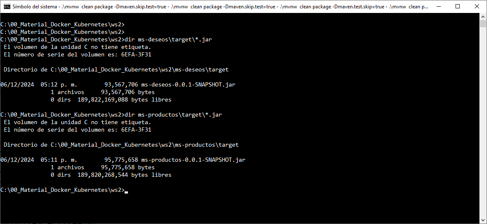

<br/>

2. Captura de pantalla que detalla las instrucciones utilizadas en Docker para registrar la imagen Docker correspondiente al microservicio `ms-productos`.

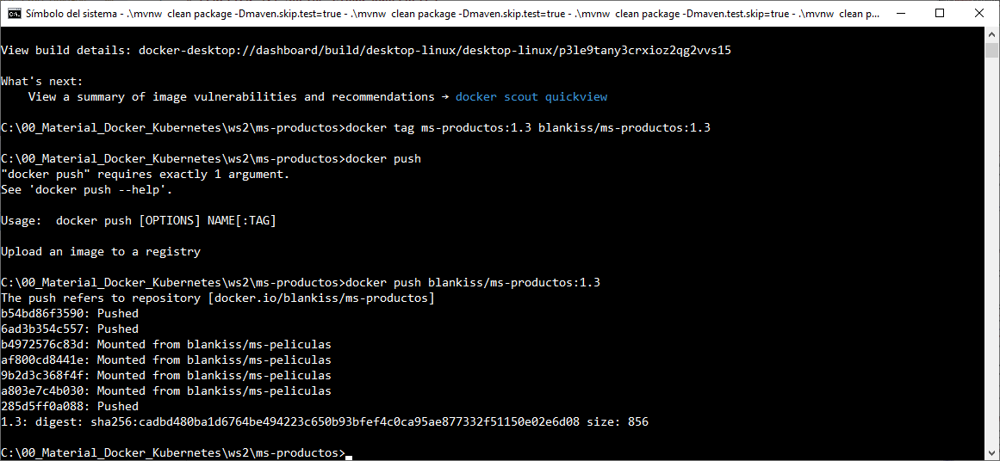

<br/>


3. Captura de pantalla que muestra las instrucciones ejecutadas para aplicar un archivo YAML que configura **Secrets** en el clúster de Kubernetes.

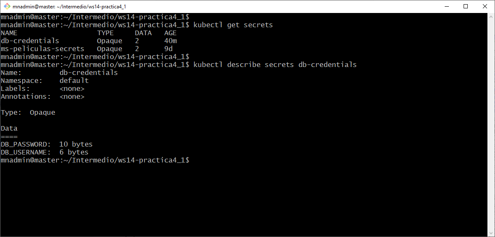

<br/>

4. Captura de pantalla que presenta la descripción detallada del **ConfigMap** asociado al microservicio `ms-productos`, incluyendo algunas de las claves y valores configurados.

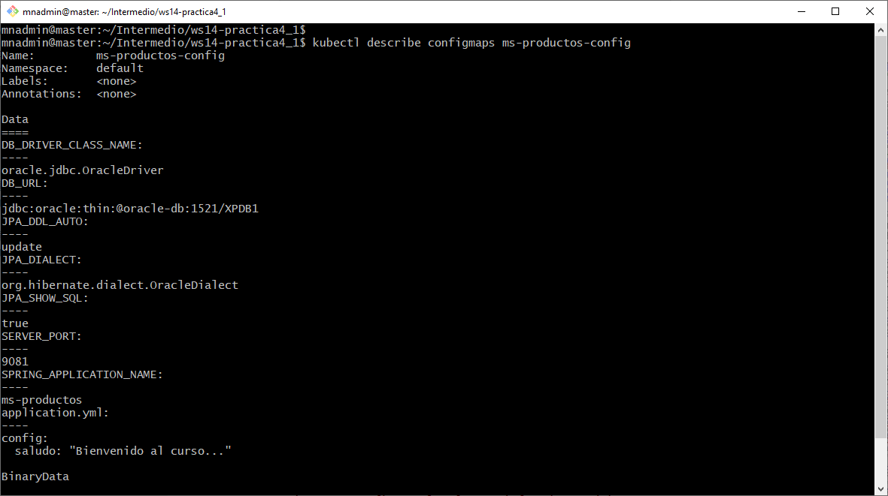

<br/>

5. Captura de pantalla que presenta la descripción detallada del **ConfigMap** asociado al microservicio `ms-deseoas`, incluyendo las claves y valores configurados.

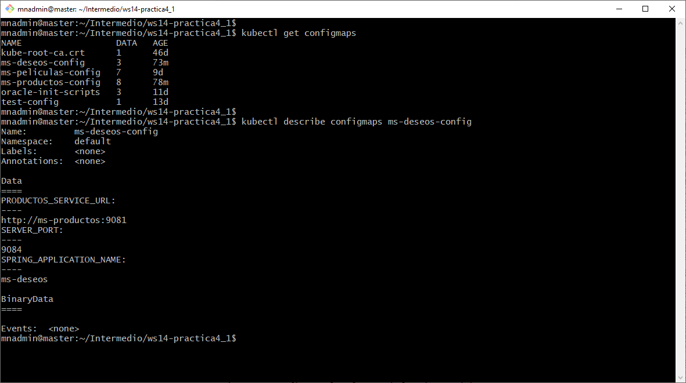

<br/>

6. Captura de pantalla que muestra el estado actual de los **Pods** del microservicio `ms-productos`, confirmando que hay dos réplicas en ejecución y funcionando correctamente.

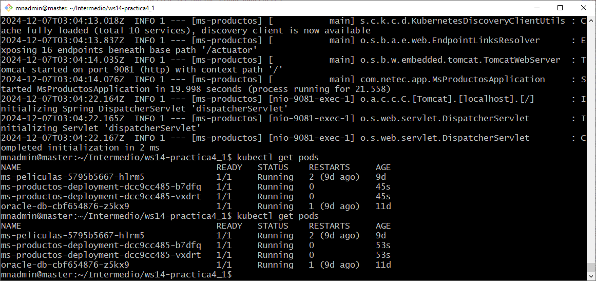

<br/>

7. Captura de pantalla que evidencia la existencia de un **Role** y su correspondiente **RoleBinding**, confirmando su correcta configuración en el clúster.

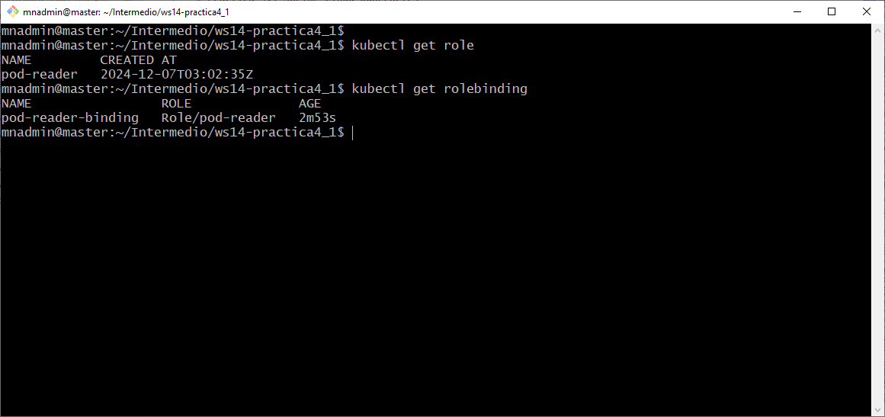


8. Captura de pantalla que muestra una solicitud al microservicio `ms-productos`, evidenciando que no se tienen productos registrados en la base de datos. Además, se observa que el **Deployment** o los **ConfigMaps** presentan un problema al desplegar la propiedad `SALUDO`, ya que esta muestra el valor por defecto definido en el código Java: `"Unknown"`.

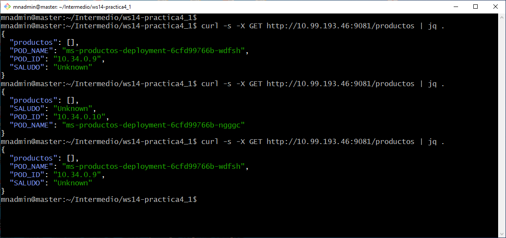

<br/>

9. Captura de pantalla que muestra la ejecución del comando `curl` utilizando el método HTTP `POST` para insertar un producto con los datos `{ "id": 1, "nombre": "Producto A", ... }`. La respuesta confirma una inserción exitosa, ya que el microservicio devuelve el mismo JSON enviado. Además, se incluye una segunda instrucción que muestra la verificación mediante una petición HTTP `GET`, donde se observa que el producto insertado aparece correctamente en los datos almacenados.


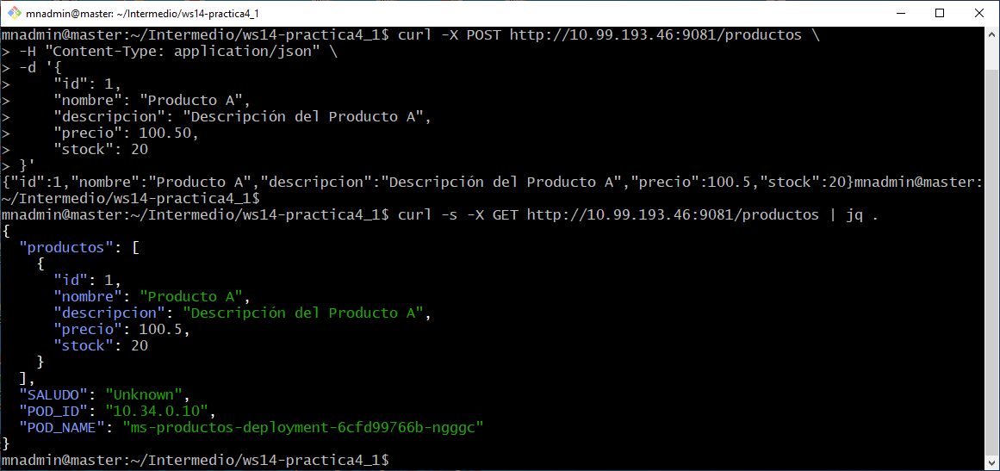

<br/>


10. Captura de pantalla que muestra nuevamente el consumo del microservicio `ms-productos`. En este segundo despliegue, se evidencia que la propiedad `SALUDO` ahora se obtiene correctamente del **ConfigMap** mediante un volumen configurado. Además, se observa el balanceo de carga de Kubernetes, alternando las respuestas que incluyen el nombre y la dirección IP de los Pods en el clúster, confirmando que las solicitudes son distribuidas entre las réplicas.


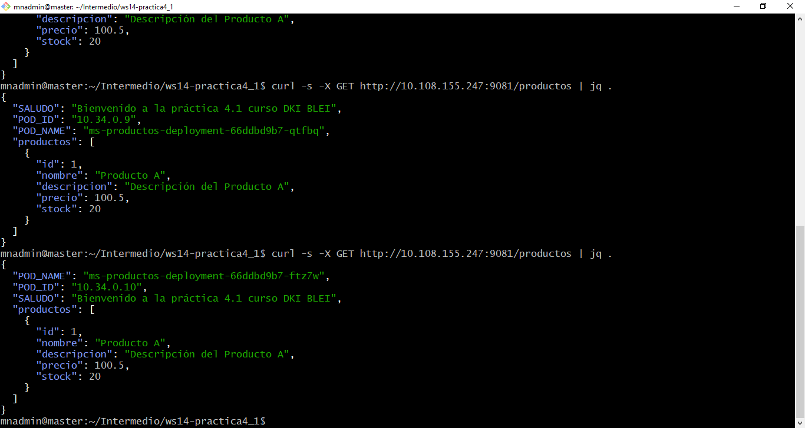

<br/>

11. Captura de pantalla que muestra el acceso exitoso al endpoint **`/actuator`** en la URL `http://10.108.155.247:9081`, confirmando que el microservicio está activo y los endpoints de Actuator están disponibles para su consulta.

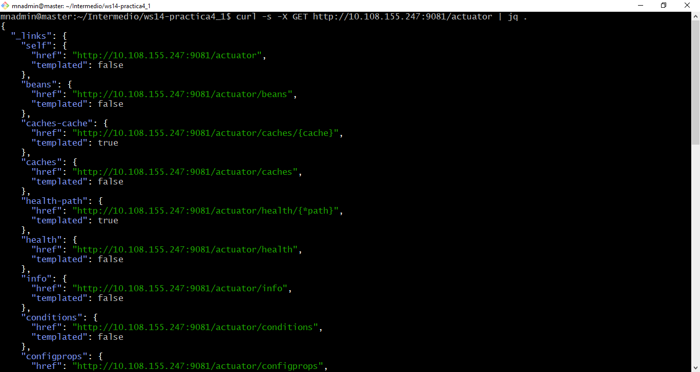

<br/>

12. Captura de pantalla que muestra el acceso exitoso al endpoint **`/actuator/health`** en la URL `http://10.108.155.247:9081`, confirmando que el microservicio está activo y los endpoints de Actuator Health están disponible para su consulta.

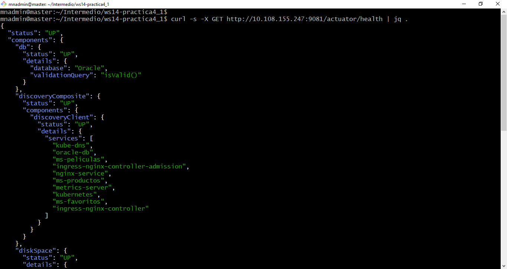

<br/>


13. Captura de pantalla que evidencia el acceso exitoso al endpoint **`/actuator/info`** en la URL `http://10.108.155.247:9081`, mostrando la información configurada del microservicio. Además, incluye una vista parcial del consumo del endpoint **`/actuator/metrics`**, confirmando la disponibilidad de las métricas del sistema y del microservicio.


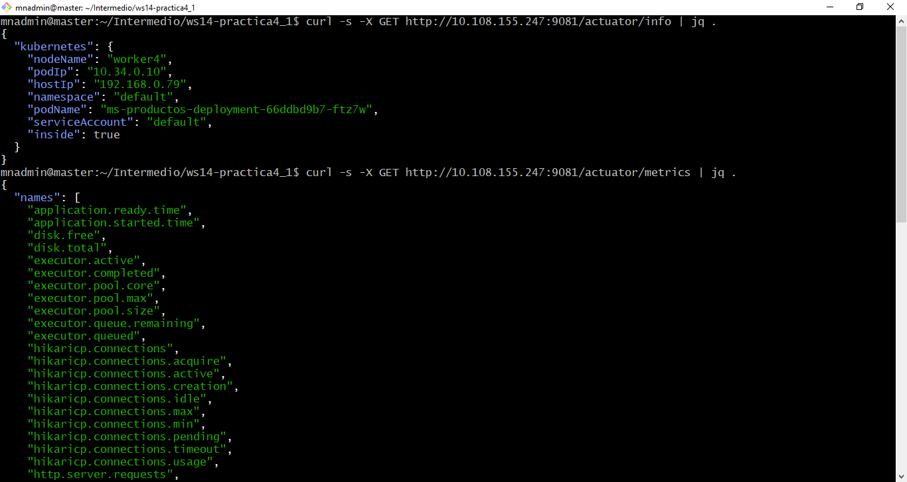

<br/>

14. Los comandos mostrados en la captura de pantalla verifican de manera efectiva que el microservicio está correctamente desplegado, configurado y operando dentro del clúster de Kubernetes. Además, aseguran que las **probes** de liveness y readiness están funcionando como se espera, validando tanto la disponibilidad interna del servicio como su capacidad para atender solicitudes, lo que garantiza un despliegue robusto y funcional.

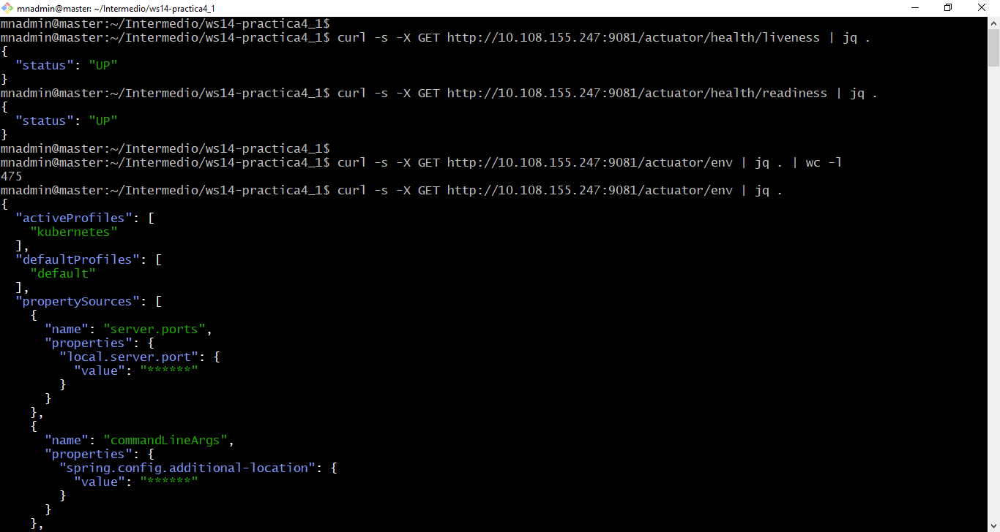

<br/>

15. Captura de pantalla que verifica nuevamente la informacion del servicio asociado ms-productos, y lo que actualmente se tiene en la base de datos, esto es un solo producto, insertado en una punto previo.


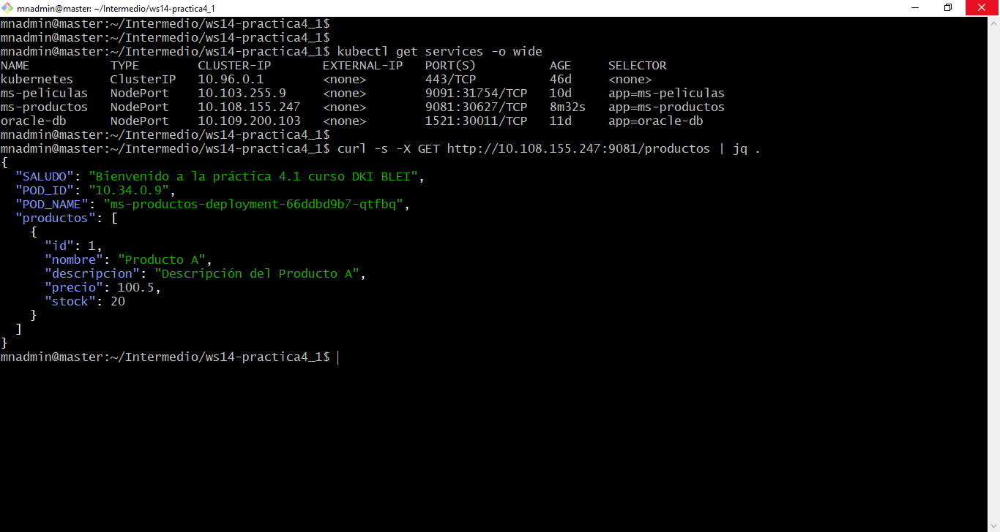

<br/>

16. Captura de pantalla que muestra el análisis de los nodos y Pods en el clúster de Kubernetes, confirmando que el nodo **worker4** está operativo y alojando correctamente las cargas de trabajo asignadas, incluyendo los microservicios `ms-productos` y `ms-peliculas` (este último no era parte de la práctica, pero se encuentra desplegado en el mismo espacio de nombres). Las métricas del nodo indican un uso moderado de recursos (CPU al 3% y memoria al 79%), lo que sugiere que el clúster está funcionando de manera eficiente dentro de los límites configurados. Sin embargo, se observa que el nodo `worker2` no está en estado **Ready** desde el inicio del ambiente utilizado para esta práctica. Esto se debe a una decisión deliberada de reasignar recursos, priorizando solo dos nodos del clúster (un nodo maestro y un nodo worker) para optimizar el rendimiento y evitar sobrecargas.


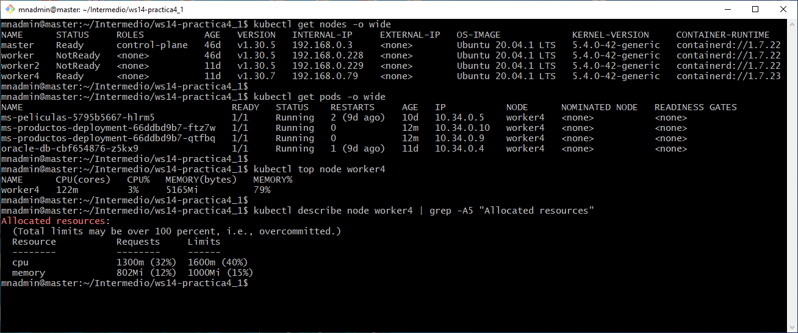

<br/>

17. Captura de pantalla que muestra el estado de los servicios, incluyendo un nuevo servicio creado para consumir el microservicio `ms-deseos`. Además, se incluyen ejemplos de consumo utilizando el comando `curl`. Inicialmente, se verifica que no existen deseos registrados para ningún producto. Posteriormente, se utiliza el comando `curl -X POST -s http://10.103.85.99:8084/deseos/1` para agregar un deseo asociado al producto con ID `1`. 

    - Es importante destacar que el segundo microservicio, `ms-deseos`, está configurado para comunicarse con `ms-productos` exclusivamente mediante el nombre del microservicio, sin requerir direcciones IP o puertos específicos. Este comportamiento demuestra que la configuración fue implementada correctamente y la comunicación entre los microservicios se realiza de manera exitosa.

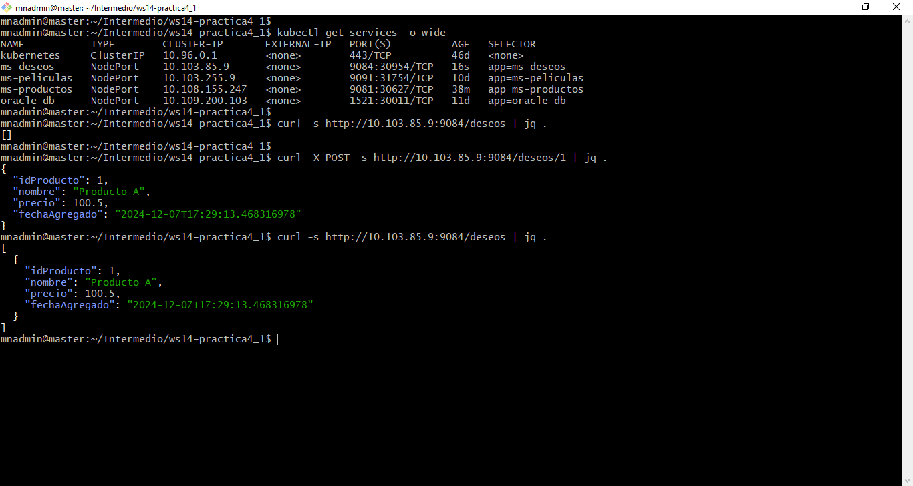

<br/>


18. Captura de pantalla que muestra el acceso exitoso al endpoint **Actuator** del segundo microservicio, confirmando su correcto despliegue y funcionamiento.

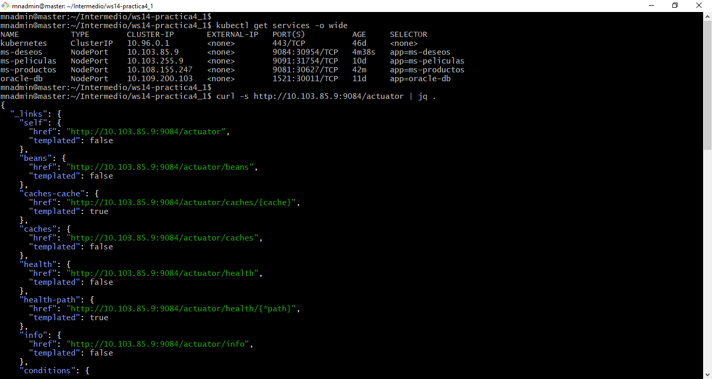

<br/>

19. Captura de pantalla que evidencia el acceso exitoso a los endpoints **Actuator/info**, **Actuator/health/liveness**, y **Actuator/health/readiness** del segundo microservicio, validando su correcto despliegue, configuración y funcionamiento dentro del clúster de Kubernetes.

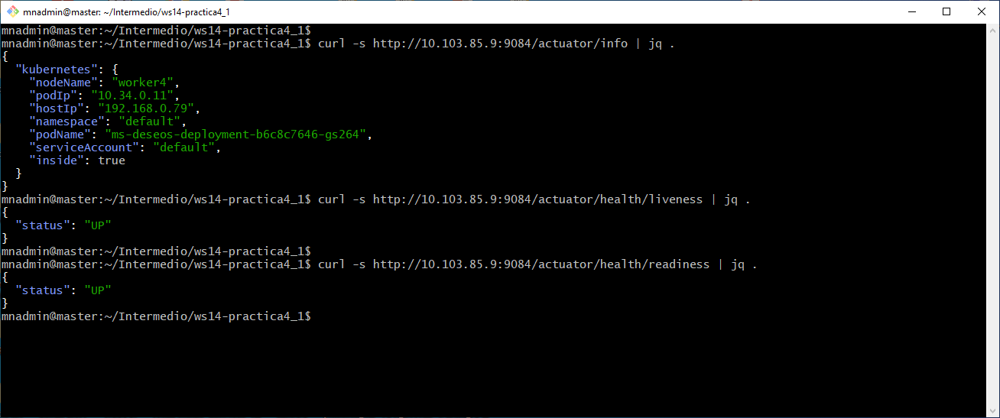

<br/>

20. La captura de pantalla muestra el estado del nodo `worker4`, que se encuentra en estado **Ready** y está alojando las cargas de trabajo del clúster, incluyendo el microservicio `ms-deseos`. Se observa que el nodo tiene un consumo eficiente de CPU (3%) pero un uso elevado de memoria (82%), indicando una alta ocupación en este recurso. Los recursos asignados al nodo están dentro de los límites configurados: se han solicitado el 45% de CPU y el 16% de memoria, con límites establecidos en 60% y 23% respectivamente. Esto garantiza un margen para evitar sobrecargas, aunque el uso elevado de memoria podría requerir monitoreo continuo. La configuración actual demuestra que el clúster tiene capacidad para soportar las cargas actuales, pero sería prudente evaluar la habilitación de más nodos `worker` para mejorar la distribución y la redundancia del clúster en caso de aumento de la carga de trabajo.

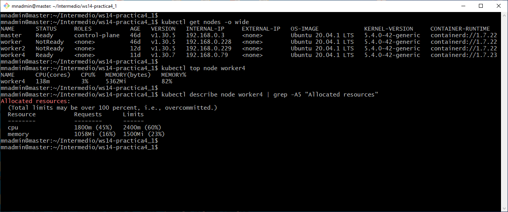

<br/>

21. Captura de pantalla que muestra todos los objetos asociados a la práctica, junto con algunos adicionales que no se eliminaron del entorno en el momento de realizar la práctica. En la salida se observan tres Pods en estado **Running**: dos correspondientes al microservicio `ms-productos` y uno al microservicio `ms-deseos`. Además, se tienen dos **Services**, cada uno configurado para exponer la funcionalidad de los microservicios. También se incluyen los **Deployments** asociados a los microservicios, junto con las réplicas configuradas para cada uno de ellos, lo que asegura la disponibilidad y el balanceo de carga en el clúster. (Salida obtenida con el comando `kubectl get all`).

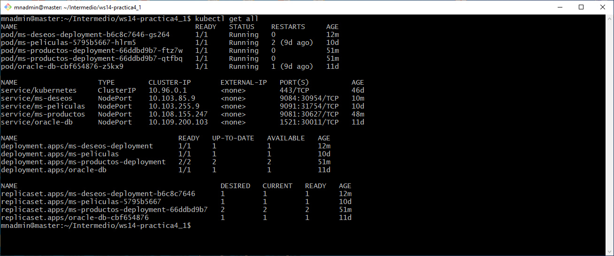

<br/>

22. Captura de pantalla que muestra el contenido del directorio de trabajo con los archivos YAML necesarios para la práctica. Aunque podrías optar por desarrollar un único archivo YAML que contenga todos los objetos de Kubernetes, en este caso se crearon archivos separados para cada componente solicitado en la práctica. Estos incluyen configuraciones específicas para el **Role**, **RoleBinding**, **Secrets**, así como los **ConfigMaps**, **Deployments**, y **Services** asociados a los microservicios del caso de estudio (`ms-productos` y `ms-deseos`).

    - El objetivo de esta práctica es que consolides tu aprendizaje creando estos archivos YAML de manera autónoma. A este punto de tu capacitación, deberías contar con las habilidades necesarias para completar esta tarea. La práctica tiene una duración estimada de 180 minutos, durante los cuales podrás medir tu capacidad para crear, configurar y estructurar los objetos solicitados. Aunque se fomenta que concluyas la práctica de manera independiente para fortalecer tu confianza, cuentas con el apoyo de tu instructor asignado en caso de que necesites orientación. ¡Es tu momento de aplicar lo aprendido!


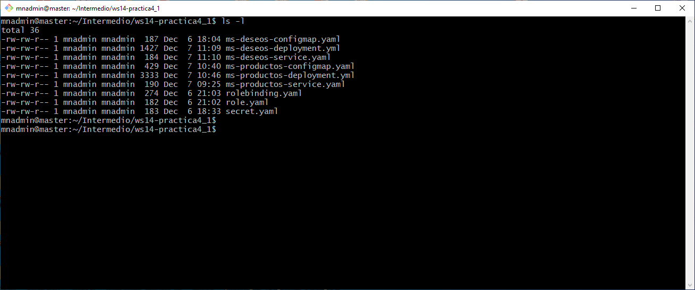

<br/>

23. Captura de pantalla que muestra las imágenes de los microservicios del caso de estudio (`ms-productos` y `ms-deseos`) registradas en el **Docker Hub**. Estas imágenes están almacenadas en un repositorio público, por lo que puedes utilizarlas directamente y omitir el **Paso 1** del proceso. 

