# Práctica 5.1. Spring Cloud Gateway

## Objetivos de las prácticas:
Al finalizar esta práctica, serás capaz de:

- Implementar y configurar un servicio de Spring Cloud Gateway en un clúster de Kubernetes. Esto incluye la creación y configuración del servicio, el enrutamiento de microservicios a través del Gateway utilizando `application.properties` y `application.yml`, la dockerización del Gateway y el despliegue mediante Deployment y Service en Kubernetes, verificando su funcionalidad a través de Curl o Postman.
 
## Duración aproximada
- 180 minutos.

<br/>

## Objetivo visual


<br/>
<br/>

## Instrucciones

### Paso 1. Crear el nuevo microservicio ms-gateway

#### 1. Crear el proyecto en Spring Tool Suite (STS)

- Crear un nuevo proyecto Maven llamado **ms-gateway**.

- Configurar las opciones:
  - Lenguaje: Java 21.
  - Tipo de empaquetado: JAR.
  - Tipo: Maven

<br/>

#### 2. Agregar dependencia de Spring Cloud Gateway

- Incluir el **Spring Cloud Routing - Reactive Gateway** al crear el proyecto o agregar manualmente al archivo `pom.xml`.

<br/>

#### 3. Añadir inicializadores necesarios al archivo `pom.xml`

- Agregar las siguientes dependencias en el `pom.xml`:

```xml

    <dependency>
        <groupId>org.springframework.cloud</groupId>
        <artifactId>spring-cloud-starter-gateway</artifactId>
    </dependency>
    <dependency>
        <groupId>org.springframework.cloud</groupId>
        <artifactId>spring-cloud-starter-kubernetes-client</artifactId>
    </dependency>
    <dependency>
        <groupId>org.springframework.cloud</groupId>
        <artifactId>spring-cloud-starter-kubernetes-client-config</artifactId>
    </dependency>
    <dependency>
        <groupId>org.springframework.cloud</groupId>
        <artifactId>spring-cloud-starter-kubernetes-client-loadbalancer</artifactId>
    </dependency>

```

- **Nota:** Verificar la compatibilidad de las versiones de Spring Cloud con la versión de Spring Boot del proyecto. Consultar [Spring Cloud Compatibility Matrix](https://spring.io/projects/spring-cloud#overview).

<br/>

#### 4. Habilitar cliente de descubrimiento

- En la clase principal `MsGatewayApplication`, añadir la anotación `@EnableDiscoveryClient`:

```java

// Líneas package e imports omitidos

import org.springframework.cloud.client.discovery.EnableDiscoveryClient;

@SpringBootApplication
@EnableDiscoveryClient
public class MsGatewayApplication {
    public static void main(String[] args) {
        SpringApplication.run(MsGatewayApplication.class, args);
    }
}
```

<br/>

#### 5. Configurar el archivo `application.properties`

- Agregar las siguientes propiedades básicas:

```properties
spring.application.name=ms-gateway
server.port=9099
```

<br/>

#### 6. Configurar rutas con `application.yml`

- Crear un archivo `application.yml` para definir las rutas necesarias:
  
```yaml
spring:
  cloud:
    gateway:
      routes:
        - id: ms-productos
          uri: lb://ms-productos
          predicates:
            - Path=/api1/**
          filters:
            - StripPrefix=1
        - id: ms-deseos
          uri: lb://ms-deseos
          predicates:
            - Path=/api2/**
          filters:
            - StripPrefix=1
```

<br/>

#### 7. Decidir el formato de configuración

- Decidir si prefieres utilizar únicamente `application.properties` o `application.yml` para todas las configuraciones del proyecto. Eliminar el archivo que no se usará para evitar conflictos.

<br/>

#### 8. Crear el artefacto JAR

- Generar el artefacto JAR del microservicio ejecutando el siguiente comando en la raíz del proyecto:

```bash
.\mvnw clean package
```

<br/>

#### 9. Crear el Dockerfile

- Escribir un archivo `Dockerfile` para dockerizar el microservicio:

```dockerfile
# 1. Imagen base.
FROM openjdk:21-jdk-slim

# 2. Establecer el directorio de trabajo.
WORKDIR /app

# 3. Copiar el archivo JAR generado.
COPY target/ms-gateway-0.0.1-SNAPSHOT.jar app.jar

# 4. Exponer el puerto utilizado por el microservicio.
EXPOSE 9099

# 5. Comando de inicio.
ENTRYPOINT ["java", "-jar", "app.jar"]
```

- **Nota**: Asegúrate de que el nombre de tu artefacto coincida exactamente con el especificado en el Dockerfile proporcionado.

<br/>

#### 10. Construir, etiquetar y registrar la imagen Docker

- Construir la imagen Docker:

```bash
docker build -t ms-gateway:<tu_version> .
```

- Etiquetar y subir la imagen a Docker Hub:

```bash
docker login
docker tag ms-gateway:<version> <tu_usuario_dockerhub>/ms-gateway:<tu_version>
docker push <tu_usuario_dockerhub>/ms-gateway:<tu_version>
```

- **Nota**: Esta imagen registrada en Docker Hub será la que deberás especificar en el manifiesto YAML del deployment del microservicio en el clúster de Kubernetes.


<br/>

#### 11. Verificar el registro de la imagen

- Asegúrate de que la imagen se encuentra registrada correctamente en Docker Hub ejecutando:

```bash
docker pull <tu_usuario_dockerhub>/ms-gateway:<tu_version>
``` 

Con estos pasos finalizados, tendrás tu microservicio **ms-gateway** listo para desplegar en Kubernetes.

<br/>
<br/>


### Paso 2. Desplegar el microservicio ms-gateway en el clúster de Kubernetes

#### 1. Crear el manifiesto YAML para el despliegue del microservicio

- Escribir un manifiesto YAML que incluya:

  - Un **Deployment** que utilice la imagen Docker creada en el Paso 1 como base para el contenedor.

  - Configurar un número adecuado de réplicas según las necesidades del servicio.

  - Optativo, definir las siguientes características opcionales (recomendadas):
    - **Resources**: límites y solicitudes de CPU y memoria para optimizar el uso de recursos del clúster.
    - **Probes**: añadir `livenessProbe` y `readinessProbe` para garantizar la disponibilidad del servicio y evitar tráfico hacia Pods no saludables.
    - Recuerda que, si utilizas **Probes**, es importante añadir `livenessProbe` y `readinessProbe` para garantizar la disponibilidad del servicio y evitar el enrutamiento de tráfico hacia Pods no saludables. Asegúrate de que tu imagen registrada en Docker Hub esté configurada correctamente para los actuators necesarios.
 
  - Asegúrate de incluir los puertos necesarios para el contenedor.

<br/>

#### 2. Crear el manifiesto YAML para el Service

- Definir un **Service** en Kubernetes para exponer el microservicio **ms-gateway**:
  - Tipo de servicio: `LoadBalancer` (para exponer el servicio externamente y permitir el acceso desde fuera del clúster).
  - Configurar el puerto externo y el puerto del contenedor de acuerdo con la configuración del microservicio (e.g., puerto 9099).
  - Incluir las etiquetas necesarias para asociar el Service con los Pods del Deployment.

<br/>

#### 3. Aplicar los manifiestos YAML al clúster

- Aplicar los manifiestos al clúster con el siguiente comando:

```bash
kubectl apply -f <nombre-del-archivo-deployment>.yaml
kubectl apply -f <nombre-del-archivo-service>.yaml
```

<br/>

#### 4. Inspeccionar los componentes de Kubernetes
- Verificar que los Pods, Deployment y Service se hayan creado correctamente utilizando los comandos:

```bash
kubectl get pods
kubectl get deployment ms-gateway 
kubectl get service ms-gateway -o wide 
```

- Asegúrate de que los Pods estén en estado `Running` y que el Service tenga una dirección IP asignada (si usas `LoadBalancer`).

<br/>
<br/>

### Paso 3. Consumo del nuevo microservicio **ms-gateway**

#### 1. Verificar la dirección IP y el puerto del servicio

- Identificar la dirección IP y el puerto expuesto por el **Service** de Kubernetes para **ms-gateway**. 

  - Si usaste un `LoadBalancer`, utilizar el siguiente comando para obtener la dirección IP externa:

    ```bash
    kubectl get services -o wide
    ```

- Anotar la dirección IP y el puerto asignados.

<br/>

#### 2. Confirmar la disponibilidad de los microservicios dependientes

- Asegúrate de que los microservicios **ms-productos** y **ms-deseos** estén en un estado saludable y listos para ser consumidos por **ms-gateway**.

  - Ejecutar el siguiente comando para verificar su estado:

    ```bash
    kubectl get pods
    kubectl get services -o wide
    ```

- Realizar una prueba básica para cada microservicio directamente, usando **Postman** o `curl`, para confirmar que están respondiendo correctamente.

<br/>

#### 3. Probar la conectividad hacia **ms-productos** a través de **ms-gateway**

- Utilizar **Postman** o `curl` para consumir las rutas configuradas en **ms-gateway** que se redirigen a **ms-productos**. Por ejemplo:

    ```bash
    curl http://<IP_DEL_GATEWAY>:<PUERTO>/api1/productos
    curl http://<IP_DEL_GATEWAY>:<PUERTO>/api2/deseos
    ```

- Asegúrate de que los datos de **ms-productos** se obtienen correctamente a través de **ms-gateway**.

<br/>

#### 4. Agregar un nuevo producto a través de **ms-gateway**

- Enviar una solicitud POST con los datos de un nuevo producto utilizando la ruta de **ms-gateway** que redirige a **ms-productos**. Ejemplo con `curl`:

    ```bash
  curl -X POST http://<IP_DEL_GATEWAY>:<PUERTO>/productos \
     -H "Content-Type: application/json" \
     -d '{
          "id": 2,
          "nombre": "Producto B",
          "descripcion": "Descripción del Producto B",
          "precio": 200.5,
          "stock": 3
     }'

    ```

- Confirmar que la solicitud fue aceptada.

<br/>

#### 5. Verificar la creación del producto

- Usar la ruta de consulta configurada en **ms-gateway** para verificar que el nuevo producto aparece en la lista de productos de **ms-productos**:

    ```bash
    curl http://<IP_DEL_GATEWAY>:<PUERTO>/api/productos
    ```

- Usar la ruta de consulta configurada en **ms-gateway** para verificar que puedes consumir el nuevo producto desde **ms-deseos**:

    ```bash
    curl -s -X POST http://<IP_DEL_GATEWAY>:<PUERTO>/api/deseos/2

    curl -s -X GET http://<IP_DEL_GATEWAY>:<PUERTO>/api/deseos
    ```
<br/>

Con estos pasos, habrás comprobado la funcionalidad del **ms-gateway**, la interacción con los microservicios dependientes y la correcta propagación de solicitudes entre los servicios.

<br/>
<br/>

## Resultados esperados

Al finalizar la práctica, se espera que el participante haya logrado:

1. **Implementación del Gateway**: 
   - Crear y configurar un microservicio **ms-gateway** utilizando Spring Cloud Gateway.
   - Configurar rutas de enrutamiento dinámico para microservicios dependientes (**ms-productos** y **ms-deseos**) utilizando `application.yml`.

2. **Dockerización**:
   - Crear un artefacto JAR para el microservicio **ms-gateway**.
   - Construir y registrar una imagen Docker del Gateway en Docker Hub, asegurándose de que esté disponible para su uso en el clúster.

3. **Despliegue en Kubernetes**:
   - Desplegar el microservicio **ms-gateway** en Kubernetes utilizando un Deployment y un Service.
   - Configurar correctamente los manifiestos YAML para incluir recursos, probes (`livenessProbe` y `readinessProbe`) y un Service de tipo `LoadBalancer` para exponer el Gateway externamente.

4. **Verificación de componentes**:
   - Validar que los Pods asociados al Deployment estén en estado `Running`.
   - Verificar que el Service de Kubernetes expone correctamente el microservicio, obteniendo la dirección IP y el puerto asignados.

5. **Consumo de microservicios a través del Gateway**:
   - Realizar pruebas exitosas con **Postman** o `curl` para:
     - Consultar datos de **ms-productos** a través de las rutas configuradas en **ms-gateway**.
     - Agregar nuevos productos a **ms-productos** mediante el Gateway.
     - Consumir datos de la lista de deseos de **ms-deseos** y verificar su interacción con **ms-productos**.

6. **Pruebas de integración**:
   - Confirmar que las solicitudes se enrutan correctamente desde el Gateway hacia los microservicios dependientes.
   - Verificar que las respuestas obtenidas a través del Gateway son consistentes con las respuestas directas de los microservicios.

<br/>
<br/>

## Resultados esperados - Visualmente

1. Captura de pantalla que evidencia el registro exitoso de la imagen `1.0.0` en Docker Hub. Durante el despliegue, se presentó un inconveniente debido a la omisión del archivo YAML que define las rutas necesarias, lo que impidió el correcto enrutamiento inicial.

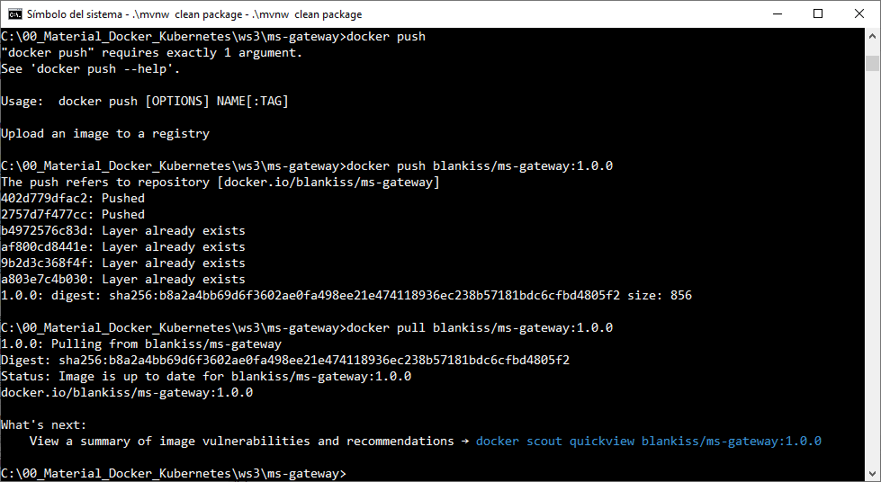

<br/>


2. Captura de pantalla que muestra el manifiesto YAML utilizado para resolver esta práctica. El objetivo principal es que puedas crear tus propios manifiestos: uno para el **Deployment** y otro para el **Service**. 

En la captura se evidencia que, inicialmente, no hay ningún objeto asociado al espacio de nombres predeterminado (`default`) relacionado con **ms-gateway**. Tras aplicar el manifiesto, se observa la creación y asociación de los siguientes componentes: un **Pod**, un **Deployment**, un **Service**, y un **ReplicaSet**, demostrando la correcta implementación del Gateway en el clúster de Kubernetes.

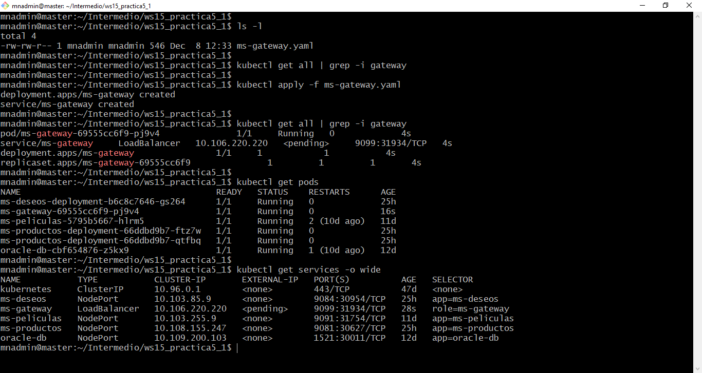

<br/>

3. Captura de pantalla que evidencia el registro exitoso de la imagen `1.0.1` en Docker Hub, la cual incluye las configuraciones corregidas para las rutas. Esta actualización asegura el funcionamiento adecuado del enrutamiento en el despliegue del microservicio.

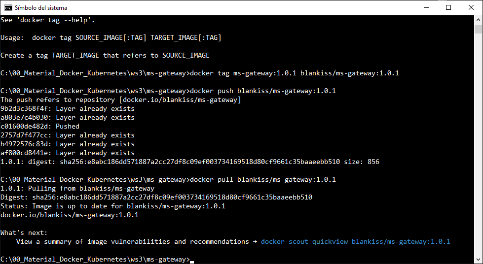

<br/>


4. Captura de pantalla que muestra el estado del Pod en `ContainerCreating`, confirmando que está utilizando la nueva versión de la imagen Docker `1.0.1`. En el manifiesto YAML se configuró la cláusula que garantiza la actualización automática de la imagen asociada al contenedor. Además, se verifica que el servicio **ms-gateway** ha sido aplicado correctamente, asegurando que el despliegue esté sincronizado con las últimas configuraciones.

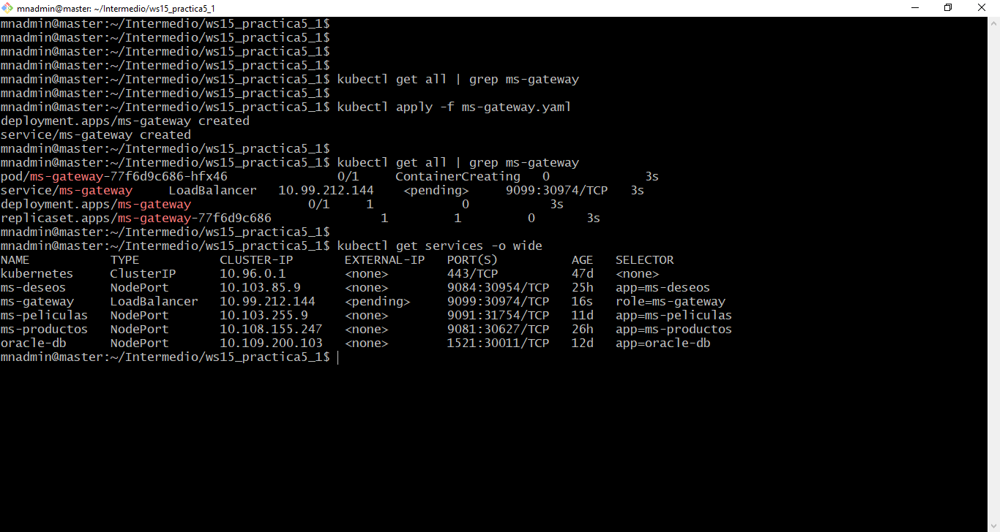

<br/>

5. Captura de pantalla que muestra el consumo exitoso de los microservicios **ms-productos** y **ms-deseos** a través de sus Pods desplegados, confirmando que los servicios están funcionando correctamente en el clúster de Kubernetes.


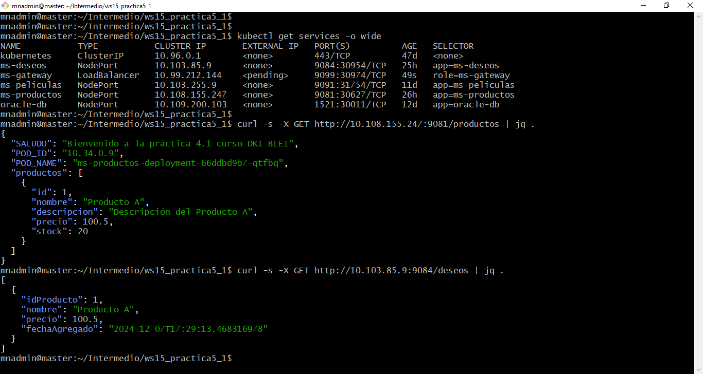

<br/>

6. Captura de pantalla que evidencia el consumo exitoso de los microservicios **ms-productos** y **ms-deseos** a través de las rutas configuradas en **ms-gateway**, verificando que el enrutamiento definido en el Gateway está funcionando correctamente y redirige las solicitudes a los servicios correspondientes.

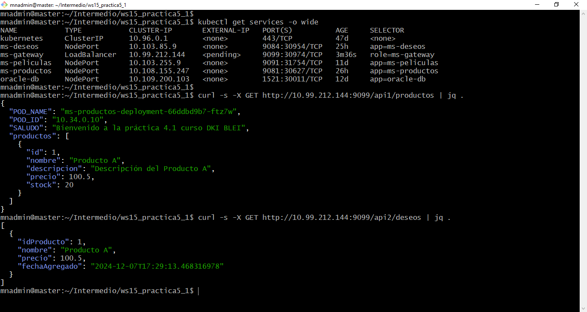

<br/>

7. Captura de pantalla que muestra los **Pods**, el **Deployment** y el **Service** de Kubernetes asociados a la práctica, confirmando que los componentes relacionados con **ms-gateway** están desplegados correctamente y operativos en el clúster.

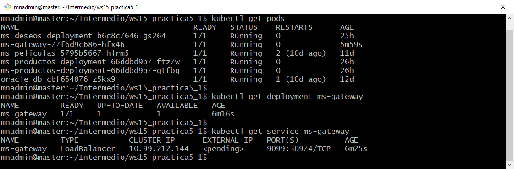

<br/>


8. Captura de pantalla que muestra el ingreso de un producto con `id:1` a través de un consumo exitoso usando `curl` en línea de comandos con una solicitud **POST**. Sin embargo, este proceso resultó en la actualización del producto existente con `id:1` en lugar de agregar un nuevo producto. Al consultar nuevamente la lista de productos, se observa un solo producto con información actualizada en nombre, descripción, precio y stock. Esto evidencia cómo el uso de `curl` puede llevar fácilmente a errores si no se validan correctamente los datos enviados en la solicitud.

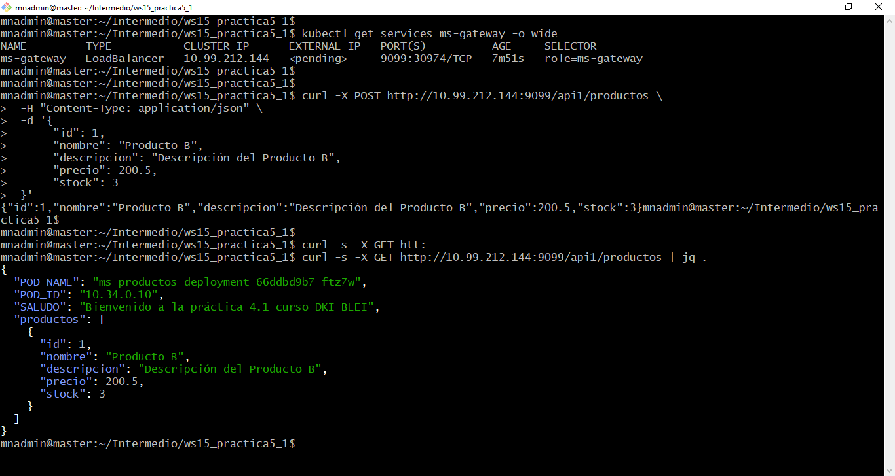

<br/>


9. Captura de pantalla que muestra el ingreso exitoso de un producto con el aparente `id:2` a través de una solicitud **POST** utilizando `curl` en línea de comandos, confirmando que el servicio procesó correctamente los datos enviados y añadió el nuevo producto a la lista.

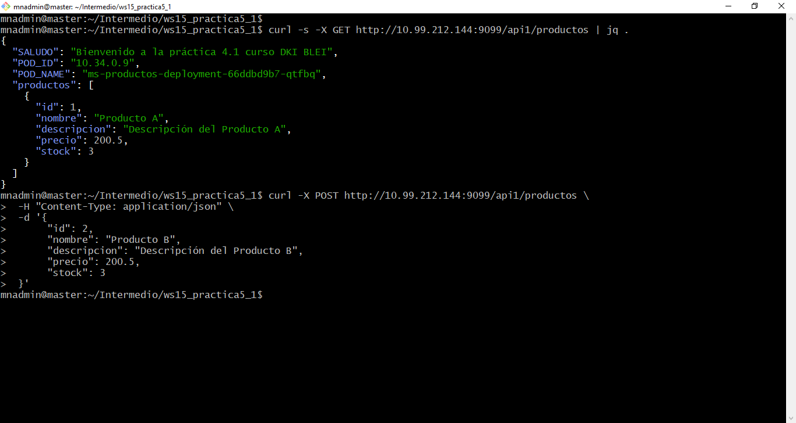

<br/>

10. Captura de pantalla que muestra el resultado de la consulta de todos los productos, donde se observa un producto con `id:1` y otro con `id:22`, en lugar del esperado `id:2`. 

Esto podría deberse a uno de los siguientes motivos:

1. **Datos mal formateados en la solicitud POST**: Es posible que el ID enviado en la solicitud no se haya especificado correctamente o se haya modificado de alguna manera durante el envío.

2. **Lógica interna del microservicio**: Si el microservicio genera automáticamente los IDs basándose en alguna lógica, podría haber asignado un ID distinto del esperado.

3. **Persistencia inconsistente**: Si el backend realiza validaciones o transformaciones en los datos antes de guardarlos, esto podría haber resultado en un ID diferente al proporcionado.

4. **Error humano o de sistema en el uso de `curl`**: Una solicitud previa mal configurada podría haber afectado la forma en que se interpretó o procesó esta nueva solicitud.

Estos resultados resaltan la importancia de validar cuidadosamente tanto los datos enviados como la respuesta del servicio para evitar discrepancias inesperadas.


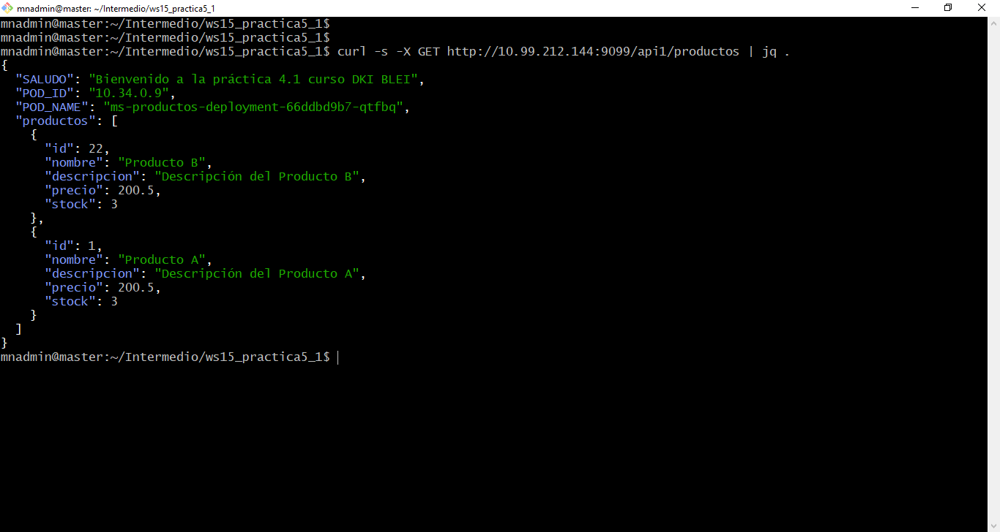

<br/>


11. Captura de pantalla que evidencia el consumo exitoso de **ms-deseos** a través de **ms-gateway**, donde se agrega a la lista de deseos el producto con `id:22`. Esto confirma que el enrutamiento configurado en el Gateway funciona correctamente y que **ms-deseos** puede interactuar con los productos gestionados por **ms-productos** a través del Gateway.

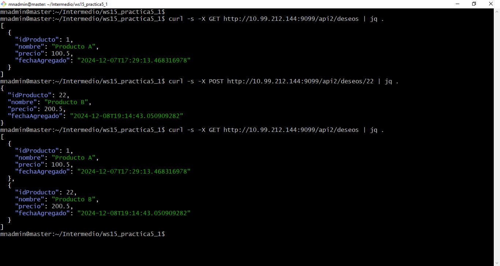

<br/>
